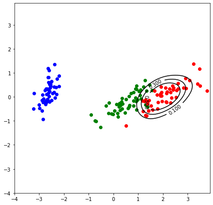
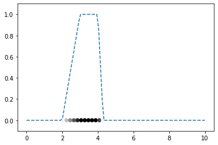
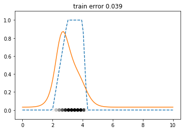
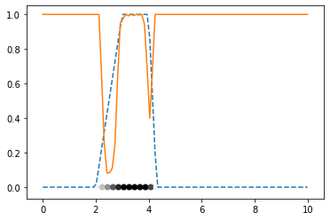

# Title
> summary


<h1>Table of Contents<span class="tocSkip"></span></h1>
<div class="toc"><ul class="toc-item"><li><span><a href="#mulearn" data-toc-modified-id="mulearn-1"><span class="toc-item-num">1&nbsp;&nbsp;</span>mulearn</a></span><ul class="toc-item"><li><span><a href="#Install" data-toc-modified-id="Install-1.1"><span class="toc-item-num">1.1&nbsp;&nbsp;</span>Install</a></span></li><li><span><a href="#How-to-use" data-toc-modified-id="How-to-use-1.2"><span class="toc-item-num">1.2&nbsp;&nbsp;</span>How to use</a></span></li></ul></li></ul></div>

# mulearn

mulearn is a python package implementing the data-driven induction of fuzzy sets described in

- D. Malchiodi and W. Pedrycz, _Learning Membership Functions for Fuzzy Sets through Modified Support Vector Clustering_, in F. Masulli, G. Pasi e R. Yager (Eds.), Fuzzy Logic and Applications. 10th International Workshop, WILF 2013, Genoa, Italy, November 19–22, 2013. Proceedings., Vol. 8256, Springer International Publishing, Switzerland, Lecture Notes on Artificial Intelligence.

## Install

`pip install mulearn`

## How to use

Fill me in please! Don't forget code examples:

```python
import pandas as pd

source = 'https://archive.ics.uci.edu/ml/machine-learning-databases/iris/iris.data'

iris_df = pd.read_csv(source, header=None)

iris_df.columns=['sepal_length', 'sepal_width', 'petal_length', 'petal_width', 'class']

iris_df.tail()
```


<div>
<style scoped>
    .dataframe tbody tr th:only-of-type {
        vertical-align: middle;
    }

    .dataframe tbody tr th {
        vertical-align: top;
    }

    .dataframe thead th {
        text-align: right;
    }
</style>
<table border="1" class="dataframe">
  <thead>
    <tr style="text-align: right;">
      <th></th>
      <th>sepal_length</th>
      <th>sepal_width</th>
      <th>petal_length</th>
      <th>petal_width</th>
      <th>class</th>
    </tr>
  </thead>
  <tbody>
    <tr>
      <th>145</th>
      <td>6.7</td>
      <td>3.0</td>
      <td>5.2</td>
      <td>2.3</td>
      <td>Iris-virginica</td>
    </tr>
    <tr>
      <th>146</th>
      <td>6.3</td>
      <td>2.5</td>
      <td>5.0</td>
      <td>1.9</td>
      <td>Iris-virginica</td>
    </tr>
    <tr>
      <th>147</th>
      <td>6.5</td>
      <td>3.0</td>
      <td>5.2</td>
      <td>2.0</td>
      <td>Iris-virginica</td>
    </tr>
    <tr>
      <th>148</th>
      <td>6.2</td>
      <td>3.4</td>
      <td>5.4</td>
      <td>2.3</td>
      <td>Iris-virginica</td>
    </tr>
    <tr>
      <th>149</th>
      <td>5.9</td>
      <td>3.0</td>
      <td>5.1</td>
      <td>1.8</td>
      <td>Iris-virginica</td>
    </tr>
  </tbody>
</table>
</div>


```python
iris_values = iris_df.iloc[:,0:4].values
iris_labels = iris_df.iloc[:,4].values
```

```python
from sklearn.decomposition import PCA
pca_2d = PCA(n_components=2)
iris_values_2d = pca_2d.fit_transform(iris_values)
```

```python
%matplotlib inline
import matplotlib.pyplot as plt

def gr_dataset(): 
    for lab, col in zip(('Iris-setosa', 'Iris-versicolor', 'Iris-virginica'),
                        ('blue', 'green', 'red')):
        plt.scatter(iris_values_2d[iris_labels==lab, 0],
                    iris_values_2d[iris_labels==lab, 1],
                    label=lab,
                    c=col)

gr_dataset()
```


```python
def to_membership_values(labels, target):
    return [1 if l==target else 0 for l in labels]

mu = {}
for target in ('Iris-setosa', 'Iris-versicolor', 'Iris-virginica'):
    mu[target] = to_membership_values(iris_labels, target)
```

```python
def gr_membership_contour(estimated_membership):
    x = np.arange(-4, 4, .1)
    y = np.arange(-4, 4, .1)
    X, Y = np.meshgrid(x, y)
    zs = np.array([estimated_membership((x, y))
                   for x,y in zip(np.ravel(X), np.ravel(Y))])
    Z = zs.reshape(X.shape)
    membership_contour = plt.contour(X, Y, Z,
                                     levels=(.1, .3, .5, .95), colors='k')
    plt.clabel(membership_contour, inline=1)
```

```python
from sklearn.model_selection import GridSearchCV, cross_val_score
from mulearn import FuzzyInductor
from mulearn.fuzzifier import LinearFuzzifier
```

```python
sigmas = [.225,.5]
parameters = parameters = {'c':[1,10,100],
                           'k':[GaussianKernel(i) for i in sigmas]}
```

```python
f = FuzzyInductor(fuzzifier=LinearFuzzifier)

virginica = GridSearchCV(estimator=f, param_grid=parameters, n_jobs=-1)
virginica.fit(iris_values_2d, mu['Iris-virginica'])
```

    100%|██████████| 100/100 [00:19<00:00,  5.22it/s]


    GridSearchCV(cv=None, error_score=nan,
                 estimator=FuzzyInductor(c=1,
                                         fuzzifier=<class 'mulearn.fuzzifier.LinearFuzzifier'>,
                                         k=GaussianKernel(1), random_state=None,
                                         return_profile=False,
                                         solve_strategy=(<function solve_optimization_tensorflow at 0x7f65d8ae1268>,
                                                         {})),
                 iid='deprecated', n_jobs=-1,
                 param_grid={'c': [1, 10, 100],
                             'k': [GaussianKernel(0.225), GaussianKernel(0.5)]},
                 pre_dispatch='2*n_jobs', refit=True, return_train_score=False,
                 scoring=None, verbose=0)


```python
import numpy as np

plt.figure(figsize=(7,7))
gr_dataset()
gr_membership_contour(virginica.best_estimator_.estimated_membership_)
plt.show()
```





```python
import numpy as np
from scipy import integrate
import matplotlib.pyplot as plt
import mulearn as ml
from tqdm.notebook import tnrange, tqdm
import tensorflow as tf

def membership(r):
    left = 2
    centerl = 3
    centerr = 4
    right = 4.3
    
    if r < left:
        return 0
    elif left <= r < centerl:
        return (r - left)/(centerl - left)
    elif centerl <= r < centerr:
        return 1
    elif centerr <= r < right:
        return (r - right)/(centerr - right)
    else:
        return 0
```

```python
x_test = np.linspace(0, 10, 100)

def get_mu(membership, x_train, x_test):
    
    mu_area = integrate.quad(membership, 0, 10, limit=1000)[0]
    
    mu_test = list(map(membership, x_test))
    x_test = np.expand_dims(x_test, axis=1)
    plt.plot(x_test, list(map(membership, x_test)), '--')

    mu_train = list(map(membership, x_train))
    x_train = np.expand_dims(x_train, axis=1)
    
    plt.scatter(x_train, [0] * m, c=1-np.array(mu_train), cmap='gray')

    plt.xlim((-0.5, 10.5))
    plt.ylim((-0.1, 1.1))
    plt.show()
    
    return x_train, mu_train, x_test, mu_test, mu_area
```

```python
m = 50
x_train = np.linspace(0, 10)

x_train, mu_train, x_test, mu_test, mu_area = get_mu(membership, x_train, x_test)
```





```python
c = 1
sigma = 0.6
k=ml.kernel.GaussianKernel(sigma)
f = ml.fuzzifier.ExponentialFuzzifier

opt = tf.optimizers.SGD(learning_rate=10**-4)
solver_opts = {'tracker': tnrange, 'n_iter': 20, 'optimizer': opt}

fi = ml.FuzzyInductor(c=c, k=k, fuzzifier=f,
                      solve_strategy=(ml.solve_optimization_tensorflow,
                                          solver_opts))

_ = fi.fit(x_train, mu_train)
```

    


```python
plt.plot(x_test, list(map(membership, x_test)), '--')
plt.plot(x_test, fi.predict(x_test))

plt.scatter(x_train, [0] * m, c=1-np.array(mu_train), cmap='gray')

plt.xlim((-0.5, 10.5))
plt.ylim((-0.1, 1.1))
train_error = fi.train_error_[0] if type(fi.train_error_)==np.ndarray else fi.train_error_
plt.title('train error {:.3f}'.format(train_error))
plt.show()
```





```python
from sklearn.model_selection import GridSearchCV

parameters = {'c': np.linspace(0.1, 1.7, 20),
              'k': [ml.kernel.GaussianKernel(sigma)
                    for sigma in np.linspace(0.1, 0.9, 10)]}
fi = ml.FuzzyInductor(fuzzifier=f)
clf = GridSearchCV(fi, parameters, cv=5, error_score=np.nan)
clf.fit(x_train, mu_train)
```

    100%|██████████| 100/100 [00:04<00:00, 20.99it/s]
    100%|██████████| 100/100 [00:05<00:00, 18.75it/s]
    /home/malchiodi/anaconda3/lib/python3.7/site-packages/numpy/core/fromnumeric.py:3335: RuntimeWarning: Mean of empty slice.
      out=out, **kwargs)
    /home/malchiodi/anaconda3/lib/python3.7/site-packages/numpy/core/_methods.py:161: RuntimeWarning: invalid value encountered in double_scalars
      ret = ret.dtype.type(ret / rcount)
    /home/malchiodi/anaconda3/lib/python3.7/site-packages/scipy/optimize/minpack.py:808: OptimizeWarning: Covariance of the parameters could not be estimated
      category=OptimizeWarning)
    100%|██████████| 100/100 [00:05<00:00, 18.37it/s]
    100%|██████████| 100/100 [00:05<00:00, 18.06it/s]
    100%|██████████| 100/100 [00:05<00:00, 17.88it/s]
    100%|██████████| 100/100 [00:05<00:00, 17.10it/s]
    100%|██████████| 100/100 [00:06<00:00, 16.16it/s]
    /home/malchiodi/anaconda3/lib/python3.7/site-packages/numpy/core/fromnumeric.py:3335: RuntimeWarning: Mean of empty slice.
      out=out, **kwargs)
    /home/malchiodi/anaconda3/lib/python3.7/site-packages/numpy/core/_methods.py:161: RuntimeWarning: invalid value encountered in double_scalars
      ret = ret.dtype.type(ret / rcount)
    /home/malchiodi/anaconda3/lib/python3.7/site-packages/scipy/optimize/minpack.py:808: OptimizeWarning: Covariance of the parameters could not be estimated
      category=OptimizeWarning)
    100%|██████████| 100/100 [00:05<00:00, 17.66it/s]
    100%|██████████| 100/100 [00:05<00:00, 18.38it/s]
    100%|██████████| 100/100 [00:05<00:00, 18.79it/s]
    100%|██████████| 100/100 [00:05<00:00, 19.48it/s]
    100%|██████████| 100/100 [00:05<00:00, 19.97it/s]
    /home/malchiodi/anaconda3/lib/python3.7/site-packages/numpy/core/fromnumeric.py:3335: RuntimeWarning: Mean of empty slice.
      out=out, **kwargs)
    /home/malchiodi/anaconda3/lib/python3.7/site-packages/numpy/core/_methods.py:161: RuntimeWarning: invalid value encountered in double_scalars
      ret = ret.dtype.type(ret / rcount)
    /home/malchiodi/anaconda3/lib/python3.7/site-packages/scipy/optimize/minpack.py:808: OptimizeWarning: Covariance of the parameters could not be estimated
      category=OptimizeWarning)
    100%|██████████| 100/100 [00:05<00:00, 19.90it/s]
    100%|██████████| 100/100 [00:05<00:00, 19.59it/s]
    100%|██████████| 100/100 [00:04<00:00, 20.37it/s]
    100%|██████████| 100/100 [00:05<00:00, 18.13it/s]
    100%|██████████| 100/100 [00:05<00:00, 19.75it/s]
    /home/malchiodi/anaconda3/lib/python3.7/site-packages/numpy/core/fromnumeric.py:3335: RuntimeWarning: Mean of empty slice.
      out=out, **kwargs)
    /home/malchiodi/anaconda3/lib/python3.7/site-packages/numpy/core/_methods.py:161: RuntimeWarning: invalid value encountered in double_scalars
      ret = ret.dtype.type(ret / rcount)
    /home/malchiodi/anaconda3/lib/python3.7/site-packages/scipy/optimize/minpack.py:808: OptimizeWarning: Covariance of the parameters could not be estimated
      category=OptimizeWarning)
    100%|██████████| 100/100 [00:05<00:00, 18.87it/s]
    100%|██████████| 100/100 [00:05<00:00, 18.53it/s]
    100%|██████████| 100/100 [00:04<00:00, 20.06it/s]
    100%|██████████| 100/100 [00:05<00:00, 18.85it/s]
    100%|██████████| 100/100 [00:04<00:00, 20.26it/s]
    /home/malchiodi/anaconda3/lib/python3.7/site-packages/numpy/core/fromnumeric.py:3335: RuntimeWarning: Mean of empty slice.
      out=out, **kwargs)
    /home/malchiodi/anaconda3/lib/python3.7/site-packages/numpy/core/_methods.py:161: RuntimeWarning: invalid value encountered in double_scalars
      ret = ret.dtype.type(ret / rcount)
    /home/malchiodi/anaconda3/lib/python3.7/site-packages/scipy/optimize/minpack.py:808: OptimizeWarning: Covariance of the parameters could not be estimated
      category=OptimizeWarning)
    100%|██████████| 100/100 [00:05<00:00, 19.08it/s]
    100%|██████████| 100/100 [00:05<00:00, 19.94it/s]
    100%|██████████| 100/100 [00:05<00:00, 18.79it/s]
    100%|██████████| 100/100 [00:04<00:00, 20.02it/s]
    100%|██████████| 100/100 [00:04<00:00, 20.48it/s]
    /home/malchiodi/anaconda3/lib/python3.7/site-packages/numpy/core/fromnumeric.py:3335: RuntimeWarning: Mean of empty slice.
      out=out, **kwargs)
    /home/malchiodi/anaconda3/lib/python3.7/site-packages/numpy/core/_methods.py:161: RuntimeWarning: invalid value encountered in double_scalars
      ret = ret.dtype.type(ret / rcount)
    /home/malchiodi/anaconda3/lib/python3.7/site-packages/scipy/optimize/minpack.py:808: OptimizeWarning: Covariance of the parameters could not be estimated
      category=OptimizeWarning)
    100%|██████████| 100/100 [00:05<00:00, 19.22it/s]
    100%|██████████| 100/100 [00:05<00:00, 18.15it/s]
    100%|██████████| 100/100 [00:05<00:00, 17.65it/s]
    100%|██████████| 100/100 [00:05<00:00, 19.98it/s]
    100%|██████████| 100/100 [00:04<00:00, 20.01it/s]
    /home/malchiodi/anaconda3/lib/python3.7/site-packages/numpy/core/fromnumeric.py:3335: RuntimeWarning: Mean of empty slice.
      out=out, **kwargs)
    /home/malchiodi/anaconda3/lib/python3.7/site-packages/numpy/core/_methods.py:161: RuntimeWarning: invalid value encountered in double_scalars
      ret = ret.dtype.type(ret / rcount)
    /home/malchiodi/anaconda3/lib/python3.7/site-packages/scipy/optimize/minpack.py:808: OptimizeWarning: Covariance of the parameters could not be estimated
      category=OptimizeWarning)
    100%|██████████| 100/100 [00:05<00:00, 19.34it/s]
    100%|██████████| 100/100 [00:05<00:00, 19.65it/s]
    100%|██████████| 100/100 [00:04<00:00, 20.38it/s]
    100%|██████████| 100/100 [00:04<00:00, 20.34it/s]
    100%|██████████| 100/100 [00:05<00:00, 19.80it/s]
    /home/malchiodi/anaconda3/lib/python3.7/site-packages/numpy/core/fromnumeric.py:3335: RuntimeWarning: Mean of empty slice.
      out=out, **kwargs)
    /home/malchiodi/anaconda3/lib/python3.7/site-packages/numpy/core/_methods.py:161: RuntimeWarning: invalid value encountered in double_scalars
      ret = ret.dtype.type(ret / rcount)
    /home/malchiodi/anaconda3/lib/python3.7/site-packages/scipy/optimize/minpack.py:808: OptimizeWarning: Covariance of the parameters could not be estimated
      category=OptimizeWarning)
    100%|██████████| 100/100 [00:05<00:00, 18.45it/s]
    100%|██████████| 100/100 [00:05<00:00, 19.49it/s]
    100%|██████████| 100/100 [00:04<00:00, 20.32it/s]
    100%|██████████| 100/100 [00:04<00:00, 20.33it/s]
    100%|██████████| 100/100 [00:05<00:00, 17.74it/s]
    /home/malchiodi/anaconda3/lib/python3.7/site-packages/numpy/core/fromnumeric.py:3335: RuntimeWarning: Mean of empty slice.
      out=out, **kwargs)
    /home/malchiodi/anaconda3/lib/python3.7/site-packages/numpy/core/_methods.py:161: RuntimeWarning: invalid value encountered in double_scalars
      ret = ret.dtype.type(ret / rcount)
    /home/malchiodi/anaconda3/lib/python3.7/site-packages/scipy/optimize/minpack.py:808: OptimizeWarning: Covariance of the parameters could not be estimated
      category=OptimizeWarning)
    100%|██████████| 100/100 [00:05<00:00, 18.50it/s]
    100%|██████████| 100/100 [00:05<00:00, 17.07it/s]
    100%|██████████| 100/100 [00:05<00:00, 19.59it/s]
    100%|██████████| 100/100 [00:04<00:00, 20.12it/s]
    100%|██████████| 100/100 [00:05<00:00, 19.93it/s]
    /home/malchiodi/anaconda3/lib/python3.7/site-packages/numpy/core/fromnumeric.py:3335: RuntimeWarning: Mean of empty slice.
      out=out, **kwargs)
    /home/malchiodi/anaconda3/lib/python3.7/site-packages/numpy/core/_methods.py:161: RuntimeWarning: invalid value encountered in double_scalars
      ret = ret.dtype.type(ret / rcount)
    /home/malchiodi/anaconda3/lib/python3.7/site-packages/scipy/optimize/minpack.py:808: OptimizeWarning: Covariance of the parameters could not be estimated
      category=OptimizeWarning)
    100%|██████████| 100/100 [00:04<00:00, 20.30it/s]
    100%|██████████| 100/100 [00:04<00:00, 20.42it/s]
    100%|██████████| 100/100 [00:05<00:00, 19.58it/s]
    100%|██████████| 100/100 [00:05<00:00, 19.24it/s]
    100%|██████████| 100/100 [00:04<00:00, 20.13it/s]
    /home/malchiodi/anaconda3/lib/python3.7/site-packages/numpy/core/fromnumeric.py:3335: RuntimeWarning: Mean of empty slice.
      out=out, **kwargs)
    /home/malchiodi/anaconda3/lib/python3.7/site-packages/numpy/core/_methods.py:161: RuntimeWarning: invalid value encountered in double_scalars
      ret = ret.dtype.type(ret / rcount)
    /home/malchiodi/anaconda3/lib/python3.7/site-packages/scipy/optimize/minpack.py:808: OptimizeWarning: Covariance of the parameters could not be estimated
      category=OptimizeWarning)
    100%|██████████| 100/100 [00:04<00:00, 20.05it/s]
    100%|██████████| 100/100 [00:04<00:00, 20.65it/s]
    100%|██████████| 100/100 [00:05<00:00, 19.28it/s]
    100%|██████████| 100/100 [00:05<00:00, 18.31it/s]
    100%|██████████| 100/100 [00:05<00:00, 17.53it/s]
    /home/malchiodi/anaconda3/lib/python3.7/site-packages/numpy/core/fromnumeric.py:3335: RuntimeWarning: Mean of empty slice.
      out=out, **kwargs)
    /home/malchiodi/anaconda3/lib/python3.7/site-packages/numpy/core/_methods.py:161: RuntimeWarning: invalid value encountered in double_scalars
      ret = ret.dtype.type(ret / rcount)
    /home/malchiodi/anaconda3/lib/python3.7/site-packages/scipy/optimize/minpack.py:808: OptimizeWarning: Covariance of the parameters could not be estimated
      category=OptimizeWarning)
    100%|██████████| 100/100 [00:04<00:00, 20.25it/s]
    100%|██████████| 100/100 [00:05<00:00, 18.99it/s]
    100%|██████████| 100/100 [00:05<00:00, 18.86it/s]
    100%|██████████| 100/100 [00:04<00:00, 20.09it/s]
    100%|██████████| 100/100 [00:04<00:00, 20.51it/s]
    /home/malchiodi/anaconda3/lib/python3.7/site-packages/numpy/core/fromnumeric.py:3335: RuntimeWarning: Mean of empty slice.
      out=out, **kwargs)
    /home/malchiodi/anaconda3/lib/python3.7/site-packages/numpy/core/_methods.py:161: RuntimeWarning: invalid value encountered in double_scalars
      ret = ret.dtype.type(ret / rcount)
    /home/malchiodi/anaconda3/lib/python3.7/site-packages/scipy/optimize/minpack.py:808: OptimizeWarning: Covariance of the parameters could not be estimated
      category=OptimizeWarning)
    100%|██████████| 100/100 [00:04<00:00, 20.66it/s]
    100%|██████████| 100/100 [00:05<00:00, 19.28it/s]
    100%|██████████| 100/100 [00:04<00:00, 20.37it/s]
    100%|██████████| 100/100 [00:05<00:00, 19.57it/s]
    100%|██████████| 100/100 [00:05<00:00, 18.64it/s]
    /home/malchiodi/anaconda3/lib/python3.7/site-packages/numpy/core/fromnumeric.py:3335: RuntimeWarning: Mean of empty slice.
      out=out, **kwargs)
    /home/malchiodi/anaconda3/lib/python3.7/site-packages/numpy/core/_methods.py:161: RuntimeWarning: invalid value encountered in double_scalars
      ret = ret.dtype.type(ret / rcount)
    /home/malchiodi/anaconda3/lib/python3.7/site-packages/scipy/optimize/minpack.py:808: OptimizeWarning: Covariance of the parameters could not be estimated
      category=OptimizeWarning)
    100%|██████████| 100/100 [00:04<00:00, 20.32it/s]
    100%|██████████| 100/100 [00:04<00:00, 20.50it/s]
    100%|██████████| 100/100 [00:04<00:00, 20.44it/s]
    100%|██████████| 100/100 [00:04<00:00, 20.71it/s]
    100%|██████████| 100/100 [00:04<00:00, 20.44it/s]
    /home/malchiodi/anaconda3/lib/python3.7/site-packages/numpy/core/fromnumeric.py:3335: RuntimeWarning: Mean of empty slice.
      out=out, **kwargs)
    /home/malchiodi/anaconda3/lib/python3.7/site-packages/numpy/core/_methods.py:161: RuntimeWarning: invalid value encountered in double_scalars
      ret = ret.dtype.type(ret / rcount)
    /home/malchiodi/anaconda3/lib/python3.7/site-packages/scipy/optimize/minpack.py:808: OptimizeWarning: Covariance of the parameters could not be estimated
      category=OptimizeWarning)
    100%|██████████| 100/100 [00:04<00:00, 20.38it/s]
    100%|██████████| 100/100 [00:04<00:00, 20.04it/s]
    100%|██████████| 100/100 [00:04<00:00, 20.42it/s]
    100%|██████████| 100/100 [00:04<00:00, 20.27it/s]
    100%|██████████| 100/100 [00:04<00:00, 20.32it/s]
    /home/malchiodi/anaconda3/lib/python3.7/site-packages/numpy/core/fromnumeric.py:3335: RuntimeWarning: Mean of empty slice.
      out=out, **kwargs)
    /home/malchiodi/anaconda3/lib/python3.7/site-packages/numpy/core/_methods.py:161: RuntimeWarning: invalid value encountered in double_scalars
      ret = ret.dtype.type(ret / rcount)
    /home/malchiodi/anaconda3/lib/python3.7/site-packages/scipy/optimize/minpack.py:808: OptimizeWarning: Covariance of the parameters could not be estimated
      category=OptimizeWarning)
    100%|██████████| 100/100 [00:04<00:00, 20.48it/s]
    100%|██████████| 100/100 [00:04<00:00, 20.30it/s]
    100%|██████████| 100/100 [00:05<00:00, 19.63it/s]
    100%|██████████| 100/100 [00:05<00:00, 19.09it/s]
    100%|██████████| 100/100 [00:04<00:00, 20.49it/s]
    /home/malchiodi/anaconda3/lib/python3.7/site-packages/numpy/core/fromnumeric.py:3335: RuntimeWarning: Mean of empty slice.
      out=out, **kwargs)
    /home/malchiodi/anaconda3/lib/python3.7/site-packages/numpy/core/_methods.py:161: RuntimeWarning: invalid value encountered in double_scalars
      ret = ret.dtype.type(ret / rcount)
    /home/malchiodi/anaconda3/lib/python3.7/site-packages/scipy/optimize/minpack.py:808: OptimizeWarning: Covariance of the parameters could not be estimated
      category=OptimizeWarning)
    100%|██████████| 100/100 [00:05<00:00, 19.21it/s]
    100%|██████████| 100/100 [00:05<00:00, 18.27it/s]
    100%|██████████| 100/100 [00:04<00:00, 20.33it/s]
    100%|██████████| 100/100 [00:04<00:00, 20.36it/s]
    100%|██████████| 100/100 [00:05<00:00, 19.04it/s]
    /home/malchiodi/anaconda3/lib/python3.7/site-packages/numpy/core/fromnumeric.py:3335: RuntimeWarning: Mean of empty slice.
      out=out, **kwargs)
    /home/malchiodi/anaconda3/lib/python3.7/site-packages/numpy/core/_methods.py:161: RuntimeWarning: invalid value encountered in double_scalars
      ret = ret.dtype.type(ret / rcount)
    /home/malchiodi/anaconda3/lib/python3.7/site-packages/scipy/optimize/minpack.py:808: OptimizeWarning: Covariance of the parameters could not be estimated
      category=OptimizeWarning)
    100%|██████████| 100/100 [00:05<00:00, 18.87it/s]
    100%|██████████| 100/100 [00:05<00:00, 19.27it/s]
    100%|██████████| 100/100 [00:05<00:00, 18.90it/s]
    100%|██████████| 100/100 [00:04<00:00, 20.34it/s]
    100%|██████████| 100/100 [00:05<00:00, 19.81it/s]
    /home/malchiodi/anaconda3/lib/python3.7/site-packages/numpy/core/fromnumeric.py:3335: RuntimeWarning: Mean of empty slice.
      out=out, **kwargs)
    /home/malchiodi/anaconda3/lib/python3.7/site-packages/numpy/core/_methods.py:161: RuntimeWarning: invalid value encountered in double_scalars
      ret = ret.dtype.type(ret / rcount)
    /home/malchiodi/anaconda3/lib/python3.7/site-packages/scipy/optimize/minpack.py:808: OptimizeWarning: Covariance of the parameters could not be estimated
      category=OptimizeWarning)
    100%|██████████| 100/100 [00:04<00:00, 20.38it/s]
    100%|██████████| 100/100 [00:04<00:00, 20.25it/s]
    100%|██████████| 100/100 [00:04<00:00, 20.25it/s]
    100%|██████████| 100/100 [00:04<00:00, 20.11it/s]
    100%|██████████| 100/100 [00:05<00:00, 19.72it/s]
    /home/malchiodi/anaconda3/lib/python3.7/site-packages/numpy/core/fromnumeric.py:3335: RuntimeWarning: Mean of empty slice.
      out=out, **kwargs)
    /home/malchiodi/anaconda3/lib/python3.7/site-packages/numpy/core/_methods.py:161: RuntimeWarning: invalid value encountered in double_scalars
      ret = ret.dtype.type(ret / rcount)
    /home/malchiodi/anaconda3/lib/python3.7/site-packages/scipy/optimize/minpack.py:808: OptimizeWarning: Covariance of the parameters could not be estimated
      category=OptimizeWarning)
    100%|██████████| 100/100 [00:04<00:00, 20.31it/s]
    100%|██████████| 100/100 [00:04<00:00, 20.58it/s]
    100%|██████████| 100/100 [00:04<00:00, 20.38it/s]
    100%|██████████| 100/100 [00:04<00:00, 20.04it/s]
    100%|██████████| 100/100 [00:04<00:00, 20.45it/s]
    /home/malchiodi/anaconda3/lib/python3.7/site-packages/numpy/core/fromnumeric.py:3335: RuntimeWarning: Mean of empty slice.
      out=out, **kwargs)
    /home/malchiodi/anaconda3/lib/python3.7/site-packages/numpy/core/_methods.py:161: RuntimeWarning: invalid value encountered in double_scalars
      ret = ret.dtype.type(ret / rcount)
    /home/malchiodi/anaconda3/lib/python3.7/site-packages/scipy/optimize/minpack.py:808: OptimizeWarning: Covariance of the parameters could not be estimated
      category=OptimizeWarning)
    100%|██████████| 100/100 [00:04<00:00, 20.32it/s]
    100%|██████████| 100/100 [00:04<00:00, 20.28it/s]
    100%|██████████| 100/100 [00:05<00:00, 19.85it/s]
    100%|██████████| 100/100 [00:04<00:00, 20.18it/s]
    100%|██████████| 100/100 [00:04<00:00, 20.36it/s]
    /home/malchiodi/anaconda3/lib/python3.7/site-packages/numpy/core/fromnumeric.py:3335: RuntimeWarning: Mean of empty slice.
      out=out, **kwargs)
    /home/malchiodi/anaconda3/lib/python3.7/site-packages/numpy/core/_methods.py:161: RuntimeWarning: invalid value encountered in double_scalars
      ret = ret.dtype.type(ret / rcount)
    /home/malchiodi/anaconda3/lib/python3.7/site-packages/scipy/optimize/minpack.py:808: OptimizeWarning: Covariance of the parameters could not be estimated
      category=OptimizeWarning)
    100%|██████████| 100/100 [00:04<00:00, 20.38it/s]
    100%|██████████| 100/100 [00:04<00:00, 20.24it/s]
    100%|██████████| 100/100 [00:04<00:00, 20.49it/s]
    100%|██████████| 100/100 [00:04<00:00, 20.62it/s]
    100%|██████████| 100/100 [00:04<00:00, 20.69it/s]
    /home/malchiodi/anaconda3/lib/python3.7/site-packages/numpy/core/fromnumeric.py:3335: RuntimeWarning: Mean of empty slice.
      out=out, **kwargs)
    /home/malchiodi/anaconda3/lib/python3.7/site-packages/numpy/core/_methods.py:161: RuntimeWarning: invalid value encountered in double_scalars
      ret = ret.dtype.type(ret / rcount)
    /home/malchiodi/anaconda3/lib/python3.7/site-packages/scipy/optimize/minpack.py:808: OptimizeWarning: Covariance of the parameters could not be estimated
      category=OptimizeWarning)
    100%|██████████| 100/100 [00:05<00:00, 19.38it/s]
    100%|██████████| 100/100 [00:04<00:00, 20.82it/s]
    100%|██████████| 100/100 [00:04<00:00, 20.38it/s]
    100%|██████████| 100/100 [00:04<00:00, 20.61it/s]
    100%|██████████| 100/100 [00:04<00:00, 20.75it/s]
    /home/malchiodi/anaconda3/lib/python3.7/site-packages/numpy/core/fromnumeric.py:3335: RuntimeWarning: Mean of empty slice.
      out=out, **kwargs)
    /home/malchiodi/anaconda3/lib/python3.7/site-packages/numpy/core/_methods.py:161: RuntimeWarning: invalid value encountered in double_scalars
      ret = ret.dtype.type(ret / rcount)
    /home/malchiodi/anaconda3/lib/python3.7/site-packages/scipy/optimize/minpack.py:808: OptimizeWarning: Covariance of the parameters could not be estimated
      category=OptimizeWarning)
    100%|██████████| 100/100 [00:04<00:00, 20.79it/s]
    100%|██████████| 100/100 [00:04<00:00, 20.60it/s]
    100%|██████████| 100/100 [00:04<00:00, 20.64it/s]
    100%|██████████| 100/100 [00:05<00:00, 19.99it/s]
    100%|██████████| 100/100 [00:04<00:00, 20.51it/s]
    /home/malchiodi/anaconda3/lib/python3.7/site-packages/numpy/core/fromnumeric.py:3335: RuntimeWarning: Mean of empty slice.
      out=out, **kwargs)
    /home/malchiodi/anaconda3/lib/python3.7/site-packages/numpy/core/_methods.py:161: RuntimeWarning: invalid value encountered in double_scalars
      ret = ret.dtype.type(ret / rcount)
    /home/malchiodi/anaconda3/lib/python3.7/site-packages/scipy/optimize/minpack.py:808: OptimizeWarning: Covariance of the parameters could not be estimated
      category=OptimizeWarning)
    100%|██████████| 100/100 [00:04<00:00, 20.84it/s]
    100%|██████████| 100/100 [00:04<00:00, 20.52it/s]
    100%|██████████| 100/100 [00:05<00:00, 19.64it/s]
    100%|██████████| 100/100 [00:05<00:00, 19.35it/s]
    100%|██████████| 100/100 [00:04<00:00, 20.75it/s]
    /home/malchiodi/anaconda3/lib/python3.7/site-packages/numpy/core/fromnumeric.py:3335: RuntimeWarning: Mean of empty slice.
      out=out, **kwargs)
    /home/malchiodi/anaconda3/lib/python3.7/site-packages/numpy/core/_methods.py:161: RuntimeWarning: invalid value encountered in double_scalars
      ret = ret.dtype.type(ret / rcount)
    /home/malchiodi/anaconda3/lib/python3.7/site-packages/scipy/optimize/minpack.py:808: OptimizeWarning: Covariance of the parameters could not be estimated
      category=OptimizeWarning)
    100%|██████████| 100/100 [00:04<00:00, 20.69it/s]
    100%|██████████| 100/100 [00:04<00:00, 20.06it/s]
    100%|██████████| 100/100 [00:04<00:00, 20.58it/s]
    100%|██████████| 100/100 [00:04<00:00, 20.51it/s]
    100%|██████████| 100/100 [00:04<00:00, 20.63it/s]
    /home/malchiodi/anaconda3/lib/python3.7/site-packages/numpy/core/fromnumeric.py:3335: RuntimeWarning: Mean of empty slice.
      out=out, **kwargs)
    /home/malchiodi/anaconda3/lib/python3.7/site-packages/numpy/core/_methods.py:161: RuntimeWarning: invalid value encountered in double_scalars
      ret = ret.dtype.type(ret / rcount)
    /home/malchiodi/anaconda3/lib/python3.7/site-packages/scipy/optimize/minpack.py:808: OptimizeWarning: Covariance of the parameters could not be estimated
      category=OptimizeWarning)
    100%|██████████| 100/100 [00:04<00:00, 20.41it/s]
    100%|██████████| 100/100 [00:04<00:00, 20.64it/s]
    100%|██████████| 100/100 [00:05<00:00, 19.50it/s]
    100%|██████████| 100/100 [00:04<00:00, 20.68it/s]
    100%|██████████| 100/100 [00:04<00:00, 20.53it/s]
    /home/malchiodi/anaconda3/lib/python3.7/site-packages/numpy/core/fromnumeric.py:3335: RuntimeWarning: Mean of empty slice.
      out=out, **kwargs)
    /home/malchiodi/anaconda3/lib/python3.7/site-packages/numpy/core/_methods.py:161: RuntimeWarning: invalid value encountered in double_scalars
      ret = ret.dtype.type(ret / rcount)
    /home/malchiodi/anaconda3/lib/python3.7/site-packages/scipy/optimize/minpack.py:808: OptimizeWarning: Covariance of the parameters could not be estimated
      category=OptimizeWarning)
    100%|██████████| 100/100 [00:05<00:00, 18.89it/s]
    100%|██████████| 100/100 [00:04<00:00, 20.87it/s]
    100%|██████████| 100/100 [00:04<00:00, 20.40it/s]
    100%|██████████| 100/100 [00:04<00:00, 20.79it/s]
    100%|██████████| 100/100 [00:04<00:00, 20.63it/s]
    /home/malchiodi/anaconda3/lib/python3.7/site-packages/numpy/core/fromnumeric.py:3335: RuntimeWarning: Mean of empty slice.
      out=out, **kwargs)
    /home/malchiodi/anaconda3/lib/python3.7/site-packages/numpy/core/_methods.py:161: RuntimeWarning: invalid value encountered in double_scalars
      ret = ret.dtype.type(ret / rcount)
    /home/malchiodi/anaconda3/lib/python3.7/site-packages/scipy/optimize/minpack.py:808: OptimizeWarning: Covariance of the parameters could not be estimated
      category=OptimizeWarning)
    100%|██████████| 100/100 [00:04<00:00, 20.40it/s]
    100%|██████████| 100/100 [00:04<00:00, 20.21it/s]
    100%|██████████| 100/100 [00:04<00:00, 20.68it/s]
    100%|██████████| 100/100 [00:05<00:00, 19.67it/s]
    100%|██████████| 100/100 [00:04<00:00, 20.72it/s]
    /home/malchiodi/anaconda3/lib/python3.7/site-packages/numpy/core/fromnumeric.py:3335: RuntimeWarning: Mean of empty slice.
      out=out, **kwargs)
    /home/malchiodi/anaconda3/lib/python3.7/site-packages/numpy/core/_methods.py:161: RuntimeWarning: invalid value encountered in double_scalars
      ret = ret.dtype.type(ret / rcount)
    /home/malchiodi/anaconda3/lib/python3.7/site-packages/scipy/optimize/minpack.py:808: OptimizeWarning: Covariance of the parameters could not be estimated
      category=OptimizeWarning)
    100%|██████████| 100/100 [00:05<00:00, 19.65it/s]
    100%|██████████| 100/100 [00:05<00:00, 19.52it/s]
    100%|██████████| 100/100 [00:05<00:00, 20.00it/s]
    100%|██████████| 100/100 [00:04<00:00, 20.53it/s]
    100%|██████████| 100/100 [00:04<00:00, 20.29it/s]
    /home/malchiodi/anaconda3/lib/python3.7/site-packages/numpy/core/fromnumeric.py:3335: RuntimeWarning: Mean of empty slice.
      out=out, **kwargs)
    /home/malchiodi/anaconda3/lib/python3.7/site-packages/numpy/core/_methods.py:161: RuntimeWarning: invalid value encountered in double_scalars
      ret = ret.dtype.type(ret / rcount)
    /home/malchiodi/anaconda3/lib/python3.7/site-packages/scipy/optimize/minpack.py:808: OptimizeWarning: Covariance of the parameters could not be estimated
      category=OptimizeWarning)
    100%|██████████| 100/100 [00:04<00:00, 20.88it/s]
    100%|██████████| 100/100 [00:04<00:00, 20.10it/s]
    100%|██████████| 100/100 [00:04<00:00, 20.02it/s]
    100%|██████████| 100/100 [00:04<00:00, 20.65it/s]
    100%|██████████| 100/100 [00:04<00:00, 20.56it/s]
    /home/malchiodi/anaconda3/lib/python3.7/site-packages/numpy/core/fromnumeric.py:3335: RuntimeWarning: Mean of empty slice.
      out=out, **kwargs)
    /home/malchiodi/anaconda3/lib/python3.7/site-packages/numpy/core/_methods.py:161: RuntimeWarning: invalid value encountered in double_scalars
      ret = ret.dtype.type(ret / rcount)
    /home/malchiodi/anaconda3/lib/python3.7/site-packages/scipy/optimize/minpack.py:808: OptimizeWarning: Covariance of the parameters could not be estimated
      category=OptimizeWarning)
    100%|██████████| 100/100 [00:04<00:00, 20.27it/s]
    100%|██████████| 100/100 [00:05<00:00, 19.83it/s]
    100%|██████████| 100/100 [00:04<00:00, 20.45it/s]
    100%|██████████| 100/100 [00:04<00:00, 20.13it/s]
    100%|██████████| 100/100 [00:04<00:00, 20.69it/s]
    /home/malchiodi/anaconda3/lib/python3.7/site-packages/numpy/core/fromnumeric.py:3335: RuntimeWarning: Mean of empty slice.
      out=out, **kwargs)
    /home/malchiodi/anaconda3/lib/python3.7/site-packages/numpy/core/_methods.py:161: RuntimeWarning: invalid value encountered in double_scalars
      ret = ret.dtype.type(ret / rcount)
    /home/malchiodi/anaconda3/lib/python3.7/site-packages/scipy/optimize/minpack.py:808: OptimizeWarning: Covariance of the parameters could not be estimated
      category=OptimizeWarning)
    100%|██████████| 100/100 [00:04<00:00, 20.38it/s]
    100%|██████████| 100/100 [00:05<00:00, 19.91it/s]
    100%|██████████| 100/100 [00:04<00:00, 20.59it/s]
    100%|██████████| 100/100 [00:04<00:00, 20.60it/s]
    100%|██████████| 100/100 [00:05<00:00, 19.17it/s]
    /home/malchiodi/anaconda3/lib/python3.7/site-packages/numpy/core/fromnumeric.py:3335: RuntimeWarning: Mean of empty slice.
      out=out, **kwargs)
    /home/malchiodi/anaconda3/lib/python3.7/site-packages/numpy/core/_methods.py:161: RuntimeWarning: invalid value encountered in double_scalars
      ret = ret.dtype.type(ret / rcount)
    /home/malchiodi/anaconda3/lib/python3.7/site-packages/scipy/optimize/minpack.py:808: OptimizeWarning: Covariance of the parameters could not be estimated
      category=OptimizeWarning)
    100%|██████████| 100/100 [00:05<00:00, 19.86it/s]
    100%|██████████| 100/100 [00:04<00:00, 20.19it/s]
    100%|██████████| 100/100 [00:04<00:00, 20.57it/s]
    100%|██████████| 100/100 [00:04<00:00, 20.25it/s]
    100%|██████████| 100/100 [00:04<00:00, 20.96it/s]
    /home/malchiodi/anaconda3/lib/python3.7/site-packages/numpy/core/fromnumeric.py:3335: RuntimeWarning: Mean of empty slice.
      out=out, **kwargs)
    /home/malchiodi/anaconda3/lib/python3.7/site-packages/numpy/core/_methods.py:161: RuntimeWarning: invalid value encountered in double_scalars
      ret = ret.dtype.type(ret / rcount)
    /home/malchiodi/anaconda3/lib/python3.7/site-packages/scipy/optimize/minpack.py:808: OptimizeWarning: Covariance of the parameters could not be estimated
      category=OptimizeWarning)
    100%|██████████| 100/100 [00:04<00:00, 20.26it/s]
    100%|██████████| 100/100 [00:04<00:00, 20.66it/s]
    100%|██████████| 100/100 [00:04<00:00, 20.17it/s]
    100%|██████████| 100/100 [00:04<00:00, 20.77it/s]
    100%|██████████| 100/100 [00:04<00:00, 20.83it/s]
    /home/malchiodi/anaconda3/lib/python3.7/site-packages/numpy/core/fromnumeric.py:3335: RuntimeWarning: Mean of empty slice.
      out=out, **kwargs)
    /home/malchiodi/anaconda3/lib/python3.7/site-packages/numpy/core/_methods.py:161: RuntimeWarning: invalid value encountered in double_scalars
      ret = ret.dtype.type(ret / rcount)
    /home/malchiodi/anaconda3/lib/python3.7/site-packages/scipy/optimize/minpack.py:808: OptimizeWarning: Covariance of the parameters could not be estimated
      category=OptimizeWarning)
    100%|██████████| 100/100 [00:05<00:00, 19.67it/s]
    100%|██████████| 100/100 [00:04<00:00, 20.64it/s]
    100%|██████████| 100/100 [00:04<00:00, 20.56it/s]
    100%|██████████| 100/100 [00:04<00:00, 20.06it/s]
    100%|██████████| 100/100 [00:05<00:00, 19.73it/s]
    /home/malchiodi/anaconda3/lib/python3.7/site-packages/numpy/core/fromnumeric.py:3335: RuntimeWarning: Mean of empty slice.
      out=out, **kwargs)
    /home/malchiodi/anaconda3/lib/python3.7/site-packages/numpy/core/_methods.py:161: RuntimeWarning: invalid value encountered in double_scalars
      ret = ret.dtype.type(ret / rcount)
    /home/malchiodi/anaconda3/lib/python3.7/site-packages/scipy/optimize/minpack.py:808: OptimizeWarning: Covariance of the parameters could not be estimated
      category=OptimizeWarning)
    100%|██████████| 100/100 [00:05<00:00, 19.12it/s]
    100%|██████████| 100/100 [00:05<00:00, 19.66it/s]
    100%|██████████| 100/100 [00:04<00:00, 20.35it/s]
    100%|██████████| 100/100 [00:04<00:00, 20.34it/s]
    100%|██████████| 100/100 [00:04<00:00, 20.61it/s]
    /home/malchiodi/anaconda3/lib/python3.7/site-packages/numpy/core/fromnumeric.py:3335: RuntimeWarning: Mean of empty slice.
      out=out, **kwargs)
    /home/malchiodi/anaconda3/lib/python3.7/site-packages/numpy/core/_methods.py:161: RuntimeWarning: invalid value encountered in double_scalars
      ret = ret.dtype.type(ret / rcount)
    /home/malchiodi/anaconda3/lib/python3.7/site-packages/scipy/optimize/minpack.py:808: OptimizeWarning: Covariance of the parameters could not be estimated
      category=OptimizeWarning)
    100%|██████████| 100/100 [00:04<00:00, 20.09it/s]
    100%|██████████| 100/100 [00:04<00:00, 20.56it/s]
    100%|██████████| 100/100 [00:04<00:00, 20.30it/s]
    100%|██████████| 100/100 [00:04<00:00, 20.08it/s]
    100%|██████████| 100/100 [00:05<00:00, 19.99it/s]
    /home/malchiodi/anaconda3/lib/python3.7/site-packages/numpy/core/fromnumeric.py:3335: RuntimeWarning: Mean of empty slice.
      out=out, **kwargs)
    /home/malchiodi/anaconda3/lib/python3.7/site-packages/numpy/core/_methods.py:161: RuntimeWarning: invalid value encountered in double_scalars
      ret = ret.dtype.type(ret / rcount)
    /home/malchiodi/anaconda3/lib/python3.7/site-packages/scipy/optimize/minpack.py:808: OptimizeWarning: Covariance of the parameters could not be estimated
      category=OptimizeWarning)
    100%|██████████| 100/100 [00:04<00:00, 20.59it/s]
    100%|██████████| 100/100 [00:04<00:00, 20.54it/s]
    100%|██████████| 100/100 [00:04<00:00, 20.41it/s]
    100%|██████████| 100/100 [00:04<00:00, 20.35it/s]
    100%|██████████| 100/100 [00:04<00:00, 20.44it/s]
    /home/malchiodi/anaconda3/lib/python3.7/site-packages/numpy/core/fromnumeric.py:3335: RuntimeWarning: Mean of empty slice.
      out=out, **kwargs)
    /home/malchiodi/anaconda3/lib/python3.7/site-packages/numpy/core/_methods.py:161: RuntimeWarning: invalid value encountered in double_scalars
      ret = ret.dtype.type(ret / rcount)
    /home/malchiodi/anaconda3/lib/python3.7/site-packages/scipy/optimize/minpack.py:808: OptimizeWarning: Covariance of the parameters could not be estimated
      category=OptimizeWarning)
    100%|██████████| 100/100 [00:04<00:00, 20.26it/s]
    100%|██████████| 100/100 [00:05<00:00, 19.43it/s]
    100%|██████████| 100/100 [00:04<00:00, 20.51it/s]
    100%|██████████| 100/100 [00:04<00:00, 20.03it/s]
    100%|██████████| 100/100 [00:04<00:00, 20.11it/s]
    /home/malchiodi/anaconda3/lib/python3.7/site-packages/numpy/core/fromnumeric.py:3335: RuntimeWarning: Mean of empty slice.
      out=out, **kwargs)
    /home/malchiodi/anaconda3/lib/python3.7/site-packages/numpy/core/_methods.py:161: RuntimeWarning: invalid value encountered in double_scalars
      ret = ret.dtype.type(ret / rcount)
    /home/malchiodi/anaconda3/lib/python3.7/site-packages/scipy/optimize/minpack.py:808: OptimizeWarning: Covariance of the parameters could not be estimated
      category=OptimizeWarning)
    100%|██████████| 100/100 [00:04<00:00, 20.31it/s]
    100%|██████████| 100/100 [00:05<00:00, 19.15it/s]
    100%|██████████| 100/100 [00:04<00:00, 20.59it/s]
    100%|██████████| 100/100 [00:05<00:00, 19.10it/s]
    100%|██████████| 100/100 [00:05<00:00, 19.41it/s]
    /home/malchiodi/anaconda3/lib/python3.7/site-packages/numpy/core/fromnumeric.py:3335: RuntimeWarning: Mean of empty slice.
      out=out, **kwargs)
    /home/malchiodi/anaconda3/lib/python3.7/site-packages/numpy/core/_methods.py:161: RuntimeWarning: invalid value encountered in double_scalars
      ret = ret.dtype.type(ret / rcount)
    /home/malchiodi/anaconda3/lib/python3.7/site-packages/scipy/optimize/minpack.py:808: OptimizeWarning: Covariance of the parameters could not be estimated
      category=OptimizeWarning)
    100%|██████████| 100/100 [00:04<00:00, 20.31it/s]
    100%|██████████| 100/100 [00:05<00:00, 19.50it/s]
    100%|██████████| 100/100 [00:04<00:00, 21.25it/s]
    100%|██████████| 100/100 [00:05<00:00, 19.95it/s]
    100%|██████████| 100/100 [00:04<00:00, 21.01it/s]
    /home/malchiodi/anaconda3/lib/python3.7/site-packages/numpy/core/fromnumeric.py:3335: RuntimeWarning: Mean of empty slice.
      out=out, **kwargs)
    /home/malchiodi/anaconda3/lib/python3.7/site-packages/numpy/core/_methods.py:161: RuntimeWarning: invalid value encountered in double_scalars
      ret = ret.dtype.type(ret / rcount)
    /home/malchiodi/anaconda3/lib/python3.7/site-packages/scipy/optimize/minpack.py:808: OptimizeWarning: Covariance of the parameters could not be estimated
      category=OptimizeWarning)
    100%|██████████| 100/100 [00:04<00:00, 21.12it/s]
    100%|██████████| 100/100 [00:04<00:00, 20.72it/s]
    100%|██████████| 100/100 [00:04<00:00, 20.79it/s]
    100%|██████████| 100/100 [00:04<00:00, 20.73it/s]
    100%|██████████| 100/100 [00:04<00:00, 20.41it/s]
    /home/malchiodi/anaconda3/lib/python3.7/site-packages/numpy/core/fromnumeric.py:3335: RuntimeWarning: Mean of empty slice.
      out=out, **kwargs)
    /home/malchiodi/anaconda3/lib/python3.7/site-packages/numpy/core/_methods.py:161: RuntimeWarning: invalid value encountered in double_scalars
      ret = ret.dtype.type(ret / rcount)
    /home/malchiodi/anaconda3/lib/python3.7/site-packages/scipy/optimize/minpack.py:808: OptimizeWarning: Covariance of the parameters could not be estimated
      category=OptimizeWarning)
    100%|██████████| 100/100 [00:04<00:00, 20.52it/s]
    100%|██████████| 100/100 [00:05<00:00, 19.36it/s]
    100%|██████████| 100/100 [00:04<00:00, 20.63it/s]
    100%|██████████| 100/100 [00:04<00:00, 20.31it/s]
    100%|██████████| 100/100 [00:04<00:00, 21.64it/s]
    /home/malchiodi/anaconda3/lib/python3.7/site-packages/numpy/core/fromnumeric.py:3335: RuntimeWarning: Mean of empty slice.
      out=out, **kwargs)
    /home/malchiodi/anaconda3/lib/python3.7/site-packages/numpy/core/_methods.py:161: RuntimeWarning: invalid value encountered in double_scalars
      ret = ret.dtype.type(ret / rcount)
    /home/malchiodi/anaconda3/lib/python3.7/site-packages/scipy/optimize/minpack.py:808: OptimizeWarning: Covariance of the parameters could not be estimated
      category=OptimizeWarning)
    100%|██████████| 100/100 [00:04<00:00, 21.54it/s]
    100%|██████████| 100/100 [00:04<00:00, 21.37it/s]
    100%|██████████| 100/100 [00:05<00:00, 18.36it/s]
    100%|██████████| 100/100 [00:05<00:00, 19.92it/s]
    100%|██████████| 100/100 [00:04<00:00, 20.81it/s]
    /home/malchiodi/anaconda3/lib/python3.7/site-packages/numpy/core/fromnumeric.py:3335: RuntimeWarning: Mean of empty slice.
      out=out, **kwargs)
    /home/malchiodi/anaconda3/lib/python3.7/site-packages/numpy/core/_methods.py:161: RuntimeWarning: invalid value encountered in double_scalars
      ret = ret.dtype.type(ret / rcount)
    /home/malchiodi/anaconda3/lib/python3.7/site-packages/scipy/optimize/minpack.py:808: OptimizeWarning: Covariance of the parameters could not be estimated
      category=OptimizeWarning)
    100%|██████████| 100/100 [00:04<00:00, 21.10it/s]
    100%|██████████| 100/100 [00:04<00:00, 20.75it/s]
    100%|██████████| 100/100 [00:05<00:00, 19.91it/s]
    100%|██████████| 100/100 [00:04<00:00, 20.92it/s]
    100%|██████████| 100/100 [00:04<00:00, 21.19it/s]
    /home/malchiodi/anaconda3/lib/python3.7/site-packages/numpy/core/fromnumeric.py:3335: RuntimeWarning: Mean of empty slice.
      out=out, **kwargs)
    /home/malchiodi/anaconda3/lib/python3.7/site-packages/numpy/core/_methods.py:161: RuntimeWarning: invalid value encountered in double_scalars
      ret = ret.dtype.type(ret / rcount)
    /home/malchiodi/anaconda3/lib/python3.7/site-packages/scipy/optimize/minpack.py:808: OptimizeWarning: Covariance of the parameters could not be estimated
      category=OptimizeWarning)
    100%|██████████| 100/100 [00:04<00:00, 21.12it/s]
    100%|██████████| 100/100 [00:04<00:00, 21.21it/s]
    100%|██████████| 100/100 [00:04<00:00, 21.31it/s]
    100%|██████████| 100/100 [00:04<00:00, 21.03it/s]
    100%|██████████| 100/100 [00:04<00:00, 20.87it/s]
    /home/malchiodi/anaconda3/lib/python3.7/site-packages/numpy/core/fromnumeric.py:3335: RuntimeWarning: Mean of empty slice.
      out=out, **kwargs)
    /home/malchiodi/anaconda3/lib/python3.7/site-packages/numpy/core/_methods.py:161: RuntimeWarning: invalid value encountered in double_scalars
      ret = ret.dtype.type(ret / rcount)
    /home/malchiodi/anaconda3/lib/python3.7/site-packages/scipy/optimize/minpack.py:808: OptimizeWarning: Covariance of the parameters could not be estimated
      category=OptimizeWarning)
    100%|██████████| 100/100 [00:04<00:00, 20.97it/s]
    100%|██████████| 100/100 [00:04<00:00, 20.81it/s]
    100%|██████████| 100/100 [00:05<00:00, 19.65it/s]
    100%|██████████| 100/100 [00:04<00:00, 20.62it/s]
    100%|██████████| 100/100 [00:04<00:00, 21.23it/s]
    /home/malchiodi/anaconda3/lib/python3.7/site-packages/numpy/core/fromnumeric.py:3335: RuntimeWarning: Mean of empty slice.
      out=out, **kwargs)
    /home/malchiodi/anaconda3/lib/python3.7/site-packages/numpy/core/_methods.py:161: RuntimeWarning: invalid value encountered in double_scalars
      ret = ret.dtype.type(ret / rcount)
    /home/malchiodi/anaconda3/lib/python3.7/site-packages/scipy/optimize/minpack.py:808: OptimizeWarning: Covariance of the parameters could not be estimated
      category=OptimizeWarning)
    100%|██████████| 100/100 [00:04<00:00, 21.16it/s]
    100%|██████████| 100/100 [00:04<00:00, 20.98it/s]
    100%|██████████| 100/100 [00:05<00:00, 19.50it/s]
    100%|██████████| 100/100 [00:05<00:00, 19.44it/s]
    100%|██████████| 100/100 [00:04<00:00, 21.06it/s]
    /home/malchiodi/anaconda3/lib/python3.7/site-packages/numpy/core/fromnumeric.py:3335: RuntimeWarning: Mean of empty slice.
      out=out, **kwargs)
    /home/malchiodi/anaconda3/lib/python3.7/site-packages/numpy/core/_methods.py:161: RuntimeWarning: invalid value encountered in double_scalars
      ret = ret.dtype.type(ret / rcount)
    /home/malchiodi/anaconda3/lib/python3.7/site-packages/scipy/optimize/minpack.py:808: OptimizeWarning: Covariance of the parameters could not be estimated
      category=OptimizeWarning)
    100%|██████████| 100/100 [00:04<00:00, 21.27it/s]
    100%|██████████| 100/100 [00:04<00:00, 21.14it/s]
    100%|██████████| 100/100 [00:04<00:00, 21.62it/s]
    100%|██████████| 100/100 [00:04<00:00, 20.27it/s]
    100%|██████████| 100/100 [00:04<00:00, 20.59it/s]
    /home/malchiodi/anaconda3/lib/python3.7/site-packages/numpy/core/fromnumeric.py:3335: RuntimeWarning: Mean of empty slice.
      out=out, **kwargs)
    /home/malchiodi/anaconda3/lib/python3.7/site-packages/numpy/core/_methods.py:161: RuntimeWarning: invalid value encountered in double_scalars
      ret = ret.dtype.type(ret / rcount)
    /home/malchiodi/anaconda3/lib/python3.7/site-packages/scipy/optimize/minpack.py:808: OptimizeWarning: Covariance of the parameters could not be estimated
      category=OptimizeWarning)
    100%|██████████| 100/100 [00:04<00:00, 20.65it/s]
    100%|██████████| 100/100 [00:05<00:00, 19.92it/s]
    100%|██████████| 100/100 [00:04<00:00, 20.69it/s]
    100%|██████████| 100/100 [00:04<00:00, 21.07it/s]
    100%|██████████| 100/100 [00:04<00:00, 21.57it/s]
    /home/malchiodi/anaconda3/lib/python3.7/site-packages/numpy/core/fromnumeric.py:3335: RuntimeWarning: Mean of empty slice.
      out=out, **kwargs)
    /home/malchiodi/anaconda3/lib/python3.7/site-packages/numpy/core/_methods.py:161: RuntimeWarning: invalid value encountered in double_scalars
      ret = ret.dtype.type(ret / rcount)
    /home/malchiodi/anaconda3/lib/python3.7/site-packages/scipy/optimize/minpack.py:808: OptimizeWarning: Covariance of the parameters could not be estimated
      category=OptimizeWarning)
    100%|██████████| 100/100 [00:04<00:00, 21.08it/s]
    100%|██████████| 100/100 [00:04<00:00, 20.88it/s]
    100%|██████████| 100/100 [00:04<00:00, 20.96it/s]
    100%|██████████| 100/100 [00:04<00:00, 20.99it/s]
    100%|██████████| 100/100 [00:05<00:00, 19.98it/s]
    /home/malchiodi/anaconda3/lib/python3.7/site-packages/numpy/core/fromnumeric.py:3335: RuntimeWarning: Mean of empty slice.
      out=out, **kwargs)
    /home/malchiodi/anaconda3/lib/python3.7/site-packages/numpy/core/_methods.py:161: RuntimeWarning: invalid value encountered in double_scalars
      ret = ret.dtype.type(ret / rcount)
    /home/malchiodi/anaconda3/lib/python3.7/site-packages/scipy/optimize/minpack.py:808: OptimizeWarning: Covariance of the parameters could not be estimated
      category=OptimizeWarning)
    100%|██████████| 100/100 [00:05<00:00, 19.40it/s]
    100%|██████████| 100/100 [00:05<00:00, 19.54it/s]
    100%|██████████| 100/100 [00:04<00:00, 20.80it/s]
    100%|██████████| 100/100 [00:04<00:00, 20.81it/s]
    100%|██████████| 100/100 [00:05<00:00, 19.52it/s]
    /home/malchiodi/anaconda3/lib/python3.7/site-packages/numpy/core/fromnumeric.py:3335: RuntimeWarning: Mean of empty slice.
      out=out, **kwargs)
    /home/malchiodi/anaconda3/lib/python3.7/site-packages/numpy/core/_methods.py:161: RuntimeWarning: invalid value encountered in double_scalars
      ret = ret.dtype.type(ret / rcount)
    /home/malchiodi/anaconda3/lib/python3.7/site-packages/scipy/optimize/minpack.py:808: OptimizeWarning: Covariance of the parameters could not be estimated
      category=OptimizeWarning)
    100%|██████████| 100/100 [00:04<00:00, 21.04it/s]
    100%|██████████| 100/100 [00:04<00:00, 21.58it/s]
    100%|██████████| 100/100 [00:04<00:00, 21.32it/s]
    100%|██████████| 100/100 [00:04<00:00, 21.25it/s]
    100%|██████████| 100/100 [00:04<00:00, 20.55it/s]
    /home/malchiodi/anaconda3/lib/python3.7/site-packages/numpy/core/fromnumeric.py:3335: RuntimeWarning: Mean of empty slice.
      out=out, **kwargs)
    /home/malchiodi/anaconda3/lib/python3.7/site-packages/numpy/core/_methods.py:161: RuntimeWarning: invalid value encountered in double_scalars
      ret = ret.dtype.type(ret / rcount)
    /home/malchiodi/anaconda3/lib/python3.7/site-packages/scipy/optimize/minpack.py:808: OptimizeWarning: Covariance of the parameters could not be estimated
      category=OptimizeWarning)
    100%|██████████| 100/100 [00:04<00:00, 21.17it/s]
    100%|██████████| 100/100 [00:04<00:00, 20.98it/s]
    100%|██████████| 100/100 [00:04<00:00, 21.26it/s]
    100%|██████████| 100/100 [00:04<00:00, 21.46it/s]
    100%|██████████| 100/100 [00:04<00:00, 20.66it/s]
    /home/malchiodi/anaconda3/lib/python3.7/site-packages/numpy/core/fromnumeric.py:3335: RuntimeWarning: Mean of empty slice.
      out=out, **kwargs)
    /home/malchiodi/anaconda3/lib/python3.7/site-packages/numpy/core/_methods.py:161: RuntimeWarning: invalid value encountered in double_scalars
      ret = ret.dtype.type(ret / rcount)
    /home/malchiodi/anaconda3/lib/python3.7/site-packages/scipy/optimize/minpack.py:808: OptimizeWarning: Covariance of the parameters could not be estimated
      category=OptimizeWarning)
    100%|██████████| 100/100 [00:05<00:00, 19.32it/s]
    100%|██████████| 100/100 [00:05<00:00, 19.47it/s]
    100%|██████████| 100/100 [00:04<00:00, 20.07it/s]
    100%|██████████| 100/100 [00:04<00:00, 21.13it/s]
    100%|██████████| 100/100 [00:04<00:00, 21.44it/s]
    /home/malchiodi/anaconda3/lib/python3.7/site-packages/numpy/core/fromnumeric.py:3335: RuntimeWarning: Mean of empty slice.
      out=out, **kwargs)
    /home/malchiodi/anaconda3/lib/python3.7/site-packages/numpy/core/_methods.py:161: RuntimeWarning: invalid value encountered in double_scalars
      ret = ret.dtype.type(ret / rcount)
    /home/malchiodi/anaconda3/lib/python3.7/site-packages/scipy/optimize/minpack.py:808: OptimizeWarning: Covariance of the parameters could not be estimated
      category=OptimizeWarning)
    100%|██████████| 100/100 [00:05<00:00, 19.67it/s]
    100%|██████████| 100/100 [00:04<00:00, 20.46it/s]
    100%|██████████| 100/100 [00:04<00:00, 21.64it/s]
    100%|██████████| 100/100 [00:04<00:00, 21.24it/s]
    100%|██████████| 100/100 [00:04<00:00, 21.39it/s]
    /home/malchiodi/anaconda3/lib/python3.7/site-packages/numpy/core/fromnumeric.py:3335: RuntimeWarning: Mean of empty slice.
      out=out, **kwargs)
    /home/malchiodi/anaconda3/lib/python3.7/site-packages/numpy/core/_methods.py:161: RuntimeWarning: invalid value encountered in double_scalars
      ret = ret.dtype.type(ret / rcount)
    /home/malchiodi/anaconda3/lib/python3.7/site-packages/scipy/optimize/minpack.py:808: OptimizeWarning: Covariance of the parameters could not be estimated
      category=OptimizeWarning)
    100%|██████████| 100/100 [00:04<00:00, 21.82it/s]
    100%|██████████| 100/100 [00:04<00:00, 21.25it/s]
    100%|██████████| 100/100 [00:04<00:00, 20.75it/s]
    100%|██████████| 100/100 [00:04<00:00, 20.53it/s]
    100%|██████████| 100/100 [00:04<00:00, 21.39it/s]
    /home/malchiodi/anaconda3/lib/python3.7/site-packages/numpy/core/fromnumeric.py:3335: RuntimeWarning: Mean of empty slice.
      out=out, **kwargs)
    /home/malchiodi/anaconda3/lib/python3.7/site-packages/numpy/core/_methods.py:161: RuntimeWarning: invalid value encountered in double_scalars
      ret = ret.dtype.type(ret / rcount)
    /home/malchiodi/anaconda3/lib/python3.7/site-packages/scipy/optimize/minpack.py:808: OptimizeWarning: Covariance of the parameters could not be estimated
      category=OptimizeWarning)
    100%|██████████| 100/100 [00:04<00:00, 21.45it/s]
    100%|██████████| 100/100 [00:04<00:00, 20.66it/s]
    100%|██████████| 100/100 [00:04<00:00, 21.69it/s]
    100%|██████████| 100/100 [00:05<00:00, 19.74it/s]
    100%|██████████| 100/100 [00:04<00:00, 21.38it/s]
    /home/malchiodi/anaconda3/lib/python3.7/site-packages/numpy/core/fromnumeric.py:3335: RuntimeWarning: Mean of empty slice.
      out=out, **kwargs)
    /home/malchiodi/anaconda3/lib/python3.7/site-packages/numpy/core/_methods.py:161: RuntimeWarning: invalid value encountered in double_scalars
      ret = ret.dtype.type(ret / rcount)
    /home/malchiodi/anaconda3/lib/python3.7/site-packages/scipy/optimize/minpack.py:808: OptimizeWarning: Covariance of the parameters could not be estimated
      category=OptimizeWarning)
    100%|██████████| 100/100 [00:04<00:00, 20.86it/s]
    100%|██████████| 100/100 [00:04<00:00, 21.40it/s]
    100%|██████████| 100/100 [00:04<00:00, 21.23it/s]
    100%|██████████| 100/100 [00:04<00:00, 21.38it/s]
    100%|██████████| 100/100 [00:04<00:00, 20.81it/s]
    /home/malchiodi/anaconda3/lib/python3.7/site-packages/numpy/core/fromnumeric.py:3335: RuntimeWarning: Mean of empty slice.
      out=out, **kwargs)
    /home/malchiodi/anaconda3/lib/python3.7/site-packages/numpy/core/_methods.py:161: RuntimeWarning: invalid value encountered in double_scalars
      ret = ret.dtype.type(ret / rcount)
    /home/malchiodi/anaconda3/lib/python3.7/site-packages/scipy/optimize/minpack.py:808: OptimizeWarning: Covariance of the parameters could not be estimated
      category=OptimizeWarning)
    100%|██████████| 100/100 [00:04<00:00, 20.20it/s]
    100%|██████████| 100/100 [00:04<00:00, 21.24it/s]
    100%|██████████| 100/100 [00:04<00:00, 20.68it/s]
    100%|██████████| 100/100 [00:04<00:00, 20.85it/s]
    100%|██████████| 100/100 [00:04<00:00, 20.09it/s]
    /home/malchiodi/anaconda3/lib/python3.7/site-packages/numpy/core/fromnumeric.py:3335: RuntimeWarning: Mean of empty slice.
      out=out, **kwargs)
    /home/malchiodi/anaconda3/lib/python3.7/site-packages/numpy/core/_methods.py:161: RuntimeWarning: invalid value encountered in double_scalars
      ret = ret.dtype.type(ret / rcount)
    /home/malchiodi/anaconda3/lib/python3.7/site-packages/scipy/optimize/minpack.py:808: OptimizeWarning: Covariance of the parameters could not be estimated
      category=OptimizeWarning)
    100%|██████████| 100/100 [00:04<00:00, 20.58it/s]
    100%|██████████| 100/100 [00:04<00:00, 20.88it/s]
    100%|██████████| 100/100 [00:04<00:00, 20.41it/s]
    100%|██████████| 100/100 [00:04<00:00, 20.71it/s]
    100%|██████████| 100/100 [00:04<00:00, 21.00it/s]
    /home/malchiodi/anaconda3/lib/python3.7/site-packages/numpy/core/fromnumeric.py:3335: RuntimeWarning: Mean of empty slice.
      out=out, **kwargs)
    /home/malchiodi/anaconda3/lib/python3.7/site-packages/numpy/core/_methods.py:161: RuntimeWarning: invalid value encountered in double_scalars
      ret = ret.dtype.type(ret / rcount)
    /home/malchiodi/anaconda3/lib/python3.7/site-packages/scipy/optimize/minpack.py:808: OptimizeWarning: Covariance of the parameters could not be estimated
      category=OptimizeWarning)
    100%|██████████| 100/100 [00:04<00:00, 20.87it/s]
    100%|██████████| 100/100 [00:04<00:00, 21.47it/s]
    100%|██████████| 100/100 [00:04<00:00, 21.05it/s]
    100%|██████████| 100/100 [00:04<00:00, 20.39it/s]
    100%|██████████| 100/100 [00:04<00:00, 21.26it/s]
    /home/malchiodi/anaconda3/lib/python3.7/site-packages/numpy/core/fromnumeric.py:3335: RuntimeWarning: Mean of empty slice.
      out=out, **kwargs)
    /home/malchiodi/anaconda3/lib/python3.7/site-packages/numpy/core/_methods.py:161: RuntimeWarning: invalid value encountered in double_scalars
      ret = ret.dtype.type(ret / rcount)
    /home/malchiodi/anaconda3/lib/python3.7/site-packages/scipy/optimize/minpack.py:808: OptimizeWarning: Covariance of the parameters could not be estimated
      category=OptimizeWarning)
    100%|██████████| 100/100 [00:04<00:00, 21.51it/s]
    100%|██████████| 100/100 [00:04<00:00, 21.06it/s]
    100%|██████████| 100/100 [00:04<00:00, 20.07it/s]
    100%|██████████| 100/100 [00:04<00:00, 20.94it/s]
    100%|██████████| 100/100 [00:04<00:00, 21.09it/s]
    /home/malchiodi/anaconda3/lib/python3.7/site-packages/numpy/core/fromnumeric.py:3335: RuntimeWarning: Mean of empty slice.
      out=out, **kwargs)
    /home/malchiodi/anaconda3/lib/python3.7/site-packages/numpy/core/_methods.py:161: RuntimeWarning: invalid value encountered in double_scalars
      ret = ret.dtype.type(ret / rcount)
    /home/malchiodi/anaconda3/lib/python3.7/site-packages/scipy/optimize/minpack.py:808: OptimizeWarning: Covariance of the parameters could not be estimated
      category=OptimizeWarning)
    100%|██████████| 100/100 [00:04<00:00, 21.33it/s]
    100%|██████████| 100/100 [00:04<00:00, 20.99it/s]
    100%|██████████| 100/100 [00:04<00:00, 20.90it/s]
    100%|██████████| 100/100 [00:04<00:00, 20.98it/s]
    100%|██████████| 100/100 [00:05<00:00, 19.43it/s]
    /home/malchiodi/anaconda3/lib/python3.7/site-packages/numpy/core/fromnumeric.py:3335: RuntimeWarning: Mean of empty slice.
      out=out, **kwargs)
    /home/malchiodi/anaconda3/lib/python3.7/site-packages/numpy/core/_methods.py:161: RuntimeWarning: invalid value encountered in double_scalars
      ret = ret.dtype.type(ret / rcount)
    /home/malchiodi/anaconda3/lib/python3.7/site-packages/scipy/optimize/minpack.py:808: OptimizeWarning: Covariance of the parameters could not be estimated
      category=OptimizeWarning)
    100%|██████████| 100/100 [00:04<00:00, 21.00it/s]
    100%|██████████| 100/100 [00:04<00:00, 21.68it/s]
    100%|██████████| 100/100 [00:04<00:00, 21.43it/s]
    100%|██████████| 100/100 [00:04<00:00, 21.75it/s]
    100%|██████████| 100/100 [00:04<00:00, 21.49it/s]
    /home/malchiodi/anaconda3/lib/python3.7/site-packages/numpy/core/fromnumeric.py:3335: RuntimeWarning: Mean of empty slice.
      out=out, **kwargs)
    /home/malchiodi/anaconda3/lib/python3.7/site-packages/numpy/core/_methods.py:161: RuntimeWarning: invalid value encountered in double_scalars
      ret = ret.dtype.type(ret / rcount)
    /home/malchiodi/anaconda3/lib/python3.7/site-packages/scipy/optimize/minpack.py:808: OptimizeWarning: Covariance of the parameters could not be estimated
      category=OptimizeWarning)
    100%|██████████| 100/100 [00:04<00:00, 21.67it/s]
    100%|██████████| 100/100 [00:04<00:00, 21.37it/s]
    100%|██████████| 100/100 [00:05<00:00, 19.60it/s]
    100%|██████████| 100/100 [00:04<00:00, 20.89it/s]
    100%|██████████| 100/100 [00:04<00:00, 20.46it/s]
    /home/malchiodi/anaconda3/lib/python3.7/site-packages/numpy/core/fromnumeric.py:3335: RuntimeWarning: Mean of empty slice.
      out=out, **kwargs)
    /home/malchiodi/anaconda3/lib/python3.7/site-packages/numpy/core/_methods.py:161: RuntimeWarning: invalid value encountered in double_scalars
      ret = ret.dtype.type(ret / rcount)
    /home/malchiodi/anaconda3/lib/python3.7/site-packages/scipy/optimize/minpack.py:808: OptimizeWarning: Covariance of the parameters could not be estimated
      category=OptimizeWarning)
    100%|██████████| 100/100 [00:04<00:00, 21.62it/s]
    100%|██████████| 100/100 [00:04<00:00, 21.63it/s]
    100%|██████████| 100/100 [00:04<00:00, 20.07it/s]
    100%|██████████| 100/100 [00:05<00:00, 19.41it/s]
    100%|██████████| 100/100 [00:04<00:00, 20.43it/s]
    /home/malchiodi/anaconda3/lib/python3.7/site-packages/numpy/core/fromnumeric.py:3335: RuntimeWarning: Mean of empty slice.
      out=out, **kwargs)
    /home/malchiodi/anaconda3/lib/python3.7/site-packages/numpy/core/_methods.py:161: RuntimeWarning: invalid value encountered in double_scalars
      ret = ret.dtype.type(ret / rcount)
    /home/malchiodi/anaconda3/lib/python3.7/site-packages/scipy/optimize/minpack.py:808: OptimizeWarning: Covariance of the parameters could not be estimated
      category=OptimizeWarning)
    100%|██████████| 100/100 [00:04<00:00, 21.44it/s]
    100%|██████████| 100/100 [00:04<00:00, 20.97it/s]
    100%|██████████| 100/100 [00:05<00:00, 19.88it/s]
    100%|██████████| 100/100 [00:04<00:00, 20.92it/s]
    100%|██████████| 100/100 [00:04<00:00, 21.40it/s]
    /home/malchiodi/anaconda3/lib/python3.7/site-packages/numpy/core/fromnumeric.py:3335: RuntimeWarning: Mean of empty slice.
      out=out, **kwargs)
    /home/malchiodi/anaconda3/lib/python3.7/site-packages/numpy/core/_methods.py:161: RuntimeWarning: invalid value encountered in double_scalars
      ret = ret.dtype.type(ret / rcount)
    /home/malchiodi/anaconda3/lib/python3.7/site-packages/scipy/optimize/minpack.py:808: OptimizeWarning: Covariance of the parameters could not be estimated
      category=OptimizeWarning)
    100%|██████████| 100/100 [00:04<00:00, 21.64it/s]
    100%|██████████| 100/100 [00:04<00:00, 21.28it/s]
    100%|██████████| 100/100 [00:04<00:00, 21.24it/s]
    100%|██████████| 100/100 [00:04<00:00, 20.78it/s]
    100%|██████████| 100/100 [00:04<00:00, 21.42it/s]
    /home/malchiodi/anaconda3/lib/python3.7/site-packages/numpy/core/fromnumeric.py:3335: RuntimeWarning: Mean of empty slice.
      out=out, **kwargs)
    /home/malchiodi/anaconda3/lib/python3.7/site-packages/numpy/core/_methods.py:161: RuntimeWarning: invalid value encountered in double_scalars
      ret = ret.dtype.type(ret / rcount)
    /home/malchiodi/anaconda3/lib/python3.7/site-packages/scipy/optimize/minpack.py:808: OptimizeWarning: Covariance of the parameters could not be estimated
      category=OptimizeWarning)
    100%|██████████| 100/100 [00:04<00:00, 21.09it/s]
    100%|██████████| 100/100 [00:04<00:00, 21.36it/s]
    100%|██████████| 100/100 [00:04<00:00, 21.58it/s]
    100%|██████████| 100/100 [00:04<00:00, 21.48it/s]
    100%|██████████| 100/100 [00:04<00:00, 21.53it/s]
    /home/malchiodi/anaconda3/lib/python3.7/site-packages/numpy/core/fromnumeric.py:3335: RuntimeWarning: Mean of empty slice.
      out=out, **kwargs)
    /home/malchiodi/anaconda3/lib/python3.7/site-packages/numpy/core/_methods.py:161: RuntimeWarning: invalid value encountered in double_scalars
      ret = ret.dtype.type(ret / rcount)
    /home/malchiodi/anaconda3/lib/python3.7/site-packages/scipy/optimize/minpack.py:808: OptimizeWarning: Covariance of the parameters could not be estimated
      category=OptimizeWarning)
    100%|██████████| 100/100 [00:04<00:00, 20.41it/s]
    100%|██████████| 100/100 [00:04<00:00, 21.08it/s]
    100%|██████████| 100/100 [00:04<00:00, 21.10it/s]
    100%|██████████| 100/100 [00:04<00:00, 20.91it/s]
    100%|██████████| 100/100 [00:04<00:00, 20.82it/s]
    /home/malchiodi/anaconda3/lib/python3.7/site-packages/numpy/core/fromnumeric.py:3335: RuntimeWarning: Mean of empty slice.
      out=out, **kwargs)
    /home/malchiodi/anaconda3/lib/python3.7/site-packages/numpy/core/_methods.py:161: RuntimeWarning: invalid value encountered in double_scalars
      ret = ret.dtype.type(ret / rcount)
    /home/malchiodi/anaconda3/lib/python3.7/site-packages/scipy/optimize/minpack.py:808: OptimizeWarning: Covariance of the parameters could not be estimated
      category=OptimizeWarning)
    100%|██████████| 100/100 [00:04<00:00, 20.50it/s]
    100%|██████████| 100/100 [00:05<00:00, 19.95it/s]
    100%|██████████| 100/100 [00:04<00:00, 20.33it/s]
    100%|██████████| 100/100 [00:04<00:00, 21.72it/s]
    100%|██████████| 100/100 [00:04<00:00, 21.28it/s]
    /home/malchiodi/anaconda3/lib/python3.7/site-packages/numpy/core/fromnumeric.py:3335: RuntimeWarning: Mean of empty slice.
      out=out, **kwargs)
    /home/malchiodi/anaconda3/lib/python3.7/site-packages/numpy/core/_methods.py:161: RuntimeWarning: invalid value encountered in double_scalars
      ret = ret.dtype.type(ret / rcount)
    /home/malchiodi/anaconda3/lib/python3.7/site-packages/scipy/optimize/minpack.py:808: OptimizeWarning: Covariance of the parameters could not be estimated
      category=OptimizeWarning)
    100%|██████████| 100/100 [00:04<00:00, 21.17it/s]
    100%|██████████| 100/100 [00:04<00:00, 20.73it/s]
    100%|██████████| 100/100 [00:05<00:00, 19.51it/s]
    100%|██████████| 100/100 [00:05<00:00, 19.79it/s]
    100%|██████████| 100/100 [00:04<00:00, 21.24it/s]
    /home/malchiodi/anaconda3/lib/python3.7/site-packages/numpy/core/fromnumeric.py:3335: RuntimeWarning: Mean of empty slice.
      out=out, **kwargs)
    /home/malchiodi/anaconda3/lib/python3.7/site-packages/numpy/core/_methods.py:161: RuntimeWarning: invalid value encountered in double_scalars
      ret = ret.dtype.type(ret / rcount)
    /home/malchiodi/anaconda3/lib/python3.7/site-packages/scipy/optimize/minpack.py:808: OptimizeWarning: Covariance of the parameters could not be estimated
      category=OptimizeWarning)
    100%|██████████| 100/100 [00:04<00:00, 21.57it/s]
    100%|██████████| 100/100 [00:04<00:00, 21.43it/s]
    100%|██████████| 100/100 [00:04<00:00, 21.32it/s]
    100%|██████████| 100/100 [00:04<00:00, 20.06it/s]
    100%|██████████| 100/100 [00:04<00:00, 21.43it/s]
    /home/malchiodi/anaconda3/lib/python3.7/site-packages/numpy/core/fromnumeric.py:3335: RuntimeWarning: Mean of empty slice.
      out=out, **kwargs)
    /home/malchiodi/anaconda3/lib/python3.7/site-packages/numpy/core/_methods.py:161: RuntimeWarning: invalid value encountered in double_scalars
      ret = ret.dtype.type(ret / rcount)
    /home/malchiodi/anaconda3/lib/python3.7/site-packages/scipy/optimize/minpack.py:808: OptimizeWarning: Covariance of the parameters could not be estimated
      category=OptimizeWarning)
    100%|██████████| 100/100 [00:04<00:00, 20.80it/s]
    100%|██████████| 100/100 [00:04<00:00, 20.94it/s]
    100%|██████████| 100/100 [00:04<00:00, 21.53it/s]
    100%|██████████| 100/100 [00:04<00:00, 21.23it/s]
    100%|██████████| 100/100 [00:04<00:00, 20.70it/s]
    /home/malchiodi/anaconda3/lib/python3.7/site-packages/numpy/core/fromnumeric.py:3335: RuntimeWarning: Mean of empty slice.
      out=out, **kwargs)
    /home/malchiodi/anaconda3/lib/python3.7/site-packages/numpy/core/_methods.py:161: RuntimeWarning: invalid value encountered in double_scalars
      ret = ret.dtype.type(ret / rcount)
    /home/malchiodi/anaconda3/lib/python3.7/site-packages/scipy/optimize/minpack.py:808: OptimizeWarning: Covariance of the parameters could not be estimated
      category=OptimizeWarning)
    100%|██████████| 100/100 [00:04<00:00, 21.04it/s]
    100%|██████████| 100/100 [00:04<00:00, 21.43it/s]
    100%|██████████| 100/100 [00:04<00:00, 21.15it/s]
    100%|██████████| 100/100 [00:05<00:00, 19.50it/s]
    100%|██████████| 100/100 [00:04<00:00, 21.86it/s]
    /home/malchiodi/anaconda3/lib/python3.7/site-packages/numpy/core/fromnumeric.py:3335: RuntimeWarning: Mean of empty slice.
      out=out, **kwargs)
    /home/malchiodi/anaconda3/lib/python3.7/site-packages/numpy/core/_methods.py:161: RuntimeWarning: invalid value encountered in double_scalars
      ret = ret.dtype.type(ret / rcount)
    /home/malchiodi/anaconda3/lib/python3.7/site-packages/scipy/optimize/minpack.py:808: OptimizeWarning: Covariance of the parameters could not be estimated
      category=OptimizeWarning)
    100%|██████████| 100/100 [00:04<00:00, 20.84it/s]
    100%|██████████| 100/100 [00:04<00:00, 21.47it/s]
    100%|██████████| 100/100 [00:04<00:00, 21.62it/s]
    100%|██████████| 100/100 [00:04<00:00, 21.77it/s]
    100%|██████████| 100/100 [00:04<00:00, 20.00it/s]
    /home/malchiodi/anaconda3/lib/python3.7/site-packages/numpy/core/fromnumeric.py:3335: RuntimeWarning: Mean of empty slice.
      out=out, **kwargs)
    /home/malchiodi/anaconda3/lib/python3.7/site-packages/numpy/core/_methods.py:161: RuntimeWarning: invalid value encountered in double_scalars
      ret = ret.dtype.type(ret / rcount)
    /home/malchiodi/anaconda3/lib/python3.7/site-packages/scipy/optimize/minpack.py:808: OptimizeWarning: Covariance of the parameters could not be estimated
      category=OptimizeWarning)
    100%|██████████| 100/100 [00:04<00:00, 20.35it/s]
    100%|██████████| 100/100 [00:04<00:00, 21.41it/s]
    100%|██████████| 100/100 [00:04<00:00, 21.55it/s]
    100%|██████████| 100/100 [00:04<00:00, 21.09it/s]
    100%|██████████| 100/100 [00:04<00:00, 21.24it/s]
    /home/malchiodi/anaconda3/lib/python3.7/site-packages/numpy/core/fromnumeric.py:3335: RuntimeWarning: Mean of empty slice.
      out=out, **kwargs)
    /home/malchiodi/anaconda3/lib/python3.7/site-packages/numpy/core/_methods.py:161: RuntimeWarning: invalid value encountered in double_scalars
      ret = ret.dtype.type(ret / rcount)
    /home/malchiodi/anaconda3/lib/python3.7/site-packages/scipy/optimize/minpack.py:808: OptimizeWarning: Covariance of the parameters could not be estimated
      category=OptimizeWarning)
    100%|██████████| 100/100 [00:04<00:00, 21.74it/s]
    100%|██████████| 100/100 [00:04<00:00, 21.74it/s]
    100%|██████████| 100/100 [00:04<00:00, 21.79it/s]
    100%|██████████| 100/100 [00:04<00:00, 20.46it/s]
    100%|██████████| 100/100 [00:04<00:00, 21.11it/s]
    /home/malchiodi/anaconda3/lib/python3.7/site-packages/numpy/core/fromnumeric.py:3335: RuntimeWarning: Mean of empty slice.
      out=out, **kwargs)
    /home/malchiodi/anaconda3/lib/python3.7/site-packages/numpy/core/_methods.py:161: RuntimeWarning: invalid value encountered in double_scalars
      ret = ret.dtype.type(ret / rcount)
    /home/malchiodi/anaconda3/lib/python3.7/site-packages/scipy/optimize/minpack.py:808: OptimizeWarning: Covariance of the parameters could not be estimated
      category=OptimizeWarning)
    100%|██████████| 100/100 [00:04<00:00, 21.01it/s]
    100%|██████████| 100/100 [00:04<00:00, 21.11it/s]
    100%|██████████| 100/100 [00:04<00:00, 21.19it/s]
    100%|██████████| 100/100 [00:04<00:00, 21.14it/s]
    100%|██████████| 100/100 [00:04<00:00, 21.21it/s]
    /home/malchiodi/anaconda3/lib/python3.7/site-packages/numpy/core/fromnumeric.py:3335: RuntimeWarning: Mean of empty slice.
      out=out, **kwargs)
    /home/malchiodi/anaconda3/lib/python3.7/site-packages/numpy/core/_methods.py:161: RuntimeWarning: invalid value encountered in double_scalars
      ret = ret.dtype.type(ret / rcount)
    /home/malchiodi/anaconda3/lib/python3.7/site-packages/scipy/optimize/minpack.py:808: OptimizeWarning: Covariance of the parameters could not be estimated
      category=OptimizeWarning)
    100%|██████████| 100/100 [00:05<00:00, 19.74it/s]
    100%|██████████| 100/100 [00:04<00:00, 21.00it/s]
    100%|██████████| 100/100 [00:04<00:00, 21.45it/s]
    100%|██████████| 100/100 [00:04<00:00, 21.40it/s]
    100%|██████████| 100/100 [00:04<00:00, 21.67it/s]
    /home/malchiodi/anaconda3/lib/python3.7/site-packages/numpy/core/fromnumeric.py:3335: RuntimeWarning: Mean of empty slice.
      out=out, **kwargs)
    /home/malchiodi/anaconda3/lib/python3.7/site-packages/numpy/core/_methods.py:161: RuntimeWarning: invalid value encountered in double_scalars
      ret = ret.dtype.type(ret / rcount)
    /home/malchiodi/anaconda3/lib/python3.7/site-packages/scipy/optimize/minpack.py:808: OptimizeWarning: Covariance of the parameters could not be estimated
      category=OptimizeWarning)
    100%|██████████| 100/100 [00:04<00:00, 20.96it/s]
    100%|██████████| 100/100 [00:04<00:00, 20.26it/s]
    100%|██████████| 100/100 [00:04<00:00, 21.66it/s]
    100%|██████████| 100/100 [00:04<00:00, 21.15it/s]
    100%|██████████| 100/100 [00:04<00:00, 20.22it/s]
    /home/malchiodi/anaconda3/lib/python3.7/site-packages/numpy/core/fromnumeric.py:3335: RuntimeWarning: Mean of empty slice.
      out=out, **kwargs)
    /home/malchiodi/anaconda3/lib/python3.7/site-packages/numpy/core/_methods.py:161: RuntimeWarning: invalid value encountered in double_scalars
      ret = ret.dtype.type(ret / rcount)
    /home/malchiodi/anaconda3/lib/python3.7/site-packages/scipy/optimize/minpack.py:808: OptimizeWarning: Covariance of the parameters could not be estimated
      category=OptimizeWarning)
    100%|██████████| 100/100 [00:04<00:00, 21.30it/s]
    100%|██████████| 100/100 [00:04<00:00, 21.60it/s]
    100%|██████████| 100/100 [00:04<00:00, 21.52it/s]
    100%|██████████| 100/100 [00:04<00:00, 21.13it/s]
    100%|██████████| 100/100 [00:04<00:00, 21.11it/s]
    /home/malchiodi/anaconda3/lib/python3.7/site-packages/numpy/core/fromnumeric.py:3335: RuntimeWarning: Mean of empty slice.
      out=out, **kwargs)
    /home/malchiodi/anaconda3/lib/python3.7/site-packages/numpy/core/_methods.py:161: RuntimeWarning: invalid value encountered in double_scalars
      ret = ret.dtype.type(ret / rcount)
    /home/malchiodi/anaconda3/lib/python3.7/site-packages/scipy/optimize/minpack.py:808: OptimizeWarning: Covariance of the parameters could not be estimated
      category=OptimizeWarning)
    100%|██████████| 100/100 [00:04<00:00, 21.66it/s]
    100%|██████████| 100/100 [00:04<00:00, 21.65it/s]
    100%|██████████| 100/100 [00:04<00:00, 20.90it/s]
    100%|██████████| 100/100 [00:04<00:00, 20.27it/s]
    100%|██████████| 100/100 [00:05<00:00, 19.79it/s]
    /home/malchiodi/anaconda3/lib/python3.7/site-packages/numpy/core/fromnumeric.py:3335: RuntimeWarning: Mean of empty slice.
      out=out, **kwargs)
    /home/malchiodi/anaconda3/lib/python3.7/site-packages/numpy/core/_methods.py:161: RuntimeWarning: invalid value encountered in double_scalars
      ret = ret.dtype.type(ret / rcount)
    /home/malchiodi/anaconda3/lib/python3.7/site-packages/scipy/optimize/minpack.py:808: OptimizeWarning: Covariance of the parameters could not be estimated
      category=OptimizeWarning)
    100%|██████████| 100/100 [00:04<00:00, 20.72it/s]
    100%|██████████| 100/100 [00:04<00:00, 20.48it/s]
    100%|██████████| 100/100 [00:04<00:00, 21.22it/s]
    100%|██████████| 100/100 [00:04<00:00, 21.23it/s]
    100%|██████████| 100/100 [00:04<00:00, 21.16it/s]
    /home/malchiodi/anaconda3/lib/python3.7/site-packages/numpy/core/fromnumeric.py:3335: RuntimeWarning: Mean of empty slice.
      out=out, **kwargs)
    /home/malchiodi/anaconda3/lib/python3.7/site-packages/numpy/core/_methods.py:161: RuntimeWarning: invalid value encountered in double_scalars
      ret = ret.dtype.type(ret / rcount)
    /home/malchiodi/anaconda3/lib/python3.7/site-packages/scipy/optimize/minpack.py:808: OptimizeWarning: Covariance of the parameters could not be estimated
      category=OptimizeWarning)
    100%|██████████| 100/100 [00:04<00:00, 20.05it/s]
    100%|██████████| 100/100 [00:05<00:00, 19.25it/s]
    100%|██████████| 100/100 [00:04<00:00, 21.26it/s]
    100%|██████████| 100/100 [00:04<00:00, 20.47it/s]
    100%|██████████| 100/100 [00:04<00:00, 20.68it/s]
    /home/malchiodi/anaconda3/lib/python3.7/site-packages/numpy/core/fromnumeric.py:3335: RuntimeWarning: Mean of empty slice.
      out=out, **kwargs)
    /home/malchiodi/anaconda3/lib/python3.7/site-packages/numpy/core/_methods.py:161: RuntimeWarning: invalid value encountered in double_scalars
      ret = ret.dtype.type(ret / rcount)
    /home/malchiodi/anaconda3/lib/python3.7/site-packages/scipy/optimize/minpack.py:808: OptimizeWarning: Covariance of the parameters could not be estimated
      category=OptimizeWarning)
    100%|██████████| 100/100 [00:04<00:00, 21.16it/s]
    100%|██████████| 100/100 [00:05<00:00, 19.65it/s]
    100%|██████████| 100/100 [00:05<00:00, 19.19it/s]
    100%|██████████| 100/100 [00:04<00:00, 21.41it/s]
    100%|██████████| 100/100 [00:04<00:00, 21.50it/s]
    /home/malchiodi/anaconda3/lib/python3.7/site-packages/numpy/core/fromnumeric.py:3335: RuntimeWarning: Mean of empty slice.
      out=out, **kwargs)
    /home/malchiodi/anaconda3/lib/python3.7/site-packages/numpy/core/_methods.py:161: RuntimeWarning: invalid value encountered in double_scalars
      ret = ret.dtype.type(ret / rcount)
    /home/malchiodi/anaconda3/lib/python3.7/site-packages/scipy/optimize/minpack.py:808: OptimizeWarning: Covariance of the parameters could not be estimated
      category=OptimizeWarning)
    100%|██████████| 100/100 [00:05<00:00, 19.49it/s]
    100%|██████████| 100/100 [00:04<00:00, 20.27it/s]
    100%|██████████| 100/100 [00:04<00:00, 20.49it/s]
    100%|██████████| 100/100 [00:04<00:00, 20.63it/s]
    100%|██████████| 100/100 [00:05<00:00, 19.99it/s]
    /home/malchiodi/anaconda3/lib/python3.7/site-packages/numpy/core/fromnumeric.py:3335: RuntimeWarning: Mean of empty slice.
      out=out, **kwargs)
    /home/malchiodi/anaconda3/lib/python3.7/site-packages/numpy/core/_methods.py:161: RuntimeWarning: invalid value encountered in double_scalars
      ret = ret.dtype.type(ret / rcount)
    /home/malchiodi/anaconda3/lib/python3.7/site-packages/scipy/optimize/minpack.py:808: OptimizeWarning: Covariance of the parameters could not be estimated
      category=OptimizeWarning)
    100%|██████████| 100/100 [00:04<00:00, 20.16it/s]
    100%|██████████| 100/100 [00:04<00:00, 22.01it/s]
    100%|██████████| 100/100 [00:04<00:00, 21.76it/s]
    100%|██████████| 100/100 [00:04<00:00, 21.76it/s]
    100%|██████████| 100/100 [00:04<00:00, 21.78it/s]
    /home/malchiodi/anaconda3/lib/python3.7/site-packages/numpy/core/fromnumeric.py:3335: RuntimeWarning: Mean of empty slice.
      out=out, **kwargs)
    /home/malchiodi/anaconda3/lib/python3.7/site-packages/numpy/core/_methods.py:161: RuntimeWarning: invalid value encountered in double_scalars
      ret = ret.dtype.type(ret / rcount)
    /home/malchiodi/anaconda3/lib/python3.7/site-packages/scipy/optimize/minpack.py:808: OptimizeWarning: Covariance of the parameters could not be estimated
      category=OptimizeWarning)
    100%|██████████| 100/100 [00:04<00:00, 20.94it/s]
    100%|██████████| 100/100 [00:05<00:00, 18.58it/s]
    100%|██████████| 100/100 [00:04<00:00, 20.04it/s]
    100%|██████████| 100/100 [00:04<00:00, 21.61it/s]
    100%|██████████| 100/100 [00:04<00:00, 20.94it/s]
    /home/malchiodi/anaconda3/lib/python3.7/site-packages/numpy/core/fromnumeric.py:3335: RuntimeWarning: Mean of empty slice.
      out=out, **kwargs)
    /home/malchiodi/anaconda3/lib/python3.7/site-packages/numpy/core/_methods.py:161: RuntimeWarning: invalid value encountered in double_scalars
      ret = ret.dtype.type(ret / rcount)
    /home/malchiodi/anaconda3/lib/python3.7/site-packages/scipy/optimize/minpack.py:808: OptimizeWarning: Covariance of the parameters could not be estimated
      category=OptimizeWarning)
    100%|██████████| 100/100 [00:04<00:00, 21.89it/s]
    100%|██████████| 100/100 [00:04<00:00, 21.76it/s]
    100%|██████████| 100/100 [00:04<00:00, 20.46it/s]
    100%|██████████| 100/100 [00:04<00:00, 20.30it/s]
    100%|██████████| 100/100 [00:04<00:00, 20.50it/s]
    /home/malchiodi/anaconda3/lib/python3.7/site-packages/numpy/core/fromnumeric.py:3335: RuntimeWarning: Mean of empty slice.
      out=out, **kwargs)
    /home/malchiodi/anaconda3/lib/python3.7/site-packages/numpy/core/_methods.py:161: RuntimeWarning: invalid value encountered in double_scalars
      ret = ret.dtype.type(ret / rcount)
    /home/malchiodi/anaconda3/lib/python3.7/site-packages/scipy/optimize/minpack.py:808: OptimizeWarning: Covariance of the parameters could not be estimated
      category=OptimizeWarning)
    100%|██████████| 100/100 [00:04<00:00, 21.34it/s]
    100%|██████████| 100/100 [00:04<00:00, 21.33it/s]
    100%|██████████| 100/100 [00:04<00:00, 21.23it/s]
    100%|██████████| 100/100 [00:04<00:00, 21.47it/s]
    100%|██████████| 100/100 [00:04<00:00, 20.53it/s]
    /home/malchiodi/anaconda3/lib/python3.7/site-packages/numpy/core/fromnumeric.py:3335: RuntimeWarning: Mean of empty slice.
      out=out, **kwargs)
    /home/malchiodi/anaconda3/lib/python3.7/site-packages/numpy/core/_methods.py:161: RuntimeWarning: invalid value encountered in double_scalars
      ret = ret.dtype.type(ret / rcount)
    /home/malchiodi/anaconda3/lib/python3.7/site-packages/scipy/optimize/minpack.py:808: OptimizeWarning: Covariance of the parameters could not be estimated
      category=OptimizeWarning)
    100%|██████████| 100/100 [00:04<00:00, 20.56it/s]
    100%|██████████| 100/100 [00:05<00:00, 19.81it/s]
    100%|██████████| 100/100 [00:05<00:00, 19.83it/s]
    100%|██████████| 100/100 [00:04<00:00, 21.48it/s]
    100%|██████████| 100/100 [00:04<00:00, 20.66it/s]
    /home/malchiodi/anaconda3/lib/python3.7/site-packages/numpy/core/fromnumeric.py:3335: RuntimeWarning: Mean of empty slice.
      out=out, **kwargs)
    /home/malchiodi/anaconda3/lib/python3.7/site-packages/numpy/core/_methods.py:161: RuntimeWarning: invalid value encountered in double_scalars
      ret = ret.dtype.type(ret / rcount)
    /home/malchiodi/anaconda3/lib/python3.7/site-packages/scipy/optimize/minpack.py:808: OptimizeWarning: Covariance of the parameters could not be estimated
      category=OptimizeWarning)
    100%|██████████| 100/100 [00:04<00:00, 21.95it/s]
    100%|██████████| 100/100 [00:04<00:00, 21.82it/s]
    100%|██████████| 100/100 [00:04<00:00, 21.85it/s]
    100%|██████████| 100/100 [00:04<00:00, 21.11it/s]
    100%|██████████| 100/100 [00:04<00:00, 20.78it/s]
    /home/malchiodi/anaconda3/lib/python3.7/site-packages/numpy/core/fromnumeric.py:3335: RuntimeWarning: Mean of empty slice.
      out=out, **kwargs)
    /home/malchiodi/anaconda3/lib/python3.7/site-packages/numpy/core/_methods.py:161: RuntimeWarning: invalid value encountered in double_scalars
      ret = ret.dtype.type(ret / rcount)
    /home/malchiodi/anaconda3/lib/python3.7/site-packages/scipy/optimize/minpack.py:808: OptimizeWarning: Covariance of the parameters could not be estimated
      category=OptimizeWarning)
    100%|██████████| 100/100 [00:05<00:00, 19.70it/s]
    100%|██████████| 100/100 [00:05<00:00, 19.84it/s]
    100%|██████████| 100/100 [00:04<00:00, 21.67it/s]
    100%|██████████| 100/100 [00:04<00:00, 20.64it/s]
    100%|██████████| 100/100 [00:04<00:00, 21.87it/s]
    /home/malchiodi/anaconda3/lib/python3.7/site-packages/numpy/core/fromnumeric.py:3335: RuntimeWarning: Mean of empty slice.
      out=out, **kwargs)
    /home/malchiodi/anaconda3/lib/python3.7/site-packages/numpy/core/_methods.py:161: RuntimeWarning: invalid value encountered in double_scalars
      ret = ret.dtype.type(ret / rcount)
    /home/malchiodi/anaconda3/lib/python3.7/site-packages/scipy/optimize/minpack.py:808: OptimizeWarning: Covariance of the parameters could not be estimated
      category=OptimizeWarning)
    100%|██████████| 100/100 [00:04<00:00, 21.74it/s]
    100%|██████████| 100/100 [00:05<00:00, 19.35it/s]
    100%|██████████| 100/100 [00:04<00:00, 21.65it/s]
    100%|██████████| 100/100 [00:04<00:00, 20.93it/s]
    100%|██████████| 100/100 [00:04<00:00, 20.83it/s]
    /home/malchiodi/anaconda3/lib/python3.7/site-packages/numpy/core/fromnumeric.py:3335: RuntimeWarning: Mean of empty slice.
      out=out, **kwargs)
    /home/malchiodi/anaconda3/lib/python3.7/site-packages/numpy/core/_methods.py:161: RuntimeWarning: invalid value encountered in double_scalars
      ret = ret.dtype.type(ret / rcount)
    /home/malchiodi/anaconda3/lib/python3.7/site-packages/scipy/optimize/minpack.py:808: OptimizeWarning: Covariance of the parameters could not be estimated
      category=OptimizeWarning)
    100%|██████████| 100/100 [00:04<00:00, 21.24it/s]
    100%|██████████| 100/100 [00:04<00:00, 21.56it/s]
    100%|██████████| 100/100 [00:04<00:00, 21.38it/s]
    100%|██████████| 100/100 [00:04<00:00, 21.64it/s]
    100%|██████████| 100/100 [00:04<00:00, 21.03it/s]
    /home/malchiodi/anaconda3/lib/python3.7/site-packages/numpy/core/fromnumeric.py:3335: RuntimeWarning: Mean of empty slice.
      out=out, **kwargs)
    /home/malchiodi/anaconda3/lib/python3.7/site-packages/numpy/core/_methods.py:161: RuntimeWarning: invalid value encountered in double_scalars
      ret = ret.dtype.type(ret / rcount)
    /home/malchiodi/anaconda3/lib/python3.7/site-packages/scipy/optimize/minpack.py:808: OptimizeWarning: Covariance of the parameters could not be estimated
      category=OptimizeWarning)
    100%|██████████| 100/100 [00:05<00:00, 19.99it/s]
    100%|██████████| 100/100 [00:04<00:00, 21.15it/s]
    100%|██████████| 100/100 [00:04<00:00, 20.53it/s]
    100%|██████████| 100/100 [00:05<00:00, 19.97it/s]
    100%|██████████| 100/100 [00:04<00:00, 21.20it/s]
    /home/malchiodi/anaconda3/lib/python3.7/site-packages/numpy/core/fromnumeric.py:3335: RuntimeWarning: Mean of empty slice.
      out=out, **kwargs)
    /home/malchiodi/anaconda3/lib/python3.7/site-packages/numpy/core/_methods.py:161: RuntimeWarning: invalid value encountered in double_scalars
      ret = ret.dtype.type(ret / rcount)
    /home/malchiodi/anaconda3/lib/python3.7/site-packages/scipy/optimize/minpack.py:808: OptimizeWarning: Covariance of the parameters could not be estimated
      category=OptimizeWarning)
    100%|██████████| 100/100 [00:04<00:00, 21.40it/s]
    100%|██████████| 100/100 [00:04<00:00, 21.36it/s]
    100%|██████████| 100/100 [00:04<00:00, 21.30it/s]
    100%|██████████| 100/100 [00:04<00:00, 21.20it/s]
    100%|██████████| 100/100 [00:04<00:00, 21.09it/s]
    /home/malchiodi/anaconda3/lib/python3.7/site-packages/numpy/core/fromnumeric.py:3335: RuntimeWarning: Mean of empty slice.
      out=out, **kwargs)
    /home/malchiodi/anaconda3/lib/python3.7/site-packages/numpy/core/_methods.py:161: RuntimeWarning: invalid value encountered in double_scalars
      ret = ret.dtype.type(ret / rcount)
    /home/malchiodi/anaconda3/lib/python3.7/site-packages/scipy/optimize/minpack.py:808: OptimizeWarning: Covariance of the parameters could not be estimated
      category=OptimizeWarning)
    100%|██████████| 100/100 [00:04<00:00, 21.26it/s]
    100%|██████████| 100/100 [00:04<00:00, 21.25it/s]
    100%|██████████| 100/100 [00:04<00:00, 21.52it/s]
    100%|██████████| 100/100 [00:04<00:00, 20.25it/s]
    100%|██████████| 100/100 [00:05<00:00, 19.75it/s]
    /home/malchiodi/anaconda3/lib/python3.7/site-packages/numpy/core/fromnumeric.py:3335: RuntimeWarning: Mean of empty slice.
      out=out, **kwargs)
    /home/malchiodi/anaconda3/lib/python3.7/site-packages/numpy/core/_methods.py:161: RuntimeWarning: invalid value encountered in double_scalars
      ret = ret.dtype.type(ret / rcount)
    /home/malchiodi/anaconda3/lib/python3.7/site-packages/scipy/optimize/minpack.py:808: OptimizeWarning: Covariance of the parameters could not be estimated
      category=OptimizeWarning)
    100%|██████████| 100/100 [00:05<00:00, 19.74it/s]
    100%|██████████| 100/100 [00:04<00:00, 20.06it/s]
    100%|██████████| 100/100 [00:04<00:00, 20.56it/s]
    100%|██████████| 100/100 [00:04<00:00, 21.32it/s]
    100%|██████████| 100/100 [00:04<00:00, 21.47it/s]
    /home/malchiodi/anaconda3/lib/python3.7/site-packages/numpy/core/fromnumeric.py:3335: RuntimeWarning: Mean of empty slice.
      out=out, **kwargs)
    /home/malchiodi/anaconda3/lib/python3.7/site-packages/numpy/core/_methods.py:161: RuntimeWarning: invalid value encountered in double_scalars
      ret = ret.dtype.type(ret / rcount)
    /home/malchiodi/anaconda3/lib/python3.7/site-packages/scipy/optimize/minpack.py:808: OptimizeWarning: Covariance of the parameters could not be estimated
      category=OptimizeWarning)
    100%|██████████| 100/100 [00:04<00:00, 21.30it/s]
    100%|██████████| 100/100 [00:04<00:00, 21.21it/s]
    100%|██████████| 100/100 [00:05<00:00, 19.34it/s]
    100%|██████████| 100/100 [00:05<00:00, 19.95it/s]
    100%|██████████| 100/100 [00:04<00:00, 20.10it/s]
    /home/malchiodi/anaconda3/lib/python3.7/site-packages/numpy/core/fromnumeric.py:3335: RuntimeWarning: Mean of empty slice.
      out=out, **kwargs)
    /home/malchiodi/anaconda3/lib/python3.7/site-packages/numpy/core/_methods.py:161: RuntimeWarning: invalid value encountered in double_scalars
      ret = ret.dtype.type(ret / rcount)
    /home/malchiodi/anaconda3/lib/python3.7/site-packages/scipy/optimize/minpack.py:808: OptimizeWarning: Covariance of the parameters could not be estimated
      category=OptimizeWarning)
    100%|██████████| 100/100 [00:04<00:00, 20.20it/s]
    100%|██████████| 100/100 [00:04<00:00, 22.25it/s]
    100%|██████████| 100/100 [00:04<00:00, 22.05it/s]
    100%|██████████| 100/100 [00:04<00:00, 21.90it/s]
    100%|██████████| 100/100 [00:04<00:00, 21.93it/s]
    /home/malchiodi/anaconda3/lib/python3.7/site-packages/numpy/core/fromnumeric.py:3335: RuntimeWarning: Mean of empty slice.
      out=out, **kwargs)
    /home/malchiodi/anaconda3/lib/python3.7/site-packages/numpy/core/_methods.py:161: RuntimeWarning: invalid value encountered in double_scalars
      ret = ret.dtype.type(ret / rcount)
    /home/malchiodi/anaconda3/lib/python3.7/site-packages/scipy/optimize/minpack.py:808: OptimizeWarning: Covariance of the parameters could not be estimated
      category=OptimizeWarning)
    100%|██████████| 100/100 [00:04<00:00, 21.33it/s]
    100%|██████████| 100/100 [00:04<00:00, 20.21it/s]
    100%|██████████| 100/100 [00:04<00:00, 20.94it/s]
    100%|██████████| 100/100 [00:04<00:00, 21.41it/s]
    100%|██████████| 100/100 [00:04<00:00, 21.72it/s]
    /home/malchiodi/anaconda3/lib/python3.7/site-packages/numpy/core/fromnumeric.py:3335: RuntimeWarning: Mean of empty slice.
      out=out, **kwargs)
    /home/malchiodi/anaconda3/lib/python3.7/site-packages/numpy/core/_methods.py:161: RuntimeWarning: invalid value encountered in double_scalars
      ret = ret.dtype.type(ret / rcount)
    /home/malchiodi/anaconda3/lib/python3.7/site-packages/scipy/optimize/minpack.py:808: OptimizeWarning: Covariance of the parameters could not be estimated
      category=OptimizeWarning)
    100%|██████████| 100/100 [00:04<00:00, 21.47it/s]
    100%|██████████| 100/100 [00:04<00:00, 21.81it/s]
    100%|██████████| 100/100 [00:04<00:00, 21.13it/s]
    100%|██████████| 100/100 [00:05<00:00, 19.66it/s]
    100%|██████████| 100/100 [00:04<00:00, 20.23it/s]
    /home/malchiodi/anaconda3/lib/python3.7/site-packages/numpy/core/fromnumeric.py:3335: RuntimeWarning: Mean of empty slice.
      out=out, **kwargs)
    /home/malchiodi/anaconda3/lib/python3.7/site-packages/numpy/core/_methods.py:161: RuntimeWarning: invalid value encountered in double_scalars
      ret = ret.dtype.type(ret / rcount)
    /home/malchiodi/anaconda3/lib/python3.7/site-packages/scipy/optimize/minpack.py:808: OptimizeWarning: Covariance of the parameters could not be estimated
      category=OptimizeWarning)
    100%|██████████| 100/100 [00:04<00:00, 21.39it/s]
    100%|██████████| 100/100 [00:04<00:00, 20.20it/s]
    100%|██████████| 100/100 [00:04<00:00, 21.17it/s]
    100%|██████████| 100/100 [00:04<00:00, 21.15it/s]
    100%|██████████| 100/100 [00:04<00:00, 21.26it/s]
    /home/malchiodi/anaconda3/lib/python3.7/site-packages/numpy/core/fromnumeric.py:3335: RuntimeWarning: Mean of empty slice.
      out=out, **kwargs)
    /home/malchiodi/anaconda3/lib/python3.7/site-packages/numpy/core/_methods.py:161: RuntimeWarning: invalid value encountered in double_scalars
      ret = ret.dtype.type(ret / rcount)
    /home/malchiodi/anaconda3/lib/python3.7/site-packages/scipy/optimize/minpack.py:808: OptimizeWarning: Covariance of the parameters could not be estimated
      category=OptimizeWarning)
    100%|██████████| 100/100 [00:04<00:00, 21.41it/s]
    100%|██████████| 100/100 [00:04<00:00, 20.76it/s]
    100%|██████████| 100/100 [00:04<00:00, 21.80it/s]
    100%|██████████| 100/100 [00:04<00:00, 21.79it/s]
    100%|██████████| 100/100 [00:04<00:00, 20.86it/s]
    /home/malchiodi/anaconda3/lib/python3.7/site-packages/numpy/core/fromnumeric.py:3335: RuntimeWarning: Mean of empty slice.
      out=out, **kwargs)
    /home/malchiodi/anaconda3/lib/python3.7/site-packages/numpy/core/_methods.py:161: RuntimeWarning: invalid value encountered in double_scalars
      ret = ret.dtype.type(ret / rcount)
    /home/malchiodi/anaconda3/lib/python3.7/site-packages/scipy/optimize/minpack.py:808: OptimizeWarning: Covariance of the parameters could not be estimated
      category=OptimizeWarning)
    100%|██████████| 100/100 [00:04<00:00, 20.98it/s]
    100%|██████████| 100/100 [00:04<00:00, 21.20it/s]
    100%|██████████| 100/100 [00:04<00:00, 21.35it/s]
    100%|██████████| 100/100 [00:04<00:00, 21.09it/s]
    100%|██████████| 100/100 [00:05<00:00, 19.00it/s]
    /home/malchiodi/anaconda3/lib/python3.7/site-packages/numpy/core/fromnumeric.py:3335: RuntimeWarning: Mean of empty slice.
      out=out, **kwargs)
    /home/malchiodi/anaconda3/lib/python3.7/site-packages/numpy/core/_methods.py:161: RuntimeWarning: invalid value encountered in double_scalars
      ret = ret.dtype.type(ret / rcount)
    /home/malchiodi/anaconda3/lib/python3.7/site-packages/scipy/optimize/minpack.py:808: OptimizeWarning: Covariance of the parameters could not be estimated
      category=OptimizeWarning)
    100%|██████████| 100/100 [00:04<00:00, 20.69it/s]
    100%|██████████| 100/100 [00:04<00:00, 21.75it/s]
    100%|██████████| 100/100 [00:04<00:00, 21.13it/s]
    100%|██████████| 100/100 [00:04<00:00, 21.68it/s]
    100%|██████████| 100/100 [00:05<00:00, 19.60it/s]
    /home/malchiodi/anaconda3/lib/python3.7/site-packages/numpy/core/fromnumeric.py:3335: RuntimeWarning: Mean of empty slice.
      out=out, **kwargs)
    /home/malchiodi/anaconda3/lib/python3.7/site-packages/numpy/core/_methods.py:161: RuntimeWarning: invalid value encountered in double_scalars
      ret = ret.dtype.type(ret / rcount)
    /home/malchiodi/anaconda3/lib/python3.7/site-packages/scipy/optimize/minpack.py:808: OptimizeWarning: Covariance of the parameters could not be estimated
      category=OptimizeWarning)
    100%|██████████| 100/100 [00:04<00:00, 20.24it/s]
    100%|██████████| 100/100 [00:05<00:00, 19.56it/s]
    100%|██████████| 100/100 [00:04<00:00, 20.85it/s]
    100%|██████████| 100/100 [00:04<00:00, 21.65it/s]
    100%|██████████| 100/100 [00:04<00:00, 20.98it/s]
    /home/malchiodi/anaconda3/lib/python3.7/site-packages/numpy/core/fromnumeric.py:3335: RuntimeWarning: Mean of empty slice.
      out=out, **kwargs)
    /home/malchiodi/anaconda3/lib/python3.7/site-packages/numpy/core/_methods.py:161: RuntimeWarning: invalid value encountered in double_scalars
      ret = ret.dtype.type(ret / rcount)
    /home/malchiodi/anaconda3/lib/python3.7/site-packages/scipy/optimize/minpack.py:808: OptimizeWarning: Covariance of the parameters could not be estimated
      category=OptimizeWarning)
    100%|██████████| 100/100 [00:04<00:00, 21.49it/s]
    100%|██████████| 100/100 [00:04<00:00, 20.83it/s]
    100%|██████████| 100/100 [00:05<00:00, 19.08it/s]
    100%|██████████| 100/100 [00:05<00:00, 19.69it/s]
    100%|██████████| 100/100 [00:04<00:00, 21.55it/s]
    /home/malchiodi/anaconda3/lib/python3.7/site-packages/numpy/core/fromnumeric.py:3335: RuntimeWarning: Mean of empty slice.
      out=out, **kwargs)
    /home/malchiodi/anaconda3/lib/python3.7/site-packages/numpy/core/_methods.py:161: RuntimeWarning: invalid value encountered in double_scalars
      ret = ret.dtype.type(ret / rcount)
    /home/malchiodi/anaconda3/lib/python3.7/site-packages/scipy/optimize/minpack.py:808: OptimizeWarning: Covariance of the parameters could not be estimated
      category=OptimizeWarning)
    100%|██████████| 100/100 [00:04<00:00, 21.99it/s]
    100%|██████████| 100/100 [00:05<00:00, 19.59it/s]
    100%|██████████| 100/100 [00:05<00:00, 19.78it/s]
    100%|██████████| 100/100 [00:04<00:00, 20.31it/s]
    100%|██████████| 100/100 [00:04<00:00, 21.67it/s]
    /home/malchiodi/anaconda3/lib/python3.7/site-packages/numpy/core/fromnumeric.py:3335: RuntimeWarning: Mean of empty slice.
      out=out, **kwargs)
    /home/malchiodi/anaconda3/lib/python3.7/site-packages/numpy/core/_methods.py:161: RuntimeWarning: invalid value encountered in double_scalars
      ret = ret.dtype.type(ret / rcount)
    /home/malchiodi/anaconda3/lib/python3.7/site-packages/scipy/optimize/minpack.py:808: OptimizeWarning: Covariance of the parameters could not be estimated
      category=OptimizeWarning)
    100%|██████████| 100/100 [00:04<00:00, 21.58it/s]
    100%|██████████| 100/100 [00:04<00:00, 20.76it/s]
    100%|██████████| 100/100 [00:04<00:00, 20.42it/s]
    100%|██████████| 100/100 [00:05<00:00, 19.56it/s]
    100%|██████████| 100/100 [00:05<00:00, 19.69it/s]
    /home/malchiodi/anaconda3/lib/python3.7/site-packages/numpy/core/fromnumeric.py:3335: RuntimeWarning: Mean of empty slice.
      out=out, **kwargs)
    /home/malchiodi/anaconda3/lib/python3.7/site-packages/numpy/core/_methods.py:161: RuntimeWarning: invalid value encountered in double_scalars
      ret = ret.dtype.type(ret / rcount)
    /home/malchiodi/anaconda3/lib/python3.7/site-packages/scipy/optimize/minpack.py:808: OptimizeWarning: Covariance of the parameters could not be estimated
      category=OptimizeWarning)
    100%|██████████| 100/100 [00:04<00:00, 21.73it/s]
    100%|██████████| 100/100 [00:05<00:00, 19.94it/s]
    100%|██████████| 100/100 [00:04<00:00, 20.02it/s]
    100%|██████████| 100/100 [00:04<00:00, 20.72it/s]
    100%|██████████| 100/100 [00:04<00:00, 21.98it/s]
    /home/malchiodi/anaconda3/lib/python3.7/site-packages/numpy/core/fromnumeric.py:3335: RuntimeWarning: Mean of empty slice.
      out=out, **kwargs)
    /home/malchiodi/anaconda3/lib/python3.7/site-packages/numpy/core/_methods.py:161: RuntimeWarning: invalid value encountered in double_scalars
      ret = ret.dtype.type(ret / rcount)
    /home/malchiodi/anaconda3/lib/python3.7/site-packages/scipy/optimize/minpack.py:808: OptimizeWarning: Covariance of the parameters could not be estimated
      category=OptimizeWarning)
    100%|██████████| 100/100 [00:04<00:00, 21.46it/s]
    100%|██████████| 100/100 [00:04<00:00, 21.31it/s]
    100%|██████████| 100/100 [00:04<00:00, 21.10it/s]
    100%|██████████| 100/100 [00:04<00:00, 21.78it/s]
    100%|██████████| 100/100 [00:04<00:00, 21.84it/s]
    /home/malchiodi/anaconda3/lib/python3.7/site-packages/numpy/core/fromnumeric.py:3335: RuntimeWarning: Mean of empty slice.
      out=out, **kwargs)
    /home/malchiodi/anaconda3/lib/python3.7/site-packages/numpy/core/_methods.py:161: RuntimeWarning: invalid value encountered in double_scalars
      ret = ret.dtype.type(ret / rcount)
    /home/malchiodi/anaconda3/lib/python3.7/site-packages/scipy/optimize/minpack.py:808: OptimizeWarning: Covariance of the parameters could not be estimated
      category=OptimizeWarning)
    100%|██████████| 100/100 [00:04<00:00, 21.48it/s]
    100%|██████████| 100/100 [00:04<00:00, 21.71it/s]
    100%|██████████| 100/100 [00:04<00:00, 20.47it/s]
    100%|██████████| 100/100 [00:04<00:00, 20.51it/s]
    100%|██████████| 100/100 [00:04<00:00, 21.32it/s]
    /home/malchiodi/anaconda3/lib/python3.7/site-packages/numpy/core/fromnumeric.py:3335: RuntimeWarning: Mean of empty slice.
      out=out, **kwargs)
    /home/malchiodi/anaconda3/lib/python3.7/site-packages/numpy/core/_methods.py:161: RuntimeWarning: invalid value encountered in double_scalars
      ret = ret.dtype.type(ret / rcount)
    /home/malchiodi/anaconda3/lib/python3.7/site-packages/scipy/optimize/minpack.py:808: OptimizeWarning: Covariance of the parameters could not be estimated
      category=OptimizeWarning)
    100%|██████████| 100/100 [00:04<00:00, 21.02it/s]
    100%|██████████| 100/100 [00:04<00:00, 21.08it/s]
    100%|██████████| 100/100 [00:04<00:00, 20.99it/s]
    100%|██████████| 100/100 [00:04<00:00, 20.75it/s]
    100%|██████████| 100/100 [00:04<00:00, 20.99it/s]
    /home/malchiodi/anaconda3/lib/python3.7/site-packages/numpy/core/fromnumeric.py:3335: RuntimeWarning: Mean of empty slice.
      out=out, **kwargs)
    /home/malchiodi/anaconda3/lib/python3.7/site-packages/numpy/core/_methods.py:161: RuntimeWarning: invalid value encountered in double_scalars
      ret = ret.dtype.type(ret / rcount)
    /home/malchiodi/anaconda3/lib/python3.7/site-packages/scipy/optimize/minpack.py:808: OptimizeWarning: Covariance of the parameters could not be estimated
      category=OptimizeWarning)
    100%|██████████| 100/100 [00:05<00:00, 19.56it/s]
    100%|██████████| 100/100 [00:04<00:00, 20.24it/s]
    100%|██████████| 100/100 [00:04<00:00, 21.43it/s]
    100%|██████████| 100/100 [00:04<00:00, 21.43it/s]
    100%|██████████| 100/100 [00:04<00:00, 21.30it/s]
    /home/malchiodi/anaconda3/lib/python3.7/site-packages/numpy/core/fromnumeric.py:3335: RuntimeWarning: Mean of empty slice.
      out=out, **kwargs)
    /home/malchiodi/anaconda3/lib/python3.7/site-packages/numpy/core/_methods.py:161: RuntimeWarning: invalid value encountered in double_scalars
      ret = ret.dtype.type(ret / rcount)
    /home/malchiodi/anaconda3/lib/python3.7/site-packages/scipy/optimize/minpack.py:808: OptimizeWarning: Covariance of the parameters could not be estimated
      category=OptimizeWarning)
    100%|██████████| 100/100 [00:04<00:00, 21.06it/s]
    100%|██████████| 100/100 [00:04<00:00, 20.25it/s]
    100%|██████████| 100/100 [00:04<00:00, 21.46it/s]
    100%|██████████| 100/100 [00:04<00:00, 20.46it/s]
    100%|██████████| 100/100 [00:04<00:00, 20.92it/s]
    /home/malchiodi/anaconda3/lib/python3.7/site-packages/numpy/core/fromnumeric.py:3335: RuntimeWarning: Mean of empty slice.
      out=out, **kwargs)
    /home/malchiodi/anaconda3/lib/python3.7/site-packages/numpy/core/_methods.py:161: RuntimeWarning: invalid value encountered in double_scalars
      ret = ret.dtype.type(ret / rcount)
    /home/malchiodi/anaconda3/lib/python3.7/site-packages/scipy/optimize/minpack.py:808: OptimizeWarning: Covariance of the parameters could not be estimated
      category=OptimizeWarning)
    100%|██████████| 100/100 [00:04<00:00, 21.28it/s]
    100%|██████████| 100/100 [00:04<00:00, 21.32it/s]
    100%|██████████| 100/100 [00:04<00:00, 20.80it/s]
    100%|██████████| 100/100 [00:04<00:00, 21.87it/s]
    100%|██████████| 100/100 [00:04<00:00, 21.34it/s]
    /home/malchiodi/anaconda3/lib/python3.7/site-packages/numpy/core/fromnumeric.py:3335: RuntimeWarning: Mean of empty slice.
      out=out, **kwargs)
    /home/malchiodi/anaconda3/lib/python3.7/site-packages/numpy/core/_methods.py:161: RuntimeWarning: invalid value encountered in double_scalars
      ret = ret.dtype.type(ret / rcount)
    /home/malchiodi/anaconda3/lib/python3.7/site-packages/scipy/optimize/minpack.py:808: OptimizeWarning: Covariance of the parameters could not be estimated
      category=OptimizeWarning)
    100%|██████████| 100/100 [00:04<00:00, 21.34it/s]
    100%|██████████| 100/100 [00:04<00:00, 21.15it/s]
    100%|██████████| 100/100 [00:04<00:00, 21.17it/s]
    100%|██████████| 100/100 [00:05<00:00, 19.44it/s]
    100%|██████████| 100/100 [00:04<00:00, 20.55it/s]
    /home/malchiodi/anaconda3/lib/python3.7/site-packages/numpy/core/fromnumeric.py:3335: RuntimeWarning: Mean of empty slice.
      out=out, **kwargs)
    /home/malchiodi/anaconda3/lib/python3.7/site-packages/numpy/core/_methods.py:161: RuntimeWarning: invalid value encountered in double_scalars
      ret = ret.dtype.type(ret / rcount)
    /home/malchiodi/anaconda3/lib/python3.7/site-packages/scipy/optimize/minpack.py:808: OptimizeWarning: Covariance of the parameters could not be estimated
      category=OptimizeWarning)
    100%|██████████| 100/100 [00:04<00:00, 21.34it/s]
    100%|██████████| 100/100 [00:04<00:00, 21.38it/s]
    100%|██████████| 100/100 [00:04<00:00, 20.90it/s]
    100%|██████████| 100/100 [00:04<00:00, 21.30it/s]
    100%|██████████| 100/100 [00:04<00:00, 20.66it/s]
    /home/malchiodi/anaconda3/lib/python3.7/site-packages/numpy/core/fromnumeric.py:3335: RuntimeWarning: Mean of empty slice.
      out=out, **kwargs)
    /home/malchiodi/anaconda3/lib/python3.7/site-packages/numpy/core/_methods.py:161: RuntimeWarning: invalid value encountered in double_scalars
      ret = ret.dtype.type(ret / rcount)
    /home/malchiodi/anaconda3/lib/python3.7/site-packages/scipy/optimize/minpack.py:808: OptimizeWarning: Covariance of the parameters could not be estimated
      category=OptimizeWarning)
    100%|██████████| 100/100 [00:04<00:00, 21.70it/s]
    100%|██████████| 100/100 [00:04<00:00, 21.74it/s]
    100%|██████████| 100/100 [00:04<00:00, 21.39it/s]
    100%|██████████| 100/100 [00:04<00:00, 21.21it/s]
    100%|██████████| 100/100 [00:04<00:00, 21.15it/s]
    /home/malchiodi/anaconda3/lib/python3.7/site-packages/numpy/core/fromnumeric.py:3335: RuntimeWarning: Mean of empty slice.
      out=out, **kwargs)
    /home/malchiodi/anaconda3/lib/python3.7/site-packages/numpy/core/_methods.py:161: RuntimeWarning: invalid value encountered in double_scalars
      ret = ret.dtype.type(ret / rcount)
    /home/malchiodi/anaconda3/lib/python3.7/site-packages/scipy/optimize/minpack.py:808: OptimizeWarning: Covariance of the parameters could not be estimated
      category=OptimizeWarning)
    100%|██████████| 100/100 [00:04<00:00, 21.30it/s]
    100%|██████████| 100/100 [00:04<00:00, 21.27it/s]
    100%|██████████| 100/100 [00:04<00:00, 21.16it/s]
    100%|██████████| 100/100 [00:04<00:00, 21.25it/s]
    100%|██████████| 100/100 [00:04<00:00, 20.80it/s]
    /home/malchiodi/anaconda3/lib/python3.7/site-packages/numpy/core/fromnumeric.py:3335: RuntimeWarning: Mean of empty slice.
      out=out, **kwargs)
    /home/malchiodi/anaconda3/lib/python3.7/site-packages/numpy/core/_methods.py:161: RuntimeWarning: invalid value encountered in double_scalars
      ret = ret.dtype.type(ret / rcount)
    /home/malchiodi/anaconda3/lib/python3.7/site-packages/scipy/optimize/minpack.py:808: OptimizeWarning: Covariance of the parameters could not be estimated
      category=OptimizeWarning)
    100%|██████████| 100/100 [00:04<00:00, 20.70it/s]
    100%|██████████| 100/100 [00:04<00:00, 20.42it/s]
    100%|██████████| 100/100 [00:05<00:00, 19.49it/s]
    100%|██████████| 100/100 [00:04<00:00, 21.50it/s]
    100%|██████████| 100/100 [00:04<00:00, 21.29it/s]
    /home/malchiodi/anaconda3/lib/python3.7/site-packages/numpy/core/fromnumeric.py:3335: RuntimeWarning: Mean of empty slice.
      out=out, **kwargs)
    /home/malchiodi/anaconda3/lib/python3.7/site-packages/numpy/core/_methods.py:161: RuntimeWarning: invalid value encountered in double_scalars
      ret = ret.dtype.type(ret / rcount)
    /home/malchiodi/anaconda3/lib/python3.7/site-packages/scipy/optimize/minpack.py:808: OptimizeWarning: Covariance of the parameters could not be estimated
      category=OptimizeWarning)
    100%|██████████| 100/100 [00:04<00:00, 20.43it/s]
    100%|██████████| 100/100 [00:05<00:00, 19.90it/s]
    100%|██████████| 100/100 [00:05<00:00, 19.96it/s]
    100%|██████████| 100/100 [00:04<00:00, 20.12it/s]
    100%|██████████| 100/100 [00:04<00:00, 21.05it/s]
    /home/malchiodi/anaconda3/lib/python3.7/site-packages/numpy/core/fromnumeric.py:3335: RuntimeWarning: Mean of empty slice.
      out=out, **kwargs)
    /home/malchiodi/anaconda3/lib/python3.7/site-packages/numpy/core/_methods.py:161: RuntimeWarning: invalid value encountered in double_scalars
      ret = ret.dtype.type(ret / rcount)
    /home/malchiodi/anaconda3/lib/python3.7/site-packages/scipy/optimize/minpack.py:808: OptimizeWarning: Covariance of the parameters could not be estimated
      category=OptimizeWarning)
    100%|██████████| 100/100 [00:04<00:00, 21.34it/s]
    100%|██████████| 100/100 [00:04<00:00, 20.68it/s]
    100%|██████████| 100/100 [00:05<00:00, 19.95it/s]
    100%|██████████| 100/100 [00:05<00:00, 19.73it/s]
    100%|██████████| 100/100 [00:04<00:00, 20.06it/s]
    /home/malchiodi/anaconda3/lib/python3.7/site-packages/numpy/core/fromnumeric.py:3335: RuntimeWarning: Mean of empty slice.
      out=out, **kwargs)
    /home/malchiodi/anaconda3/lib/python3.7/site-packages/numpy/core/_methods.py:161: RuntimeWarning: invalid value encountered in double_scalars
      ret = ret.dtype.type(ret / rcount)
    /home/malchiodi/anaconda3/lib/python3.7/site-packages/scipy/optimize/minpack.py:808: OptimizeWarning: Covariance of the parameters could not be estimated
      category=OptimizeWarning)
    100%|██████████| 100/100 [00:04<00:00, 21.55it/s]
    100%|██████████| 100/100 [00:04<00:00, 21.12it/s]
    100%|██████████| 100/100 [00:04<00:00, 21.28it/s]
    100%|██████████| 100/100 [00:04<00:00, 20.93it/s]
    100%|██████████| 100/100 [00:04<00:00, 21.69it/s]
    /home/malchiodi/anaconda3/lib/python3.7/site-packages/numpy/core/fromnumeric.py:3335: RuntimeWarning: Mean of empty slice.
      out=out, **kwargs)
    /home/malchiodi/anaconda3/lib/python3.7/site-packages/numpy/core/_methods.py:161: RuntimeWarning: invalid value encountered in double_scalars
      ret = ret.dtype.type(ret / rcount)
    /home/malchiodi/anaconda3/lib/python3.7/site-packages/scipy/optimize/minpack.py:808: OptimizeWarning: Covariance of the parameters could not be estimated
      category=OptimizeWarning)
    100%|██████████| 100/100 [00:04<00:00, 21.45it/s]
    100%|██████████| 100/100 [00:04<00:00, 20.26it/s]
    100%|██████████| 100/100 [00:04<00:00, 20.35it/s]
    100%|██████████| 100/100 [00:04<00:00, 20.47it/s]
    100%|██████████| 100/100 [00:05<00:00, 19.86it/s]
    /home/malchiodi/anaconda3/lib/python3.7/site-packages/numpy/core/fromnumeric.py:3335: RuntimeWarning: Mean of empty slice.
      out=out, **kwargs)
    /home/malchiodi/anaconda3/lib/python3.7/site-packages/numpy/core/_methods.py:161: RuntimeWarning: invalid value encountered in double_scalars
      ret = ret.dtype.type(ret / rcount)
    /home/malchiodi/anaconda3/lib/python3.7/site-packages/scipy/optimize/minpack.py:808: OptimizeWarning: Covariance of the parameters could not be estimated
      category=OptimizeWarning)
    100%|██████████| 100/100 [00:05<00:00, 19.81it/s]
    100%|██████████| 100/100 [00:04<00:00, 22.04it/s]
    100%|██████████| 100/100 [00:04<00:00, 21.71it/s]
    100%|██████████| 100/100 [00:04<00:00, 21.75it/s]
    100%|██████████| 100/100 [00:04<00:00, 21.72it/s]
    /home/malchiodi/anaconda3/lib/python3.7/site-packages/numpy/core/fromnumeric.py:3335: RuntimeWarning: Mean of empty slice.
      out=out, **kwargs)
    /home/malchiodi/anaconda3/lib/python3.7/site-packages/numpy/core/_methods.py:161: RuntimeWarning: invalid value encountered in double_scalars
      ret = ret.dtype.type(ret / rcount)
    /home/malchiodi/anaconda3/lib/python3.7/site-packages/scipy/optimize/minpack.py:808: OptimizeWarning: Covariance of the parameters could not be estimated
      category=OptimizeWarning)
    100%|██████████| 100/100 [00:04<00:00, 20.28it/s]
    100%|██████████| 100/100 [00:04<00:00, 21.26it/s]
    100%|██████████| 100/100 [00:04<00:00, 21.34it/s]
    100%|██████████| 100/100 [00:04<00:00, 21.28it/s]
    100%|██████████| 100/100 [00:04<00:00, 21.03it/s]
    /home/malchiodi/anaconda3/lib/python3.7/site-packages/numpy/core/fromnumeric.py:3335: RuntimeWarning: Mean of empty slice.
      out=out, **kwargs)
    /home/malchiodi/anaconda3/lib/python3.7/site-packages/numpy/core/_methods.py:161: RuntimeWarning: invalid value encountered in double_scalars
      ret = ret.dtype.type(ret / rcount)
    /home/malchiodi/anaconda3/lib/python3.7/site-packages/scipy/optimize/minpack.py:808: OptimizeWarning: Covariance of the parameters could not be estimated
      category=OptimizeWarning)
    100%|██████████| 100/100 [00:04<00:00, 21.05it/s]
    100%|██████████| 100/100 [00:04<00:00, 21.34it/s]
    100%|██████████| 100/100 [00:04<00:00, 21.27it/s]
    100%|██████████| 100/100 [00:04<00:00, 21.41it/s]
    100%|██████████| 100/100 [00:05<00:00, 19.39it/s]
    /home/malchiodi/anaconda3/lib/python3.7/site-packages/numpy/core/fromnumeric.py:3335: RuntimeWarning: Mean of empty slice.
      out=out, **kwargs)
    /home/malchiodi/anaconda3/lib/python3.7/site-packages/numpy/core/_methods.py:161: RuntimeWarning: invalid value encountered in double_scalars
      ret = ret.dtype.type(ret / rcount)
    /home/malchiodi/anaconda3/lib/python3.7/site-packages/scipy/optimize/minpack.py:808: OptimizeWarning: Covariance of the parameters could not be estimated
      category=OptimizeWarning)
    100%|██████████| 100/100 [00:05<00:00, 19.32it/s]
    100%|██████████| 100/100 [00:04<00:00, 21.55it/s]
    100%|██████████| 100/100 [00:04<00:00, 21.52it/s]
    100%|██████████| 100/100 [00:04<00:00, 21.05it/s]
    100%|██████████| 100/100 [00:05<00:00, 19.38it/s]
    /home/malchiodi/anaconda3/lib/python3.7/site-packages/numpy/core/fromnumeric.py:3335: RuntimeWarning: Mean of empty slice.
      out=out, **kwargs)
    /home/malchiodi/anaconda3/lib/python3.7/site-packages/numpy/core/_methods.py:161: RuntimeWarning: invalid value encountered in double_scalars
      ret = ret.dtype.type(ret / rcount)
    /home/malchiodi/anaconda3/lib/python3.7/site-packages/scipy/optimize/minpack.py:808: OptimizeWarning: Covariance of the parameters could not be estimated
      category=OptimizeWarning)
    100%|██████████| 100/100 [00:04<00:00, 21.74it/s]
    100%|██████████| 100/100 [00:04<00:00, 21.81it/s]
    100%|██████████| 100/100 [00:04<00:00, 21.29it/s]
    100%|██████████| 100/100 [00:04<00:00, 20.09it/s]
    100%|██████████| 100/100 [00:04<00:00, 21.03it/s]
    /home/malchiodi/anaconda3/lib/python3.7/site-packages/numpy/core/fromnumeric.py:3335: RuntimeWarning: Mean of empty slice.
      out=out, **kwargs)
    /home/malchiodi/anaconda3/lib/python3.7/site-packages/numpy/core/_methods.py:161: RuntimeWarning: invalid value encountered in double_scalars
      ret = ret.dtype.type(ret / rcount)
    /home/malchiodi/anaconda3/lib/python3.7/site-packages/scipy/optimize/minpack.py:808: OptimizeWarning: Covariance of the parameters could not be estimated
      category=OptimizeWarning)
    100%|██████████| 100/100 [00:04<00:00, 21.55it/s]
    100%|██████████| 100/100 [00:04<00:00, 21.55it/s]
    100%|██████████| 100/100 [00:04<00:00, 20.63it/s]
    100%|██████████| 100/100 [00:04<00:00, 21.27it/s]
    100%|██████████| 100/100 [00:04<00:00, 21.34it/s]
    /home/malchiodi/anaconda3/lib/python3.7/site-packages/numpy/core/fromnumeric.py:3335: RuntimeWarning: Mean of empty slice.
      out=out, **kwargs)
    /home/malchiodi/anaconda3/lib/python3.7/site-packages/numpy/core/_methods.py:161: RuntimeWarning: invalid value encountered in double_scalars
      ret = ret.dtype.type(ret / rcount)
    /home/malchiodi/anaconda3/lib/python3.7/site-packages/scipy/optimize/minpack.py:808: OptimizeWarning: Covariance of the parameters could not be estimated
      category=OptimizeWarning)
    100%|██████████| 100/100 [00:04<00:00, 21.64it/s]
    100%|██████████| 100/100 [00:05<00:00, 19.71it/s]
    100%|██████████| 100/100 [00:04<00:00, 21.12it/s]
    100%|██████████| 100/100 [00:04<00:00, 21.16it/s]
    100%|██████████| 100/100 [00:04<00:00, 21.67it/s]
    /home/malchiodi/anaconda3/lib/python3.7/site-packages/numpy/core/fromnumeric.py:3335: RuntimeWarning: Mean of empty slice.
      out=out, **kwargs)
    /home/malchiodi/anaconda3/lib/python3.7/site-packages/numpy/core/_methods.py:161: RuntimeWarning: invalid value encountered in double_scalars
      ret = ret.dtype.type(ret / rcount)
    /home/malchiodi/anaconda3/lib/python3.7/site-packages/scipy/optimize/minpack.py:808: OptimizeWarning: Covariance of the parameters could not be estimated
      category=OptimizeWarning)
    100%|██████████| 100/100 [00:04<00:00, 20.08it/s]
    100%|██████████| 100/100 [00:04<00:00, 21.38it/s]
    100%|██████████| 100/100 [00:04<00:00, 21.56it/s]
    100%|██████████| 100/100 [00:04<00:00, 20.12it/s]
    100%|██████████| 100/100 [00:04<00:00, 20.70it/s]
    /home/malchiodi/anaconda3/lib/python3.7/site-packages/numpy/core/fromnumeric.py:3335: RuntimeWarning: Mean of empty slice.
      out=out, **kwargs)
    /home/malchiodi/anaconda3/lib/python3.7/site-packages/numpy/core/_methods.py:161: RuntimeWarning: invalid value encountered in double_scalars
      ret = ret.dtype.type(ret / rcount)
    /home/malchiodi/anaconda3/lib/python3.7/site-packages/scipy/optimize/minpack.py:808: OptimizeWarning: Covariance of the parameters could not be estimated
      category=OptimizeWarning)
    100%|██████████| 100/100 [00:04<00:00, 20.80it/s]
    100%|██████████| 100/100 [00:04<00:00, 21.29it/s]
    100%|██████████| 100/100 [00:04<00:00, 20.58it/s]
    100%|██████████| 100/100 [00:04<00:00, 21.02it/s]
    100%|██████████| 100/100 [00:04<00:00, 21.38it/s]
    /home/malchiodi/anaconda3/lib/python3.7/site-packages/numpy/core/fromnumeric.py:3335: RuntimeWarning: Mean of empty slice.
      out=out, **kwargs)
    /home/malchiodi/anaconda3/lib/python3.7/site-packages/numpy/core/_methods.py:161: RuntimeWarning: invalid value encountered in double_scalars
      ret = ret.dtype.type(ret / rcount)
    /home/malchiodi/anaconda3/lib/python3.7/site-packages/scipy/optimize/minpack.py:808: OptimizeWarning: Covariance of the parameters could not be estimated
      category=OptimizeWarning)
    100%|██████████| 100/100 [00:04<00:00, 21.42it/s]
    100%|██████████| 100/100 [00:04<00:00, 21.02it/s]
    100%|██████████| 100/100 [00:04<00:00, 20.66it/s]
    100%|██████████| 100/100 [00:05<00:00, 19.67it/s]
    100%|██████████| 100/100 [00:05<00:00, 19.93it/s]
    /home/malchiodi/anaconda3/lib/python3.7/site-packages/numpy/core/fromnumeric.py:3335: RuntimeWarning: Mean of empty slice.
      out=out, **kwargs)
    /home/malchiodi/anaconda3/lib/python3.7/site-packages/numpy/core/_methods.py:161: RuntimeWarning: invalid value encountered in double_scalars
      ret = ret.dtype.type(ret / rcount)
    /home/malchiodi/anaconda3/lib/python3.7/site-packages/scipy/optimize/minpack.py:808: OptimizeWarning: Covariance of the parameters could not be estimated
      category=OptimizeWarning)
    100%|██████████| 100/100 [00:04<00:00, 20.15it/s]
    100%|██████████| 100/100 [00:04<00:00, 21.55it/s]
    100%|██████████| 100/100 [00:04<00:00, 21.16it/s]
    100%|██████████| 100/100 [00:04<00:00, 21.12it/s]
    100%|██████████| 100/100 [00:04<00:00, 21.77it/s]
    /home/malchiodi/anaconda3/lib/python3.7/site-packages/numpy/core/fromnumeric.py:3335: RuntimeWarning: Mean of empty slice.
      out=out, **kwargs)
    /home/malchiodi/anaconda3/lib/python3.7/site-packages/numpy/core/_methods.py:161: RuntimeWarning: invalid value encountered in double_scalars
      ret = ret.dtype.type(ret / rcount)
    /home/malchiodi/anaconda3/lib/python3.7/site-packages/scipy/optimize/minpack.py:808: OptimizeWarning: Covariance of the parameters could not be estimated
      category=OptimizeWarning)
    100%|██████████| 100/100 [00:04<00:00, 21.56it/s]
    100%|██████████| 100/100 [00:05<00:00, 19.25it/s]
    100%|██████████| 100/100 [00:04<00:00, 21.42it/s]
    100%|██████████| 100/100 [00:04<00:00, 20.15it/s]
    100%|██████████| 100/100 [00:04<00:00, 21.73it/s]
    /home/malchiodi/anaconda3/lib/python3.7/site-packages/numpy/core/fromnumeric.py:3335: RuntimeWarning: Mean of empty slice.
      out=out, **kwargs)
    /home/malchiodi/anaconda3/lib/python3.7/site-packages/numpy/core/_methods.py:161: RuntimeWarning: invalid value encountered in double_scalars
      ret = ret.dtype.type(ret / rcount)
    /home/malchiodi/anaconda3/lib/python3.7/site-packages/scipy/optimize/minpack.py:808: OptimizeWarning: Covariance of the parameters could not be estimated
      category=OptimizeWarning)
    100%|██████████| 100/100 [00:04<00:00, 21.24it/s]
    100%|██████████| 100/100 [00:04<00:00, 21.57it/s]
    100%|██████████| 100/100 [00:04<00:00, 21.44it/s]
    100%|██████████| 100/100 [00:04<00:00, 21.60it/s]
    100%|██████████| 100/100 [00:04<00:00, 20.65it/s]
    /home/malchiodi/anaconda3/lib/python3.7/site-packages/numpy/core/fromnumeric.py:3335: RuntimeWarning: Mean of empty slice.
      out=out, **kwargs)
    /home/malchiodi/anaconda3/lib/python3.7/site-packages/numpy/core/_methods.py:161: RuntimeWarning: invalid value encountered in double_scalars
      ret = ret.dtype.type(ret / rcount)
    /home/malchiodi/anaconda3/lib/python3.7/site-packages/scipy/optimize/minpack.py:808: OptimizeWarning: Covariance of the parameters could not be estimated
      category=OptimizeWarning)
    100%|██████████| 100/100 [00:04<00:00, 21.81it/s]
    100%|██████████| 100/100 [00:05<00:00, 19.91it/s]
    100%|██████████| 100/100 [00:05<00:00, 19.57it/s]
    100%|██████████| 100/100 [00:04<00:00, 20.64it/s]
    100%|██████████| 100/100 [00:04<00:00, 21.35it/s]
    /home/malchiodi/anaconda3/lib/python3.7/site-packages/numpy/core/fromnumeric.py:3335: RuntimeWarning: Mean of empty slice.
      out=out, **kwargs)
    /home/malchiodi/anaconda3/lib/python3.7/site-packages/numpy/core/_methods.py:161: RuntimeWarning: invalid value encountered in double_scalars
      ret = ret.dtype.type(ret / rcount)
    /home/malchiodi/anaconda3/lib/python3.7/site-packages/scipy/optimize/minpack.py:808: OptimizeWarning: Covariance of the parameters could not be estimated
      category=OptimizeWarning)
    100%|██████████| 100/100 [00:04<00:00, 21.86it/s]
    100%|██████████| 100/100 [00:04<00:00, 21.12it/s]
    100%|██████████| 100/100 [00:04<00:00, 21.70it/s]
    100%|██████████| 100/100 [00:04<00:00, 21.79it/s]
    100%|██████████| 100/100 [00:04<00:00, 21.73it/s]
    /home/malchiodi/anaconda3/lib/python3.7/site-packages/numpy/core/fromnumeric.py:3335: RuntimeWarning: Mean of empty slice.
      out=out, **kwargs)
    /home/malchiodi/anaconda3/lib/python3.7/site-packages/numpy/core/_methods.py:161: RuntimeWarning: invalid value encountered in double_scalars
      ret = ret.dtype.type(ret / rcount)
    /home/malchiodi/anaconda3/lib/python3.7/site-packages/scipy/optimize/minpack.py:808: OptimizeWarning: Covariance of the parameters could not be estimated
      category=OptimizeWarning)
    100%|██████████| 100/100 [00:04<00:00, 21.06it/s]
    100%|██████████| 100/100 [00:04<00:00, 21.27it/s]
    100%|██████████| 100/100 [00:04<00:00, 20.72it/s]
    100%|██████████| 100/100 [00:04<00:00, 20.79it/s]
    100%|██████████| 100/100 [00:04<00:00, 21.09it/s]
    /home/malchiodi/anaconda3/lib/python3.7/site-packages/numpy/core/fromnumeric.py:3335: RuntimeWarning: Mean of empty slice.
      out=out, **kwargs)
    /home/malchiodi/anaconda3/lib/python3.7/site-packages/numpy/core/_methods.py:161: RuntimeWarning: invalid value encountered in double_scalars
      ret = ret.dtype.type(ret / rcount)
    /home/malchiodi/anaconda3/lib/python3.7/site-packages/scipy/optimize/minpack.py:808: OptimizeWarning: Covariance of the parameters could not be estimated
      category=OptimizeWarning)
    100%|██████████| 100/100 [00:04<00:00, 21.05it/s]
    100%|██████████| 100/100 [00:05<00:00, 19.65it/s]
    100%|██████████| 100/100 [00:04<00:00, 20.58it/s]
    100%|██████████| 100/100 [00:04<00:00, 21.73it/s]
    100%|██████████| 100/100 [00:05<00:00, 19.17it/s]
    /home/malchiodi/anaconda3/lib/python3.7/site-packages/numpy/core/fromnumeric.py:3335: RuntimeWarning: Mean of empty slice.
      out=out, **kwargs)
    /home/malchiodi/anaconda3/lib/python3.7/site-packages/numpy/core/_methods.py:161: RuntimeWarning: invalid value encountered in double_scalars
      ret = ret.dtype.type(ret / rcount)
    /home/malchiodi/anaconda3/lib/python3.7/site-packages/scipy/optimize/minpack.py:808: OptimizeWarning: Covariance of the parameters could not be estimated
      category=OptimizeWarning)
    100%|██████████| 100/100 [00:04<00:00, 20.60it/s]
    100%|██████████| 100/100 [00:04<00:00, 21.32it/s]
    100%|██████████| 100/100 [00:04<00:00, 21.61it/s]
    100%|██████████| 100/100 [00:04<00:00, 21.39it/s]
    100%|██████████| 100/100 [00:04<00:00, 21.17it/s]
    /home/malchiodi/anaconda3/lib/python3.7/site-packages/numpy/core/fromnumeric.py:3335: RuntimeWarning: Mean of empty slice.
      out=out, **kwargs)
    /home/malchiodi/anaconda3/lib/python3.7/site-packages/numpy/core/_methods.py:161: RuntimeWarning: invalid value encountered in double_scalars
      ret = ret.dtype.type(ret / rcount)
    /home/malchiodi/anaconda3/lib/python3.7/site-packages/scipy/optimize/minpack.py:808: OptimizeWarning: Covariance of the parameters could not be estimated
      category=OptimizeWarning)
    100%|██████████| 100/100 [00:04<00:00, 20.55it/s]
    100%|██████████| 100/100 [00:05<00:00, 19.60it/s]
    100%|██████████| 100/100 [00:04<00:00, 20.86it/s]
    100%|██████████| 100/100 [00:04<00:00, 21.57it/s]
    100%|██████████| 100/100 [00:04<00:00, 21.86it/s]
    /home/malchiodi/anaconda3/lib/python3.7/site-packages/numpy/core/fromnumeric.py:3335: RuntimeWarning: Mean of empty slice.
      out=out, **kwargs)
    /home/malchiodi/anaconda3/lib/python3.7/site-packages/numpy/core/_methods.py:161: RuntimeWarning: invalid value encountered in double_scalars
      ret = ret.dtype.type(ret / rcount)
    /home/malchiodi/anaconda3/lib/python3.7/site-packages/scipy/optimize/minpack.py:808: OptimizeWarning: Covariance of the parameters could not be estimated
      category=OptimizeWarning)
    100%|██████████| 100/100 [00:04<00:00, 20.93it/s]
    100%|██████████| 100/100 [00:04<00:00, 20.80it/s]
    100%|██████████| 100/100 [00:04<00:00, 21.14it/s]
    100%|██████████| 100/100 [00:04<00:00, 21.31it/s]
    100%|██████████| 100/100 [00:04<00:00, 21.56it/s]
    /home/malchiodi/anaconda3/lib/python3.7/site-packages/numpy/core/fromnumeric.py:3335: RuntimeWarning: Mean of empty slice.
      out=out, **kwargs)
    /home/malchiodi/anaconda3/lib/python3.7/site-packages/numpy/core/_methods.py:161: RuntimeWarning: invalid value encountered in double_scalars
      ret = ret.dtype.type(ret / rcount)
    /home/malchiodi/anaconda3/lib/python3.7/site-packages/scipy/optimize/minpack.py:808: OptimizeWarning: Covariance of the parameters could not be estimated
      category=OptimizeWarning)
    100%|██████████| 100/100 [00:05<00:00, 19.21it/s]
    100%|██████████| 100/100 [00:04<00:00, 20.08it/s]
    100%|██████████| 100/100 [00:05<00:00, 18.96it/s]
    100%|██████████| 100/100 [00:04<00:00, 20.23it/s]
    100%|██████████| 100/100 [00:04<00:00, 20.10it/s]
    /home/malchiodi/anaconda3/lib/python3.7/site-packages/numpy/core/fromnumeric.py:3335: RuntimeWarning: Mean of empty slice.
      out=out, **kwargs)
    /home/malchiodi/anaconda3/lib/python3.7/site-packages/numpy/core/_methods.py:161: RuntimeWarning: invalid value encountered in double_scalars
      ret = ret.dtype.type(ret / rcount)
    /home/malchiodi/anaconda3/lib/python3.7/site-packages/scipy/optimize/minpack.py:808: OptimizeWarning: Covariance of the parameters could not be estimated
      category=OptimizeWarning)
    100%|██████████| 100/100 [00:04<00:00, 21.61it/s]
    100%|██████████| 100/100 [00:04<00:00, 20.74it/s]
    100%|██████████| 100/100 [00:04<00:00, 20.66it/s]
    100%|██████████| 100/100 [00:05<00:00, 19.35it/s]
    100%|██████████| 100/100 [00:05<00:00, 19.86it/s]
    /home/malchiodi/anaconda3/lib/python3.7/site-packages/numpy/core/fromnumeric.py:3335: RuntimeWarning: Mean of empty slice.
      out=out, **kwargs)
    /home/malchiodi/anaconda3/lib/python3.7/site-packages/numpy/core/_methods.py:161: RuntimeWarning: invalid value encountered in double_scalars
      ret = ret.dtype.type(ret / rcount)
    /home/malchiodi/anaconda3/lib/python3.7/site-packages/scipy/optimize/minpack.py:808: OptimizeWarning: Covariance of the parameters could not be estimated
      category=OptimizeWarning)
    100%|██████████| 100/100 [00:04<00:00, 21.70it/s]
    100%|██████████| 100/100 [00:04<00:00, 21.25it/s]
    100%|██████████| 100/100 [00:04<00:00, 21.44it/s]
    100%|██████████| 100/100 [00:04<00:00, 21.67it/s]
    100%|██████████| 100/100 [00:04<00:00, 21.63it/s]
    /home/malchiodi/anaconda3/lib/python3.7/site-packages/numpy/core/fromnumeric.py:3335: RuntimeWarning: Mean of empty slice.
      out=out, **kwargs)
    /home/malchiodi/anaconda3/lib/python3.7/site-packages/numpy/core/_methods.py:161: RuntimeWarning: invalid value encountered in double_scalars
      ret = ret.dtype.type(ret / rcount)
    /home/malchiodi/anaconda3/lib/python3.7/site-packages/scipy/optimize/minpack.py:808: OptimizeWarning: Covariance of the parameters could not be estimated
      category=OptimizeWarning)
    100%|██████████| 100/100 [00:04<00:00, 21.52it/s]
    100%|██████████| 100/100 [00:04<00:00, 20.56it/s]
    100%|██████████| 100/100 [00:04<00:00, 20.70it/s]
    100%|██████████| 100/100 [00:04<00:00, 20.64it/s]
    100%|██████████| 100/100 [00:05<00:00, 19.73it/s]
    /home/malchiodi/anaconda3/lib/python3.7/site-packages/numpy/core/fromnumeric.py:3335: RuntimeWarning: Mean of empty slice.
      out=out, **kwargs)
    /home/malchiodi/anaconda3/lib/python3.7/site-packages/numpy/core/_methods.py:161: RuntimeWarning: invalid value encountered in double_scalars
      ret = ret.dtype.type(ret / rcount)
    /home/malchiodi/anaconda3/lib/python3.7/site-packages/scipy/optimize/minpack.py:808: OptimizeWarning: Covariance of the parameters could not be estimated
      category=OptimizeWarning)
    100%|██████████| 100/100 [00:04<00:00, 21.54it/s]
    100%|██████████| 100/100 [00:04<00:00, 20.27it/s]
    100%|██████████| 100/100 [00:04<00:00, 21.16it/s]
    100%|██████████| 100/100 [00:04<00:00, 21.17it/s]
    100%|██████████| 100/100 [00:04<00:00, 21.21it/s]
    /home/malchiodi/anaconda3/lib/python3.7/site-packages/numpy/core/fromnumeric.py:3335: RuntimeWarning: Mean of empty slice.
      out=out, **kwargs)
    /home/malchiodi/anaconda3/lib/python3.7/site-packages/numpy/core/_methods.py:161: RuntimeWarning: invalid value encountered in double_scalars
      ret = ret.dtype.type(ret / rcount)
    /home/malchiodi/anaconda3/lib/python3.7/site-packages/scipy/optimize/minpack.py:808: OptimizeWarning: Covariance of the parameters could not be estimated
      category=OptimizeWarning)
    100%|██████████| 100/100 [00:04<00:00, 21.28it/s]
    100%|██████████| 100/100 [00:04<00:00, 21.33it/s]
    100%|██████████| 100/100 [00:04<00:00, 21.38it/s]
    100%|██████████| 100/100 [00:04<00:00, 20.50it/s]
    100%|██████████| 100/100 [00:04<00:00, 21.22it/s]
    /home/malchiodi/anaconda3/lib/python3.7/site-packages/numpy/core/fromnumeric.py:3335: RuntimeWarning: Mean of empty slice.
      out=out, **kwargs)
    /home/malchiodi/anaconda3/lib/python3.7/site-packages/numpy/core/_methods.py:161: RuntimeWarning: invalid value encountered in double_scalars
      ret = ret.dtype.type(ret / rcount)
    /home/malchiodi/anaconda3/lib/python3.7/site-packages/scipy/optimize/minpack.py:808: OptimizeWarning: Covariance of the parameters could not be estimated
      category=OptimizeWarning)
    100%|██████████| 100/100 [00:04<00:00, 21.18it/s]
    100%|██████████| 100/100 [00:04<00:00, 20.76it/s]
    100%|██████████| 100/100 [00:04<00:00, 20.50it/s]
    100%|██████████| 100/100 [00:04<00:00, 20.50it/s]
    100%|██████████| 100/100 [00:04<00:00, 21.44it/s]
    /home/malchiodi/anaconda3/lib/python3.7/site-packages/numpy/core/fromnumeric.py:3335: RuntimeWarning: Mean of empty slice.
      out=out, **kwargs)
    /home/malchiodi/anaconda3/lib/python3.7/site-packages/numpy/core/_methods.py:161: RuntimeWarning: invalid value encountered in double_scalars
      ret = ret.dtype.type(ret / rcount)
    /home/malchiodi/anaconda3/lib/python3.7/site-packages/scipy/optimize/minpack.py:808: OptimizeWarning: Covariance of the parameters could not be estimated
      category=OptimizeWarning)
    100%|██████████| 100/100 [00:04<00:00, 21.27it/s]
    100%|██████████| 100/100 [00:04<00:00, 20.98it/s]
    100%|██████████| 100/100 [00:04<00:00, 21.03it/s]
    100%|██████████| 100/100 [00:04<00:00, 20.77it/s]
    100%|██████████| 100/100 [00:05<00:00, 19.58it/s]
    /home/malchiodi/anaconda3/lib/python3.7/site-packages/numpy/core/fromnumeric.py:3335: RuntimeWarning: Mean of empty slice.
      out=out, **kwargs)
    /home/malchiodi/anaconda3/lib/python3.7/site-packages/numpy/core/_methods.py:161: RuntimeWarning: invalid value encountered in double_scalars
      ret = ret.dtype.type(ret / rcount)
    /home/malchiodi/anaconda3/lib/python3.7/site-packages/scipy/optimize/minpack.py:808: OptimizeWarning: Covariance of the parameters could not be estimated
      category=OptimizeWarning)
    100%|██████████| 100/100 [00:04<00:00, 20.31it/s]
    100%|██████████| 100/100 [00:04<00:00, 21.83it/s]
    100%|██████████| 100/100 [00:04<00:00, 21.40it/s]
    100%|██████████| 100/100 [00:04<00:00, 21.25it/s]
    100%|██████████| 100/100 [00:04<00:00, 21.13it/s]
    /home/malchiodi/anaconda3/lib/python3.7/site-packages/numpy/core/fromnumeric.py:3335: RuntimeWarning: Mean of empty slice.
      out=out, **kwargs)
    /home/malchiodi/anaconda3/lib/python3.7/site-packages/numpy/core/_methods.py:161: RuntimeWarning: invalid value encountered in double_scalars
      ret = ret.dtype.type(ret / rcount)
    /home/malchiodi/anaconda3/lib/python3.7/site-packages/scipy/optimize/minpack.py:808: OptimizeWarning: Covariance of the parameters could not be estimated
      category=OptimizeWarning)
    100%|██████████| 100/100 [00:04<00:00, 21.15it/s]
    100%|██████████| 100/100 [00:04<00:00, 20.89it/s]
    100%|██████████| 100/100 [00:04<00:00, 21.11it/s]
    100%|██████████| 100/100 [00:04<00:00, 21.13it/s]
    100%|██████████| 100/100 [00:04<00:00, 20.98it/s]
    /home/malchiodi/anaconda3/lib/python3.7/site-packages/numpy/core/fromnumeric.py:3335: RuntimeWarning: Mean of empty slice.
      out=out, **kwargs)
    /home/malchiodi/anaconda3/lib/python3.7/site-packages/numpy/core/_methods.py:161: RuntimeWarning: invalid value encountered in double_scalars
      ret = ret.dtype.type(ret / rcount)
    /home/malchiodi/anaconda3/lib/python3.7/site-packages/scipy/optimize/minpack.py:808: OptimizeWarning: Covariance of the parameters could not be estimated
      category=OptimizeWarning)
    100%|██████████| 100/100 [00:04<00:00, 20.95it/s]
    100%|██████████| 100/100 [00:04<00:00, 21.04it/s]
    100%|██████████| 100/100 [00:04<00:00, 21.15it/s]
    100%|██████████| 100/100 [00:04<00:00, 21.52it/s]
    100%|██████████| 100/100 [00:04<00:00, 21.26it/s]
    /home/malchiodi/anaconda3/lib/python3.7/site-packages/numpy/core/fromnumeric.py:3335: RuntimeWarning: Mean of empty slice.
      out=out, **kwargs)
    /home/malchiodi/anaconda3/lib/python3.7/site-packages/numpy/core/_methods.py:161: RuntimeWarning: invalid value encountered in double_scalars
      ret = ret.dtype.type(ret / rcount)
    /home/malchiodi/anaconda3/lib/python3.7/site-packages/scipy/optimize/minpack.py:808: OptimizeWarning: Covariance of the parameters could not be estimated
      category=OptimizeWarning)
    100%|██████████| 100/100 [00:04<00:00, 21.47it/s]
    100%|██████████| 100/100 [00:04<00:00, 20.21it/s]
    100%|██████████| 100/100 [00:04<00:00, 21.67it/s]
    100%|██████████| 100/100 [00:04<00:00, 20.79it/s]
    100%|██████████| 100/100 [00:05<00:00, 19.91it/s]
    /home/malchiodi/anaconda3/lib/python3.7/site-packages/numpy/core/fromnumeric.py:3335: RuntimeWarning: Mean of empty slice.
      out=out, **kwargs)
    /home/malchiodi/anaconda3/lib/python3.7/site-packages/numpy/core/_methods.py:161: RuntimeWarning: invalid value encountered in double_scalars
      ret = ret.dtype.type(ret / rcount)
    /home/malchiodi/anaconda3/lib/python3.7/site-packages/scipy/optimize/minpack.py:808: OptimizeWarning: Covariance of the parameters could not be estimated
      category=OptimizeWarning)
    100%|██████████| 100/100 [00:04<00:00, 21.04it/s]
    100%|██████████| 100/100 [00:05<00:00, 19.34it/s]
    100%|██████████| 100/100 [00:04<00:00, 20.66it/s]
    100%|██████████| 100/100 [00:04<00:00, 21.30it/s]
    100%|██████████| 100/100 [00:04<00:00, 21.40it/s]
    /home/malchiodi/anaconda3/lib/python3.7/site-packages/numpy/core/fromnumeric.py:3335: RuntimeWarning: Mean of empty slice.
      out=out, **kwargs)
    /home/malchiodi/anaconda3/lib/python3.7/site-packages/numpy/core/_methods.py:161: RuntimeWarning: invalid value encountered in double_scalars
      ret = ret.dtype.type(ret / rcount)
    /home/malchiodi/anaconda3/lib/python3.7/site-packages/scipy/optimize/minpack.py:808: OptimizeWarning: Covariance of the parameters could not be estimated
      category=OptimizeWarning)
    100%|██████████| 100/100 [00:04<00:00, 21.17it/s]
    100%|██████████| 100/100 [00:04<00:00, 20.73it/s]
    100%|██████████| 100/100 [00:04<00:00, 20.49it/s]
    100%|██████████| 100/100 [00:05<00:00, 19.76it/s]
    100%|██████████| 100/100 [00:04<00:00, 20.65it/s]
    /home/malchiodi/anaconda3/lib/python3.7/site-packages/numpy/core/fromnumeric.py:3335: RuntimeWarning: Mean of empty slice.
      out=out, **kwargs)
    /home/malchiodi/anaconda3/lib/python3.7/site-packages/numpy/core/_methods.py:161: RuntimeWarning: invalid value encountered in double_scalars
      ret = ret.dtype.type(ret / rcount)
    /home/malchiodi/anaconda3/lib/python3.7/site-packages/scipy/optimize/minpack.py:808: OptimizeWarning: Covariance of the parameters could not be estimated
      category=OptimizeWarning)
    100%|██████████| 100/100 [00:04<00:00, 21.49it/s]
    100%|██████████| 100/100 [00:05<00:00, 19.40it/s]
    100%|██████████| 100/100 [00:04<00:00, 20.96it/s]
    100%|██████████| 100/100 [00:04<00:00, 21.31it/s]
    100%|██████████| 100/100 [00:04<00:00, 21.06it/s]
    /home/malchiodi/anaconda3/lib/python3.7/site-packages/numpy/core/fromnumeric.py:3335: RuntimeWarning: Mean of empty slice.
      out=out, **kwargs)
    /home/malchiodi/anaconda3/lib/python3.7/site-packages/numpy/core/_methods.py:161: RuntimeWarning: invalid value encountered in double_scalars
      ret = ret.dtype.type(ret / rcount)
    /home/malchiodi/anaconda3/lib/python3.7/site-packages/scipy/optimize/minpack.py:808: OptimizeWarning: Covariance of the parameters could not be estimated
      category=OptimizeWarning)
    100%|██████████| 100/100 [00:04<00:00, 21.25it/s]
    100%|██████████| 100/100 [00:04<00:00, 20.73it/s]
    100%|██████████| 100/100 [00:04<00:00, 21.59it/s]
    100%|██████████| 100/100 [00:04<00:00, 20.17it/s]
    100%|██████████| 100/100 [00:04<00:00, 21.13it/s]
    /home/malchiodi/anaconda3/lib/python3.7/site-packages/numpy/core/fromnumeric.py:3335: RuntimeWarning: Mean of empty slice.
      out=out, **kwargs)
    /home/malchiodi/anaconda3/lib/python3.7/site-packages/numpy/core/_methods.py:161: RuntimeWarning: invalid value encountered in double_scalars
      ret = ret.dtype.type(ret / rcount)
    /home/malchiodi/anaconda3/lib/python3.7/site-packages/scipy/optimize/minpack.py:808: OptimizeWarning: Covariance of the parameters could not be estimated
      category=OptimizeWarning)
    100%|██████████| 100/100 [00:04<00:00, 21.42it/s]
    100%|██████████| 100/100 [00:04<00:00, 21.72it/s]
    100%|██████████| 100/100 [00:04<00:00, 21.43it/s]
    100%|██████████| 100/100 [00:04<00:00, 21.14it/s]
    100%|██████████| 100/100 [00:04<00:00, 21.40it/s]
    /home/malchiodi/anaconda3/lib/python3.7/site-packages/numpy/core/fromnumeric.py:3335: RuntimeWarning: Mean of empty slice.
      out=out, **kwargs)
    /home/malchiodi/anaconda3/lib/python3.7/site-packages/numpy/core/_methods.py:161: RuntimeWarning: invalid value encountered in double_scalars
      ret = ret.dtype.type(ret / rcount)
    /home/malchiodi/anaconda3/lib/python3.7/site-packages/scipy/optimize/minpack.py:808: OptimizeWarning: Covariance of the parameters could not be estimated
      category=OptimizeWarning)
    100%|██████████| 100/100 [00:04<00:00, 21.77it/s]
    100%|██████████| 100/100 [00:04<00:00, 21.16it/s]
    100%|██████████| 100/100 [00:04<00:00, 21.80it/s]
    100%|██████████| 100/100 [00:04<00:00, 21.45it/s]
    100%|██████████| 100/100 [00:04<00:00, 20.93it/s]
    /home/malchiodi/anaconda3/lib/python3.7/site-packages/numpy/core/fromnumeric.py:3335: RuntimeWarning: Mean of empty slice.
      out=out, **kwargs)
    /home/malchiodi/anaconda3/lib/python3.7/site-packages/numpy/core/_methods.py:161: RuntimeWarning: invalid value encountered in double_scalars
      ret = ret.dtype.type(ret / rcount)
    /home/malchiodi/anaconda3/lib/python3.7/site-packages/scipy/optimize/minpack.py:808: OptimizeWarning: Covariance of the parameters could not be estimated
      category=OptimizeWarning)
    100%|██████████| 100/100 [00:04<00:00, 20.56it/s]
    100%|██████████| 100/100 [00:04<00:00, 21.35it/s]
    100%|██████████| 100/100 [00:04<00:00, 20.06it/s]
    100%|██████████| 100/100 [00:04<00:00, 21.00it/s]
    100%|██████████| 100/100 [00:04<00:00, 21.26it/s]
    /home/malchiodi/anaconda3/lib/python3.7/site-packages/numpy/core/fromnumeric.py:3335: RuntimeWarning: Mean of empty slice.
      out=out, **kwargs)
    /home/malchiodi/anaconda3/lib/python3.7/site-packages/numpy/core/_methods.py:161: RuntimeWarning: invalid value encountered in double_scalars
      ret = ret.dtype.type(ret / rcount)
    /home/malchiodi/anaconda3/lib/python3.7/site-packages/scipy/optimize/minpack.py:808: OptimizeWarning: Covariance of the parameters could not be estimated
      category=OptimizeWarning)
    100%|██████████| 100/100 [00:05<00:00, 19.17it/s]
    100%|██████████| 100/100 [00:04<00:00, 20.87it/s]
    100%|██████████| 100/100 [00:04<00:00, 21.07it/s]
    100%|██████████| 100/100 [00:05<00:00, 19.52it/s]
    100%|██████████| 100/100 [00:04<00:00, 21.67it/s]
    /home/malchiodi/anaconda3/lib/python3.7/site-packages/numpy/core/fromnumeric.py:3335: RuntimeWarning: Mean of empty slice.
      out=out, **kwargs)
    /home/malchiodi/anaconda3/lib/python3.7/site-packages/numpy/core/_methods.py:161: RuntimeWarning: invalid value encountered in double_scalars
      ret = ret.dtype.type(ret / rcount)
    /home/malchiodi/anaconda3/lib/python3.7/site-packages/scipy/optimize/minpack.py:808: OptimizeWarning: Covariance of the parameters could not be estimated
      category=OptimizeWarning)
    100%|██████████| 100/100 [00:04<00:00, 21.03it/s]
    100%|██████████| 100/100 [00:04<00:00, 20.99it/s]
    100%|██████████| 100/100 [00:04<00:00, 20.88it/s]
    100%|██████████| 100/100 [00:04<00:00, 20.94it/s]
    100%|██████████| 100/100 [00:04<00:00, 21.17it/s]
    /home/malchiodi/anaconda3/lib/python3.7/site-packages/numpy/core/fromnumeric.py:3335: RuntimeWarning: Mean of empty slice.
      out=out, **kwargs)
    /home/malchiodi/anaconda3/lib/python3.7/site-packages/numpy/core/_methods.py:161: RuntimeWarning: invalid value encountered in double_scalars
      ret = ret.dtype.type(ret / rcount)
    /home/malchiodi/anaconda3/lib/python3.7/site-packages/scipy/optimize/minpack.py:808: OptimizeWarning: Covariance of the parameters could not be estimated
      category=OptimizeWarning)
    100%|██████████| 100/100 [00:04<00:00, 21.24it/s]
    100%|██████████| 100/100 [00:04<00:00, 20.36it/s]
    100%|██████████| 100/100 [00:04<00:00, 20.91it/s]
    100%|██████████| 100/100 [00:04<00:00, 21.36it/s]
    100%|██████████| 100/100 [00:04<00:00, 21.53it/s]
    /home/malchiodi/anaconda3/lib/python3.7/site-packages/numpy/core/fromnumeric.py:3335: RuntimeWarning: Mean of empty slice.
      out=out, **kwargs)
    /home/malchiodi/anaconda3/lib/python3.7/site-packages/numpy/core/_methods.py:161: RuntimeWarning: invalid value encountered in double_scalars
      ret = ret.dtype.type(ret / rcount)
    /home/malchiodi/anaconda3/lib/python3.7/site-packages/scipy/optimize/minpack.py:808: OptimizeWarning: Covariance of the parameters could not be estimated
      category=OptimizeWarning)
    100%|██████████| 100/100 [00:04<00:00, 21.45it/s]
    100%|██████████| 100/100 [00:04<00:00, 21.69it/s]
    100%|██████████| 100/100 [00:04<00:00, 21.29it/s]
    100%|██████████| 100/100 [00:04<00:00, 21.53it/s]
    100%|██████████| 100/100 [00:05<00:00, 19.92it/s]
    /home/malchiodi/anaconda3/lib/python3.7/site-packages/numpy/core/fromnumeric.py:3335: RuntimeWarning: Mean of empty slice.
      out=out, **kwargs)
    /home/malchiodi/anaconda3/lib/python3.7/site-packages/numpy/core/_methods.py:161: RuntimeWarning: invalid value encountered in double_scalars
      ret = ret.dtype.type(ret / rcount)
    /home/malchiodi/anaconda3/lib/python3.7/site-packages/scipy/optimize/minpack.py:808: OptimizeWarning: Covariance of the parameters could not be estimated
      category=OptimizeWarning)
    100%|██████████| 100/100 [00:04<00:00, 20.37it/s]
    100%|██████████| 100/100 [00:04<00:00, 21.57it/s]
    100%|██████████| 100/100 [00:05<00:00, 19.94it/s]
    100%|██████████| 100/100 [00:04<00:00, 20.22it/s]
    100%|██████████| 100/100 [00:04<00:00, 21.21it/s]
    /home/malchiodi/anaconda3/lib/python3.7/site-packages/numpy/core/fromnumeric.py:3335: RuntimeWarning: Mean of empty slice.
      out=out, **kwargs)
    /home/malchiodi/anaconda3/lib/python3.7/site-packages/numpy/core/_methods.py:161: RuntimeWarning: invalid value encountered in double_scalars
      ret = ret.dtype.type(ret / rcount)
    /home/malchiodi/anaconda3/lib/python3.7/site-packages/scipy/optimize/minpack.py:808: OptimizeWarning: Covariance of the parameters could not be estimated
      category=OptimizeWarning)
    100%|██████████| 100/100 [00:05<00:00, 19.53it/s]
    100%|██████████| 100/100 [00:04<00:00, 21.51it/s]
    100%|██████████| 100/100 [00:04<00:00, 21.27it/s]
    100%|██████████| 100/100 [00:05<00:00, 18.98it/s]
    100%|██████████| 100/100 [00:05<00:00, 19.61it/s]
    /home/malchiodi/anaconda3/lib/python3.7/site-packages/numpy/core/fromnumeric.py:3335: RuntimeWarning: Mean of empty slice.
      out=out, **kwargs)
    /home/malchiodi/anaconda3/lib/python3.7/site-packages/numpy/core/_methods.py:161: RuntimeWarning: invalid value encountered in double_scalars
      ret = ret.dtype.type(ret / rcount)
    /home/malchiodi/anaconda3/lib/python3.7/site-packages/scipy/optimize/minpack.py:808: OptimizeWarning: Covariance of the parameters could not be estimated
      category=OptimizeWarning)
    100%|██████████| 100/100 [00:04<00:00, 21.58it/s]
    100%|██████████| 100/100 [00:04<00:00, 21.81it/s]
    100%|██████████| 100/100 [00:04<00:00, 21.47it/s]
    100%|██████████| 100/100 [00:04<00:00, 21.51it/s]
    100%|██████████| 100/100 [00:04<00:00, 21.21it/s]
    /home/malchiodi/anaconda3/lib/python3.7/site-packages/numpy/core/fromnumeric.py:3335: RuntimeWarning: Mean of empty slice.
      out=out, **kwargs)
    /home/malchiodi/anaconda3/lib/python3.7/site-packages/numpy/core/_methods.py:161: RuntimeWarning: invalid value encountered in double_scalars
      ret = ret.dtype.type(ret / rcount)
    /home/malchiodi/anaconda3/lib/python3.7/site-packages/scipy/optimize/minpack.py:808: OptimizeWarning: Covariance of the parameters could not be estimated
      category=OptimizeWarning)
    100%|██████████| 100/100 [00:04<00:00, 21.10it/s]
    100%|██████████| 100/100 [00:04<00:00, 21.23it/s]
    100%|██████████| 100/100 [00:04<00:00, 21.20it/s]
    100%|██████████| 100/100 [00:04<00:00, 21.33it/s]
    100%|██████████| 100/100 [00:04<00:00, 21.25it/s]
    /home/malchiodi/anaconda3/lib/python3.7/site-packages/numpy/core/fromnumeric.py:3335: RuntimeWarning: Mean of empty slice.
      out=out, **kwargs)
    /home/malchiodi/anaconda3/lib/python3.7/site-packages/numpy/core/_methods.py:161: RuntimeWarning: invalid value encountered in double_scalars
      ret = ret.dtype.type(ret / rcount)
    /home/malchiodi/anaconda3/lib/python3.7/site-packages/scipy/optimize/minpack.py:808: OptimizeWarning: Covariance of the parameters could not be estimated
      category=OptimizeWarning)
    100%|██████████| 100/100 [00:04<00:00, 21.13it/s]
    100%|██████████| 100/100 [00:04<00:00, 21.01it/s]
    100%|██████████| 100/100 [00:04<00:00, 21.81it/s]
    100%|██████████| 100/100 [00:04<00:00, 21.57it/s]
    100%|██████████| 100/100 [00:05<00:00, 18.29it/s]
    /home/malchiodi/anaconda3/lib/python3.7/site-packages/numpy/core/fromnumeric.py:3335: RuntimeWarning: Mean of empty slice.
      out=out, **kwargs)
    /home/malchiodi/anaconda3/lib/python3.7/site-packages/numpy/core/_methods.py:161: RuntimeWarning: invalid value encountered in double_scalars
      ret = ret.dtype.type(ret / rcount)
    /home/malchiodi/anaconda3/lib/python3.7/site-packages/scipy/optimize/minpack.py:808: OptimizeWarning: Covariance of the parameters could not be estimated
      category=OptimizeWarning)
    100%|██████████| 100/100 [00:04<00:00, 21.61it/s]
    100%|██████████| 100/100 [00:04<00:00, 20.69it/s]
    100%|██████████| 100/100 [00:04<00:00, 21.37it/s]
    100%|██████████| 100/100 [00:04<00:00, 20.65it/s]
    100%|██████████| 100/100 [00:04<00:00, 20.13it/s]
    /home/malchiodi/anaconda3/lib/python3.7/site-packages/numpy/core/fromnumeric.py:3335: RuntimeWarning: Mean of empty slice.
      out=out, **kwargs)
    /home/malchiodi/anaconda3/lib/python3.7/site-packages/numpy/core/_methods.py:161: RuntimeWarning: invalid value encountered in double_scalars
      ret = ret.dtype.type(ret / rcount)
    /home/malchiodi/anaconda3/lib/python3.7/site-packages/scipy/optimize/minpack.py:808: OptimizeWarning: Covariance of the parameters could not be estimated
      category=OptimizeWarning)
    100%|██████████| 100/100 [00:04<00:00, 21.23it/s]
    100%|██████████| 100/100 [00:04<00:00, 21.15it/s]
    100%|██████████| 100/100 [00:04<00:00, 21.28it/s]
    100%|██████████| 100/100 [00:04<00:00, 21.55it/s]
    100%|██████████| 100/100 [00:04<00:00, 21.60it/s]
    /home/malchiodi/anaconda3/lib/python3.7/site-packages/numpy/core/fromnumeric.py:3335: RuntimeWarning: Mean of empty slice.
      out=out, **kwargs)
    /home/malchiodi/anaconda3/lib/python3.7/site-packages/numpy/core/_methods.py:161: RuntimeWarning: invalid value encountered in double_scalars
      ret = ret.dtype.type(ret / rcount)
    /home/malchiodi/anaconda3/lib/python3.7/site-packages/scipy/optimize/minpack.py:808: OptimizeWarning: Covariance of the parameters could not be estimated
      category=OptimizeWarning)
    100%|██████████| 100/100 [00:05<00:00, 19.77it/s]
    100%|██████████| 100/100 [00:04<00:00, 21.57it/s]
    100%|██████████| 100/100 [00:04<00:00, 21.47it/s]
    100%|██████████| 100/100 [00:04<00:00, 21.23it/s]
    100%|██████████| 100/100 [00:05<00:00, 19.63it/s]
    /home/malchiodi/anaconda3/lib/python3.7/site-packages/numpy/core/fromnumeric.py:3335: RuntimeWarning: Mean of empty slice.
      out=out, **kwargs)
    /home/malchiodi/anaconda3/lib/python3.7/site-packages/numpy/core/_methods.py:161: RuntimeWarning: invalid value encountered in double_scalars
      ret = ret.dtype.type(ret / rcount)
    /home/malchiodi/anaconda3/lib/python3.7/site-packages/scipy/optimize/minpack.py:808: OptimizeWarning: Covariance of the parameters could not be estimated
      category=OptimizeWarning)
    100%|██████████| 100/100 [00:05<00:00, 19.41it/s]
    100%|██████████| 100/100 [00:04<00:00, 21.65it/s]
    100%|██████████| 100/100 [00:04<00:00, 21.09it/s]
    100%|██████████| 100/100 [00:05<00:00, 19.91it/s]
    100%|██████████| 100/100 [00:04<00:00, 20.10it/s]
    /home/malchiodi/anaconda3/lib/python3.7/site-packages/numpy/core/fromnumeric.py:3335: RuntimeWarning: Mean of empty slice.
      out=out, **kwargs)
    /home/malchiodi/anaconda3/lib/python3.7/site-packages/numpy/core/_methods.py:161: RuntimeWarning: invalid value encountered in double_scalars
      ret = ret.dtype.type(ret / rcount)
    /home/malchiodi/anaconda3/lib/python3.7/site-packages/scipy/optimize/minpack.py:808: OptimizeWarning: Covariance of the parameters could not be estimated
      category=OptimizeWarning)
    100%|██████████| 100/100 [00:04<00:00, 21.00it/s]
    100%|██████████| 100/100 [00:04<00:00, 21.45it/s]
    100%|██████████| 100/100 [00:04<00:00, 20.90it/s]
    100%|██████████| 100/100 [00:04<00:00, 20.84it/s]
    100%|██████████| 100/100 [00:04<00:00, 21.38it/s]
    /home/malchiodi/anaconda3/lib/python3.7/site-packages/numpy/core/fromnumeric.py:3335: RuntimeWarning: Mean of empty slice.
      out=out, **kwargs)
    /home/malchiodi/anaconda3/lib/python3.7/site-packages/numpy/core/_methods.py:161: RuntimeWarning: invalid value encountered in double_scalars
      ret = ret.dtype.type(ret / rcount)
    /home/malchiodi/anaconda3/lib/python3.7/site-packages/scipy/optimize/minpack.py:808: OptimizeWarning: Covariance of the parameters could not be estimated
      category=OptimizeWarning)
    100%|██████████| 100/100 [00:04<00:00, 21.08it/s]
    100%|██████████| 100/100 [00:04<00:00, 20.83it/s]
    100%|██████████| 100/100 [00:04<00:00, 21.28it/s]
    100%|██████████| 100/100 [00:04<00:00, 21.22it/s]
    100%|██████████| 100/100 [00:04<00:00, 21.23it/s]
    /home/malchiodi/anaconda3/lib/python3.7/site-packages/numpy/core/fromnumeric.py:3335: RuntimeWarning: Mean of empty slice.
      out=out, **kwargs)
    /home/malchiodi/anaconda3/lib/python3.7/site-packages/numpy/core/_methods.py:161: RuntimeWarning: invalid value encountered in double_scalars
      ret = ret.dtype.type(ret / rcount)
    /home/malchiodi/anaconda3/lib/python3.7/site-packages/scipy/optimize/minpack.py:808: OptimizeWarning: Covariance of the parameters could not be estimated
      category=OptimizeWarning)
    100%|██████████| 100/100 [00:04<00:00, 20.73it/s]
    100%|██████████| 100/100 [00:04<00:00, 21.59it/s]
    100%|██████████| 100/100 [00:04<00:00, 21.09it/s]
    100%|██████████| 100/100 [00:04<00:00, 21.01it/s]
    100%|██████████| 100/100 [00:04<00:00, 20.96it/s]
    /home/malchiodi/anaconda3/lib/python3.7/site-packages/numpy/core/fromnumeric.py:3335: RuntimeWarning: Mean of empty slice.
      out=out, **kwargs)
    /home/malchiodi/anaconda3/lib/python3.7/site-packages/numpy/core/_methods.py:161: RuntimeWarning: invalid value encountered in double_scalars
      ret = ret.dtype.type(ret / rcount)
    /home/malchiodi/anaconda3/lib/python3.7/site-packages/scipy/optimize/minpack.py:808: OptimizeWarning: Covariance of the parameters could not be estimated
      category=OptimizeWarning)
    100%|██████████| 100/100 [00:04<00:00, 21.51it/s]
    100%|██████████| 100/100 [00:04<00:00, 21.06it/s]
    100%|██████████| 100/100 [00:04<00:00, 21.53it/s]
    100%|██████████| 100/100 [00:04<00:00, 21.83it/s]
    100%|██████████| 100/100 [00:04<00:00, 21.32it/s]
    /home/malchiodi/anaconda3/lib/python3.7/site-packages/numpy/core/fromnumeric.py:3335: RuntimeWarning: Mean of empty slice.
      out=out, **kwargs)
    /home/malchiodi/anaconda3/lib/python3.7/site-packages/numpy/core/_methods.py:161: RuntimeWarning: invalid value encountered in double_scalars
      ret = ret.dtype.type(ret / rcount)
    /home/malchiodi/anaconda3/lib/python3.7/site-packages/scipy/optimize/minpack.py:808: OptimizeWarning: Covariance of the parameters could not be estimated
      category=OptimizeWarning)
    100%|██████████| 100/100 [00:04<00:00, 20.34it/s]
    100%|██████████| 100/100 [00:05<00:00, 19.85it/s]
    100%|██████████| 100/100 [00:04<00:00, 21.16it/s]
    100%|██████████| 100/100 [00:04<00:00, 21.57it/s]
    100%|██████████| 100/100 [00:04<00:00, 21.44it/s]
    /home/malchiodi/anaconda3/lib/python3.7/site-packages/numpy/core/fromnumeric.py:3335: RuntimeWarning: Mean of empty slice.
      out=out, **kwargs)
    /home/malchiodi/anaconda3/lib/python3.7/site-packages/numpy/core/_methods.py:161: RuntimeWarning: invalid value encountered in double_scalars
      ret = ret.dtype.type(ret / rcount)
    /home/malchiodi/anaconda3/lib/python3.7/site-packages/scipy/optimize/minpack.py:808: OptimizeWarning: Covariance of the parameters could not be estimated
      category=OptimizeWarning)
    100%|██████████| 100/100 [00:04<00:00, 21.24it/s]
    100%|██████████| 100/100 [00:04<00:00, 21.40it/s]
    100%|██████████| 100/100 [00:04<00:00, 21.21it/s]
    100%|██████████| 100/100 [00:05<00:00, 19.47it/s]
    100%|██████████| 100/100 [00:04<00:00, 21.54it/s]
    /home/malchiodi/anaconda3/lib/python3.7/site-packages/numpy/core/fromnumeric.py:3335: RuntimeWarning: Mean of empty slice.
      out=out, **kwargs)
    /home/malchiodi/anaconda3/lib/python3.7/site-packages/numpy/core/_methods.py:161: RuntimeWarning: invalid value encountered in double_scalars
      ret = ret.dtype.type(ret / rcount)
    /home/malchiodi/anaconda3/lib/python3.7/site-packages/scipy/optimize/minpack.py:808: OptimizeWarning: Covariance of the parameters could not be estimated
      category=OptimizeWarning)
    100%|██████████| 100/100 [00:04<00:00, 21.37it/s]
    100%|██████████| 100/100 [00:04<00:00, 21.69it/s]
    100%|██████████| 100/100 [00:04<00:00, 21.12it/s]
    100%|██████████| 100/100 [00:04<00:00, 21.08it/s]
    100%|██████████| 100/100 [00:04<00:00, 20.98it/s]
    /home/malchiodi/anaconda3/lib/python3.7/site-packages/numpy/core/fromnumeric.py:3335: RuntimeWarning: Mean of empty slice.
      out=out, **kwargs)
    /home/malchiodi/anaconda3/lib/python3.7/site-packages/numpy/core/_methods.py:161: RuntimeWarning: invalid value encountered in double_scalars
      ret = ret.dtype.type(ret / rcount)
    /home/malchiodi/anaconda3/lib/python3.7/site-packages/scipy/optimize/minpack.py:808: OptimizeWarning: Covariance of the parameters could not be estimated
      category=OptimizeWarning)
    100%|██████████| 100/100 [00:04<00:00, 21.14it/s]
    100%|██████████| 100/100 [00:04<00:00, 20.62it/s]
    100%|██████████| 100/100 [00:04<00:00, 20.21it/s]
    100%|██████████| 100/100 [00:04<00:00, 21.52it/s]
    100%|██████████| 100/100 [00:04<00:00, 21.82it/s]
    /home/malchiodi/anaconda3/lib/python3.7/site-packages/numpy/core/fromnumeric.py:3335: RuntimeWarning: Mean of empty slice.
      out=out, **kwargs)
    /home/malchiodi/anaconda3/lib/python3.7/site-packages/numpy/core/_methods.py:161: RuntimeWarning: invalid value encountered in double_scalars
      ret = ret.dtype.type(ret / rcount)
    /home/malchiodi/anaconda3/lib/python3.7/site-packages/scipy/optimize/minpack.py:808: OptimizeWarning: Covariance of the parameters could not be estimated
      category=OptimizeWarning)
    100%|██████████| 100/100 [00:05<00:00, 19.97it/s]
    100%|██████████| 100/100 [00:05<00:00, 19.72it/s]
    100%|██████████| 100/100 [00:05<00:00, 19.49it/s]
    100%|██████████| 100/100 [00:04<00:00, 20.99it/s]
    100%|██████████| 100/100 [00:04<00:00, 20.30it/s]
    /home/malchiodi/anaconda3/lib/python3.7/site-packages/numpy/core/fromnumeric.py:3335: RuntimeWarning: Mean of empty slice.
      out=out, **kwargs)
    /home/malchiodi/anaconda3/lib/python3.7/site-packages/numpy/core/_methods.py:161: RuntimeWarning: invalid value encountered in double_scalars
      ret = ret.dtype.type(ret / rcount)
    /home/malchiodi/anaconda3/lib/python3.7/site-packages/scipy/optimize/minpack.py:808: OptimizeWarning: Covariance of the parameters could not be estimated
      category=OptimizeWarning)
    100%|██████████| 100/100 [00:04<00:00, 21.41it/s]
    100%|██████████| 100/100 [00:04<00:00, 20.46it/s]
    100%|██████████| 100/100 [00:05<00:00, 19.42it/s]
    100%|██████████| 100/100 [00:04<00:00, 21.07it/s]
    100%|██████████| 100/100 [00:04<00:00, 21.12it/s]
    /home/malchiodi/anaconda3/lib/python3.7/site-packages/numpy/core/fromnumeric.py:3335: RuntimeWarning: Mean of empty slice.
      out=out, **kwargs)
    /home/malchiodi/anaconda3/lib/python3.7/site-packages/numpy/core/_methods.py:161: RuntimeWarning: invalid value encountered in double_scalars
      ret = ret.dtype.type(ret / rcount)
    /home/malchiodi/anaconda3/lib/python3.7/site-packages/scipy/optimize/minpack.py:808: OptimizeWarning: Covariance of the parameters could not be estimated
      category=OptimizeWarning)
    100%|██████████| 100/100 [00:04<00:00, 21.31it/s]
    100%|██████████| 100/100 [00:04<00:00, 20.71it/s]
    100%|██████████| 100/100 [00:04<00:00, 21.01it/s]
    100%|██████████| 100/100 [00:04<00:00, 21.40it/s]
    100%|██████████| 100/100 [00:04<00:00, 20.86it/s]
    /home/malchiodi/anaconda3/lib/python3.7/site-packages/numpy/core/fromnumeric.py:3335: RuntimeWarning: Mean of empty slice.
      out=out, **kwargs)
    /home/malchiodi/anaconda3/lib/python3.7/site-packages/numpy/core/_methods.py:161: RuntimeWarning: invalid value encountered in double_scalars
      ret = ret.dtype.type(ret / rcount)
    /home/malchiodi/anaconda3/lib/python3.7/site-packages/scipy/optimize/minpack.py:808: OptimizeWarning: Covariance of the parameters could not be estimated
      category=OptimizeWarning)
    100%|██████████| 100/100 [00:04<00:00, 21.23it/s]
    100%|██████████| 100/100 [00:04<00:00, 21.12it/s]
    100%|██████████| 100/100 [00:04<00:00, 20.99it/s]
    100%|██████████| 100/100 [00:04<00:00, 20.63it/s]
    100%|██████████| 100/100 [00:04<00:00, 21.15it/s]
    /home/malchiodi/anaconda3/lib/python3.7/site-packages/numpy/core/fromnumeric.py:3335: RuntimeWarning: Mean of empty slice.
      out=out, **kwargs)
    /home/malchiodi/anaconda3/lib/python3.7/site-packages/numpy/core/_methods.py:161: RuntimeWarning: invalid value encountered in double_scalars
      ret = ret.dtype.type(ret / rcount)
    /home/malchiodi/anaconda3/lib/python3.7/site-packages/scipy/optimize/minpack.py:808: OptimizeWarning: Covariance of the parameters could not be estimated
      category=OptimizeWarning)
    100%|██████████| 100/100 [00:04<00:00, 21.58it/s]
    100%|██████████| 100/100 [00:05<00:00, 20.00it/s]
    100%|██████████| 100/100 [00:04<00:00, 20.85it/s]
    100%|██████████| 100/100 [00:04<00:00, 21.03it/s]
    100%|██████████| 100/100 [00:05<00:00, 19.64it/s]
    /home/malchiodi/anaconda3/lib/python3.7/site-packages/numpy/core/fromnumeric.py:3335: RuntimeWarning: Mean of empty slice.
      out=out, **kwargs)
    /home/malchiodi/anaconda3/lib/python3.7/site-packages/numpy/core/_methods.py:161: RuntimeWarning: invalid value encountered in double_scalars
      ret = ret.dtype.type(ret / rcount)
    /home/malchiodi/anaconda3/lib/python3.7/site-packages/scipy/optimize/minpack.py:808: OptimizeWarning: Covariance of the parameters could not be estimated
      category=OptimizeWarning)
    100%|██████████| 100/100 [00:05<00:00, 19.64it/s]
    100%|██████████| 100/100 [00:05<00:00, 19.77it/s]
    100%|██████████| 100/100 [00:04<00:00, 21.20it/s]
    100%|██████████| 100/100 [00:04<00:00, 21.45it/s]
    100%|██████████| 100/100 [00:04<00:00, 21.18it/s]
    /home/malchiodi/anaconda3/lib/python3.7/site-packages/numpy/core/fromnumeric.py:3335: RuntimeWarning: Mean of empty slice.
      out=out, **kwargs)
    /home/malchiodi/anaconda3/lib/python3.7/site-packages/numpy/core/_methods.py:161: RuntimeWarning: invalid value encountered in double_scalars
      ret = ret.dtype.type(ret / rcount)
    /home/malchiodi/anaconda3/lib/python3.7/site-packages/scipy/optimize/minpack.py:808: OptimizeWarning: Covariance of the parameters could not be estimated
      category=OptimizeWarning)
    100%|██████████| 100/100 [00:04<00:00, 21.52it/s]
    100%|██████████| 100/100 [00:04<00:00, 21.60it/s]
    100%|██████████| 100/100 [00:04<00:00, 20.04it/s]
    100%|██████████| 100/100 [00:04<00:00, 20.31it/s]
    100%|██████████| 100/100 [00:05<00:00, 19.94it/s]
    /home/malchiodi/anaconda3/lib/python3.7/site-packages/numpy/core/fromnumeric.py:3335: RuntimeWarning: Mean of empty slice.
      out=out, **kwargs)
    /home/malchiodi/anaconda3/lib/python3.7/site-packages/numpy/core/_methods.py:161: RuntimeWarning: invalid value encountered in double_scalars
      ret = ret.dtype.type(ret / rcount)
    /home/malchiodi/anaconda3/lib/python3.7/site-packages/scipy/optimize/minpack.py:808: OptimizeWarning: Covariance of the parameters could not be estimated
      category=OptimizeWarning)
    100%|██████████| 100/100 [00:04<00:00, 20.99it/s]
    100%|██████████| 100/100 [00:04<00:00, 21.17it/s]
    100%|██████████| 100/100 [00:04<00:00, 21.11it/s]
    100%|██████████| 100/100 [00:04<00:00, 20.52it/s]
    100%|██████████| 100/100 [00:04<00:00, 21.91it/s]
    /home/malchiodi/anaconda3/lib/python3.7/site-packages/numpy/core/fromnumeric.py:3335: RuntimeWarning: Mean of empty slice.
      out=out, **kwargs)
    /home/malchiodi/anaconda3/lib/python3.7/site-packages/numpy/core/_methods.py:161: RuntimeWarning: invalid value encountered in double_scalars
      ret = ret.dtype.type(ret / rcount)
    /home/malchiodi/anaconda3/lib/python3.7/site-packages/scipy/optimize/minpack.py:808: OptimizeWarning: Covariance of the parameters could not be estimated
      category=OptimizeWarning)
    100%|██████████| 100/100 [00:05<00:00, 19.91it/s]
    100%|██████████| 100/100 [00:04<00:00, 20.75it/s]
    100%|██████████| 100/100 [00:04<00:00, 20.29it/s]
    100%|██████████| 100/100 [00:04<00:00, 21.10it/s]
    100%|██████████| 100/100 [00:04<00:00, 20.39it/s]
    /home/malchiodi/anaconda3/lib/python3.7/site-packages/numpy/core/fromnumeric.py:3335: RuntimeWarning: Mean of empty slice.
      out=out, **kwargs)
    /home/malchiodi/anaconda3/lib/python3.7/site-packages/numpy/core/_methods.py:161: RuntimeWarning: invalid value encountered in double_scalars
      ret = ret.dtype.type(ret / rcount)
    /home/malchiodi/anaconda3/lib/python3.7/site-packages/scipy/optimize/minpack.py:808: OptimizeWarning: Covariance of the parameters could not be estimated
      category=OptimizeWarning)
    100%|██████████| 100/100 [00:04<00:00, 21.12it/s]
    100%|██████████| 100/100 [00:04<00:00, 20.26it/s]
    100%|██████████| 100/100 [00:05<00:00, 19.76it/s]
    100%|██████████| 100/100 [00:05<00:00, 17.35it/s]


    GridSearchCV(cv=5, error_score=nan,
                 estimator=FuzzyInductor(c=1,
                                         fuzzifier=<class 'mulearn.fuzzifier.ExponentialFuzzifier'>,
                                         k=GaussianKernel(1), random_state=None,
                                         return_profile=False,
                                         solve_strategy=(<function solve_optimization_tensorflow at 0x7fdd509912f0>,
                                                         {})),
                 iid='deprecated', n_jobs=None,
                 param_grid={'c': array([0.1       , 0.18421053, 0.26842105, 0.35263158, 0.436...
                                   GaussianKernel(0.2777777777777778),
                                   GaussianKernel(0.3666666666666667),
                                   GaussianKernel(0.4555555555555556),
                                   GaussianKernel(0.5444444444444445),
                                   GaussianKernel(0.6333333333333333),
                                   GaussianKernel(0.7222222222222222),
                                   GaussianKernel(0.8111111111111111),
                                   GaussianKernel(0.9)]},
                 pre_dispatch='2*n_jobs', refit=True, return_train_score=False,
                 scoring=None, verbose=0)


```python
plt.plot(x_test, list(map(membership, x_test)), '--')
plt.plot(x_test, clf.predict(x_test))

plt.scatter(x_train, [0] * m, c=1-np.array(mu_train), cmap='gray')
```


    <matplotlib.collections.PathCollection at 0x7fdcb0e26828>





```python
def learn_mu(x_train, mu_train,
             c, sigma,
             generator, fuzzifier,
             solver_opts = {}):
    
    fi = ml.FuzzyInductor(c=c,
                          k=ml.kernel.GaussianKernel(sigma),
                          fuzzifier=fuzzifier,
                          return_profile=True)
    fi.fit(x_train, mu_train)
    return fi
```
