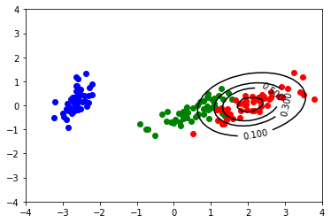

# Title
> summary


<h1>Table of Contents<span class="tocSkip"></span></h1>
<div class="toc"><ul class="toc-item"><li><span><a href="#mulearn" data-toc-modified-id="mulearn-1"><span class="toc-item-num">1&nbsp;&nbsp;</span>mulearn</a></span><ul class="toc-item"><li><span><a href="#Install" data-toc-modified-id="Install-1.1"><span class="toc-item-num">1.1&nbsp;&nbsp;</span>Install</a></span></li><li><span><a href="#How-to-use" data-toc-modified-id="How-to-use-1.2"><span class="toc-item-num">1.2&nbsp;&nbsp;</span>How to use</a></span></li></ul></li></ul></div>

```python
from mulearn import kernel, FuzzyInductor

from mulearn.fuzzifier import LinearFuzzifier
from mulearn.fuzzifier import ExponentialFuzzifier
from mulearn.kernel import GaussianKernel

from mulearn.optimization import solve_optimization_gurobi
from mulearn.optimization import solve_optimization_tensorflow
```

# mulearn

mulearn is a python package implementing the data-driven induction of fuzzy sets described in

- D. Malchiodi and W. Pedrycz, _Learning Membership Functions for Fuzzy Sets through Modified Support Vector Clustering_, in F. Masulli, G. Pasi e R. Yager (Eds.), Fuzzy Logic and Applications. 10th International Workshop, WILF 2013, Genoa, Italy, November 19–22, 2013. Proceedings., Vol. 8256, Springer International Publishing, Switzerland, Lecture Notes on Artificial Intelligence.

## Install

`pip install mulearn`

## How to use

Fill me in please! Don't forget code examples:

```python
%matplotlib inline
import matplotlib.pyplot as plt
import pandas as pd
import numpy as np
from sklearn.decomposition import PCA

source = 'https://archive.ics.uci.edu/ml/machine-learning-databases/iris/iris.data'

iris_df = pd.read_csv(source, header=None)
iris_df.columns=['sepal_length', 'sepal_width', 'petal_length', 'petal_width', 'class']

iris_values = iris_df.iloc[:,0:4].values
iris_labels = iris_df.iloc[:,4].values

pca_2d = PCA(n_components=2)
iris_values_2d = pca_2d.fit_transform(iris_values)
```

```python
def gr_dataset(): 
    for lab, col in zip(('Iris-setosa', 'Iris-versicolor', 'Iris-virginica'),
                        ('blue', 'green', 'red')):
        plt.scatter(iris_values_2d[iris_labels==lab, 0],
                    iris_values_2d[iris_labels==lab, 1],
                    label=lab,
                    c=col)

gr_dataset()
```


```python
def to_membership_values(labels, target):
    return [1 if l==target else 0 for l in labels]

mu = {}
for target in ('Iris-setosa', 'Iris-versicolor', 'Iris-virginica'):
    mu[target] = to_membership_values(iris_labels, target)
```

```python
def gr_membership_contour(estimated_membership):
    x = np.linspace(-4, 4, 50)
    y = np.linspace(-4, 4, 50)
    X, Y = np.meshgrid(x, y)
    zs = np.array([estimated_membership((x, y))
                   for x,y in zip(np.ravel(X), np.ravel(Y))])
    Z = zs.reshape(X.shape)
    membership_contour = plt.contour(X, Y, Z,
                                     levels=(.1, .3, .5, .95), colors='k')
    plt.clabel(membership_contour, inline=1)
    
```

```python
f = FuzzyInductor(fuzzifier=(LinearFuzzifier, {}))
f.fit(iris_values_2d, mu['Iris-virginica'])

gr_dataset()
gr_membership_contour(f.estimated_membership_)
plt.show()
```

    fitting 1, GaussianKernel(1), (<class 'mulearn.fuzzifier.LinearFuzzifier'>, {})


      0%|          | 0/100 [00:00<?, ?it/s]

    WARNING:tensorflow:From /home/malchiodi/anaconda3/lib/python3.7/site-packages/tensorflow_core/python/ops/math_grad.py:1430: where (from tensorflow.python.ops.array_ops) is deprecated and will be removed in a future version.
    Instructions for updating:
    Use tf.where in 2.0, which has the same broadcast rule as np.where


    100%|██████████| 100/100 [00:16<00:00,  5.94it/s]


```python
f = FuzzyInductor()
f.fit(iris_values_2d, mu['Iris-virginica'])
gr_dataset()
gr_membership_contour(f.estimated_membership_)
plt.show()
```

    fitting 1, GaussianKernel(1), (<class 'mulearn.fuzzifier.ExponentialFuzzifier'>, {})


    100%|██████████| 100/100 [00:18<00:00,  5.40it/s]





```python
f = FuzzyInductor(fuzzifier=(ExponentialFuzzifier,
                             {'profile': 'alpha', 'alpha': 0.25}))
f.fit(iris_values_2d, mu['Iris-virginica'])

gr_dataset()
gr_membership_contour(f.estimated_membership_)
plt.show()
```

    fitting 1, GaussianKernel(1), (<class 'mulearn.fuzzifier.ExponentialFuzzifier'>, {'profile': 'alpha', 'alpha': 0.25})


    100%|██████████| 100/100 [00:19<00:00,  5.12it/s]


```python
f = FuzzyInductor(k=GaussianKernel(.3))
f.fit(iris_values_2d, mu['Iris-virginica'])

gr_dataset()
gr_membership_contour(f.estimated_membership_)
plt.show()
```

    fitting 1, GaussianKernel(0.3), (<class 'mulearn.fuzzifier.ExponentialFuzzifier'>, {})


    100%|██████████| 100/100 [00:20<00:00,  4.92it/s]


```python
try:
    f = FuzzyInductor(solve_strategy=(solve_optimization_gurobi, {}))
    f.fit(iris_values_2d, mu['Iris-virginica'])

    gr_dataset()
    gr_membership_contour(f.estimated_membership_)
    plt.show()
except (ModuleNotFoundError, ValueError):
    print('Gurobi not available')
```

    fitting 1, GaussianKernel(1), (<class 'mulearn.fuzzifier.ExponentialFuzzifier'>, {})
    Academic license - for non-commercial use only


```python
f = FuzzyInductor(fuzzifier=(ExponentialFuzzifier,
                             {'profile': 'alpha', 'alpha': 0.15}),
                  k=GaussianKernel(1.5),
                  solve_strategy=(solve_optimization_tensorflow,
                                  {'n_iter': 20}),
                  return_profile=True)
f.fit(iris_values_2d, mu['Iris-virginica'])

gr_dataset()
gr_membership_contour(f.estimated_membership_)
plt.show()
```

    fitting 1, GaussianKernel(1.5), (<class 'mulearn.fuzzifier.ExponentialFuzzifier'>, {'profile': 'alpha', 'alpha': 0.15})


    100%|██████████| 20/20 [00:04<00:00,  4.37it/s]


```python
plt.plot(f.profile_[0], mu['Iris-virginica'], '.')
plt.plot(f.profile_[1], f.profile_[2])
plt.ylim((-0.1, 1.1))
plt.show()
```


```python
sigmas = [.225,.5]
parameters = {'c': [1,10,100],
              'k': [GaussianKernel(i) for i in sigmas]}
```

```python
from sklearn.model_selection import GridSearchCV

f = FuzzyInductor()

virginica = GridSearchCV(f, param_grid=parameters, cv=2)
virginica.fit(iris_values_2d, mu['Iris-virginica'])
```

    
      0%|          | 0/100 [00:00<?, ?it/s]

    fitting 1, GaussianKernel(0.225), (<class 'mulearn.fuzzifier.ExponentialFuzzifier'>, {})


    
      1%|          | 1/100 [00:00<00:22,  4.36it/s]
      3%|▎         | 3/100 [00:00<00:18,  5.35it/s]
      5%|▌         | 5/100 [00:00<00:14,  6.38it/s]
      7%|▋         | 7/100 [00:00<00:12,  7.38it/s]
      9%|▉         | 9/100 [00:00<00:11,  8.16it/s]
     10%|█         | 10/100 [00:01<00:11,  7.96it/s]
     11%|█         | 11/100 [00:01<00:10,  8.47it/s]
     13%|█▎        | 13/100 [00:01<00:09,  9.15it/s]
     15%|█▌        | 15/100 [00:01<00:08,  9.80it/s]
     17%|█▋        | 17/100 [00:01<00:08, 10.26it/s]
     19%|█▉        | 19/100 [00:01<00:07, 10.64it/s]
     21%|██        | 21/100 [00:02<00:07, 10.82it/s]
     23%|██▎       | 23/100 [00:02<00:06, 11.01it/s]
     25%|██▌       | 25/100 [00:02<00:06, 11.10it/s]
     27%|██▋       | 27/100 [00:02<00:06, 11.21it/s]
     29%|██▉       | 29/100 [00:02<00:06, 11.26it/s]
     31%|███       | 31/100 [00:02<00:06, 11.23it/s]
     33%|███▎      | 33/100 [00:03<00:05, 11.32it/s]
     35%|███▌      | 35/100 [00:03<00:05, 11.33it/s]
     37%|███▋      | 37/100 [00:03<00:05, 11.32it/s]
     39%|███▉      | 39/100 [00:03<00:05, 11.29it/s]
     41%|████      | 41/100 [00:03<00:05, 11.30it/s]
     43%|████▎     | 43/100 [00:03<00:05, 11.18it/s]
     45%|████▌     | 45/100 [00:04<00:04, 11.14it/s]
     47%|████▋     | 47/100 [00:04<00:04, 11.14it/s]
     49%|████▉     | 49/100 [00:04<00:04, 11.32it/s]
     51%|█████     | 51/100 [00:04<00:04, 11.46it/s]
     53%|█████▎    | 53/100 [00:04<00:04, 11.38it/s]
     55%|█████▌    | 55/100 [00:05<00:03, 11.39it/s]
     57%|█████▋    | 57/100 [00:05<00:03, 11.51it/s]
     59%|█████▉    | 59/100 [00:05<00:03, 11.56it/s]
     61%|██████    | 61/100 [00:05<00:03, 11.57it/s]
     63%|██████▎   | 63/100 [00:05<00:03, 11.60it/s]
     65%|██████▌   | 65/100 [00:05<00:03, 11.58it/s]
     67%|██████▋   | 67/100 [00:06<00:02, 11.58it/s]
     69%|██████▉   | 69/100 [00:06<00:02, 11.38it/s]
     71%|███████   | 71/100 [00:06<00:02, 11.28it/s]
     73%|███████▎  | 73/100 [00:06<00:02, 11.18it/s]
     75%|███████▌  | 75/100 [00:06<00:02, 11.23it/s]
     77%|███████▋  | 77/100 [00:06<00:02, 11.01it/s]
     79%|███████▉  | 79/100 [00:07<00:01, 11.05it/s]
     81%|████████  | 81/100 [00:07<00:01, 11.03it/s]
     83%|████████▎ | 83/100 [00:07<00:01, 11.09it/s]
     85%|████████▌ | 85/100 [00:07<00:01, 11.18it/s]
     87%|████████▋ | 87/100 [00:07<00:01, 10.99it/s]
     89%|████████▉ | 89/100 [00:08<00:01,  9.75it/s]
     91%|█████████ | 91/100 [00:08<00:00, 10.00it/s]
     93%|█████████▎| 93/100 [00:08<00:00, 10.29it/s]
     95%|█████████▌| 95/100 [00:08<00:00, 10.39it/s]
     97%|█████████▋| 97/100 [00:08<00:00, 10.22it/s]
    100%|██████████| 100/100 [00:09<00:00, 10.89it/s][A
    
      0%|          | 0/100 [00:00<?, ?it/s]

    fitting 1, GaussianKernel(0.225), (<class 'mulearn.fuzzifier.ExponentialFuzzifier'>, {})


    
      1%|          | 1/100 [00:00<00:25,  3.91it/s]
      2%|▏         | 2/100 [00:00<00:21,  4.57it/s]
      3%|▎         | 3/100 [00:00<00:18,  5.21it/s]
      4%|▍         | 4/100 [00:00<00:15,  6.01it/s]
      6%|▌         | 6/100 [00:00<00:13,  6.78it/s]
      7%|▋         | 7/100 [00:00<00:13,  6.87it/s]
      9%|▉         | 9/100 [00:01<00:11,  7.72it/s]
     11%|█         | 11/100 [00:01<00:10,  8.46it/s]
     12%|█▏        | 12/100 [00:01<00:10,  8.77it/s]
     13%|█▎        | 13/100 [00:01<00:10,  8.30it/s]
     14%|█▍        | 14/100 [00:01<00:10,  8.23it/s]
     16%|█▌        | 16/100 [00:01<00:09,  8.95it/s]
     18%|█▊        | 18/100 [00:02<00:08,  9.56it/s]
     20%|██        | 20/100 [00:02<00:07, 10.02it/s]
     22%|██▏       | 22/100 [00:02<00:07, 10.37it/s]
     24%|██▍       | 24/100 [00:02<00:07, 10.52it/s]
     26%|██▌       | 26/100 [00:02<00:06, 10.68it/s]
     28%|██▊       | 28/100 [00:02<00:06, 10.84it/s]
     30%|███       | 30/100 [00:03<00:06, 10.92it/s]
     32%|███▏      | 32/100 [00:03<00:06, 10.83it/s]
     34%|███▍      | 34/100 [00:03<00:06, 10.78it/s]
     36%|███▌      | 36/100 [00:03<00:06, 10.42it/s]
     38%|███▊      | 38/100 [00:03<00:06,  9.81it/s]
     40%|████      | 40/100 [00:04<00:05, 10.10it/s]
     42%|████▏     | 42/100 [00:04<00:05, 10.27it/s]
     44%|████▍     | 44/100 [00:04<00:05, 10.35it/s]
     46%|████▌     | 46/100 [00:04<00:05, 10.55it/s]
     48%|████▊     | 48/100 [00:04<00:04, 10.59it/s]
     50%|█████     | 50/100 [00:05<00:04, 10.59it/s]
     52%|█████▏    | 52/100 [00:05<00:04, 10.55it/s]
     54%|█████▍    | 54/100 [00:05<00:04, 10.65it/s]
     56%|█████▌    | 56/100 [00:05<00:04, 10.49it/s]
     58%|█████▊    | 58/100 [00:05<00:03, 10.59it/s]
     60%|██████    | 60/100 [00:05<00:03, 10.83it/s]
     62%|██████▏   | 62/100 [00:06<00:03, 10.92it/s]
     64%|██████▍   | 64/100 [00:06<00:03, 10.90it/s]
     66%|██████▌   | 66/100 [00:06<00:03, 10.80it/s]
     68%|██████▊   | 68/100 [00:06<00:02, 10.72it/s]
     70%|███████   | 70/100 [00:06<00:02, 10.78it/s]
     72%|███████▏  | 72/100 [00:07<00:02, 10.83it/s]
     74%|███████▍  | 74/100 [00:07<00:02, 10.87it/s]
     76%|███████▌  | 76/100 [00:07<00:02, 10.86it/s]
     78%|███████▊  | 78/100 [00:07<00:02,  9.33it/s]
     80%|████████  | 80/100 [00:07<00:02,  9.86it/s]
     82%|████████▏ | 82/100 [00:08<00:01, 10.04it/s]
     84%|████████▍ | 84/100 [00:08<00:01, 10.25it/s]
     86%|████████▌ | 86/100 [00:08<00:01, 10.44it/s]
     88%|████████▊ | 88/100 [00:08<00:01, 10.57it/s]
     90%|█████████ | 90/100 [00:08<00:00, 10.63it/s]
     92%|█████████▏| 92/100 [00:09<00:00, 10.71it/s]
     94%|█████████▍| 94/100 [00:09<00:00, 10.71it/s]
     96%|█████████▌| 96/100 [00:09<00:00, 10.76it/s]
     98%|█████████▊| 98/100 [00:09<00:00, 10.82it/s]
    100%|██████████| 100/100 [00:09<00:00, 10.22it/s]
    /home/malchiodi/repo/web/mulearn/mulearn/__init__.py:98: UserWarning: No support vectors found
      warn('No support vectors found')
    /home/malchiodi/anaconda3/lib/python3.7/site-packages/sklearn/model_selection/_validation.py:536: FitFailedWarning: Estimator fit failed. The score on this train-test partition for these parameters will be set to nan. Details: 
    TypeError: 'NoneType' object is not callable
    
      FitFailedWarning)
    
      0%|          | 0/100 [00:00<?, ?it/s]

    fitting 1, GaussianKernel(0.5), (<class 'mulearn.fuzzifier.ExponentialFuzzifier'>, {})


    
      1%|          | 1/100 [00:00<00:23,  4.15it/s]
      3%|▎         | 3/100 [00:00<00:19,  5.10it/s]
      5%|▌         | 5/100 [00:00<00:15,  6.12it/s]
      7%|▋         | 7/100 [00:00<00:13,  7.08it/s]
      9%|▉         | 9/100 [00:00<00:11,  7.95it/s]
     11%|█         | 11/100 [00:01<00:10,  8.75it/s]
     13%|█▎        | 13/100 [00:01<00:09,  9.15it/s]
     15%|█▌        | 15/100 [00:01<00:08,  9.61it/s]
     17%|█▋        | 17/100 [00:01<00:08,  9.93it/s]
     19%|█▉        | 19/100 [00:01<00:07, 10.30it/s]
     21%|██        | 21/100 [00:02<00:07, 10.57it/s]
     23%|██▎       | 23/100 [00:02<00:07, 10.71it/s]
     25%|██▌       | 25/100 [00:02<00:06, 10.78it/s]
     27%|██▋       | 27/100 [00:02<00:06, 10.85it/s]
     29%|██▉       | 29/100 [00:02<00:06, 10.89it/s]
     31%|███       | 31/100 [00:02<00:06, 10.94it/s]
     33%|███▎      | 33/100 [00:03<00:06, 10.99it/s]
     35%|███▌      | 35/100 [00:03<00:05, 10.99it/s]
     37%|███▋      | 37/100 [00:03<00:05, 11.08it/s]
     39%|███▉      | 39/100 [00:03<00:05, 10.99it/s]
     41%|████      | 41/100 [00:03<00:05, 10.93it/s]
     43%|████▎     | 43/100 [00:04<00:05, 10.71it/s]
     45%|████▌     | 45/100 [00:04<00:05, 10.72it/s]
     47%|████▋     | 47/100 [00:04<00:04, 10.78it/s]
     49%|████▉     | 49/100 [00:04<00:04, 10.83it/s]
     51%|█████     | 51/100 [00:04<00:04, 10.88it/s]
     53%|█████▎    | 53/100 [00:04<00:04, 10.98it/s]
     55%|█████▌    | 55/100 [00:05<00:04, 11.07it/s]
     57%|█████▋    | 57/100 [00:05<00:03, 10.93it/s]
     59%|█████▉    | 59/100 [00:05<00:03, 10.94it/s]
     61%|██████    | 61/100 [00:05<00:03, 10.96it/s]
     63%|██████▎   | 63/100 [00:05<00:03, 10.95it/s]
     65%|██████▌   | 65/100 [00:06<00:03, 10.95it/s]
     67%|██████▋   | 67/100 [00:06<00:03, 10.88it/s]
     69%|██████▉   | 69/100 [00:06<00:02, 10.91it/s]
     71%|███████   | 71/100 [00:06<00:02, 10.93it/s]
     73%|███████▎  | 73/100 [00:06<00:02, 10.95it/s]
     75%|███████▌  | 75/100 [00:06<00:02, 10.94it/s]
     77%|███████▋  | 77/100 [00:07<00:02, 11.04it/s]
     79%|███████▉  | 79/100 [00:07<00:01, 11.17it/s]
     81%|████████  | 81/100 [00:07<00:01, 11.17it/s]
     83%|████████▎ | 83/100 [00:07<00:01, 11.23it/s]
     85%|████████▌ | 85/100 [00:07<00:01, 11.18it/s]
     87%|████████▋ | 87/100 [00:08<00:01, 11.09it/s]
     89%|████████▉ | 89/100 [00:08<00:00, 11.01it/s]
     91%|█████████ | 91/100 [00:08<00:00, 11.13it/s]
     93%|█████████▎| 93/100 [00:08<00:00, 11.19it/s]
     95%|█████████▌| 95/100 [00:08<00:00, 11.23it/s]
     97%|█████████▋| 97/100 [00:08<00:00, 11.27it/s]
    100%|██████████| 100/100 [00:09<00:00, 10.85it/s][A
    
      0%|          | 0/100 [00:00<?, ?it/s]

    fitting 1, GaussianKernel(0.5), (<class 'mulearn.fuzzifier.ExponentialFuzzifier'>, {})


    
      1%|          | 1/100 [00:00<00:22,  4.36it/s]
      3%|▎         | 3/100 [00:00<00:18,  5.35it/s]
      5%|▌         | 5/100 [00:00<00:15,  6.29it/s]
      7%|▋         | 7/100 [00:00<00:12,  7.23it/s]
      9%|▉         | 9/100 [00:00<00:11,  8.03it/s]
     11%|█         | 11/100 [00:01<00:10,  8.71it/s]
     13%|█▎        | 13/100 [00:01<00:09,  9.24it/s]
     15%|█▌        | 15/100 [00:01<00:08,  9.64it/s]
     17%|█▋        | 17/100 [00:01<00:08, 10.15it/s]
     19%|█▉        | 19/100 [00:01<00:07, 10.42it/s]
     21%|██        | 21/100 [00:02<00:07, 10.58it/s]
     23%|██▎       | 23/100 [00:02<00:07, 10.68it/s]
     25%|██▌       | 25/100 [00:02<00:06, 10.75it/s]
     27%|██▋       | 27/100 [00:02<00:06, 10.69it/s]
     29%|██▉       | 29/100 [00:02<00:06, 10.83it/s]
     31%|███       | 31/100 [00:02<00:06, 11.01it/s]
     33%|███▎      | 33/100 [00:03<00:06, 11.06it/s]
     35%|███▌      | 35/100 [00:03<00:05, 11.06it/s]
     37%|███▋      | 37/100 [00:03<00:05, 11.04it/s]
     39%|███▉      | 39/100 [00:03<00:05, 10.98it/s]
     41%|████      | 41/100 [00:03<00:05, 11.12it/s]
     43%|████▎     | 43/100 [00:04<00:05, 11.21it/s]
     45%|████▌     | 45/100 [00:04<00:04, 11.27it/s]
     47%|████▋     | 47/100 [00:04<00:04, 11.32it/s]
     49%|████▉     | 49/100 [00:04<00:04, 11.33it/s]
     51%|█████     | 51/100 [00:04<00:04, 11.35it/s]
     53%|█████▎    | 53/100 [00:04<00:04, 11.15it/s]
     55%|█████▌    | 55/100 [00:05<00:04, 11.08it/s]
     57%|█████▋    | 57/100 [00:05<00:03, 10.94it/s]
     59%|█████▉    | 59/100 [00:05<00:03, 10.91it/s]
     61%|██████    | 61/100 [00:05<00:03, 10.87it/s]
     63%|██████▎   | 63/100 [00:05<00:03, 10.86it/s]
     65%|██████▌   | 65/100 [00:06<00:03, 10.98it/s]
     67%|██████▋   | 67/100 [00:06<00:03, 10.95it/s]
     69%|██████▉   | 69/100 [00:06<00:02, 10.91it/s]
     71%|███████   | 71/100 [00:06<00:02, 10.97it/s]
     73%|███████▎  | 73/100 [00:06<00:02, 10.91it/s]
     75%|███████▌  | 75/100 [00:06<00:02, 10.89it/s]
     77%|███████▋  | 77/100 [00:07<00:02, 10.91it/s]
     79%|███████▉  | 79/100 [00:07<00:01, 10.88it/s]
     81%|████████  | 81/100 [00:07<00:01, 10.99it/s]
     83%|████████▎ | 83/100 [00:07<00:01, 11.00it/s]
     85%|████████▌ | 85/100 [00:07<00:01, 11.05it/s]
     87%|████████▋ | 87/100 [00:08<00:01, 11.09it/s]
     89%|████████▉ | 89/100 [00:08<00:00, 11.10it/s]
     91%|█████████ | 91/100 [00:08<00:00, 11.13it/s]
     93%|█████████▎| 93/100 [00:08<00:00, 11.15it/s]
     95%|█████████▌| 95/100 [00:08<00:00, 11.20it/s]
     97%|█████████▋| 97/100 [00:08<00:00, 11.21it/s]
    100%|██████████| 100/100 [00:09<00:00, 10.88it/s][A
    /home/malchiodi/repo/web/mulearn/mulearn/__init__.py:98: UserWarning: No support vectors found
      warn('No support vectors found')
    /home/malchiodi/anaconda3/lib/python3.7/site-packages/sklearn/model_selection/_validation.py:536: FitFailedWarning: Estimator fit failed. The score on this train-test partition for these parameters will be set to nan. Details: 
    TypeError: 'NoneType' object is not callable
    
      FitFailedWarning)
    
      0%|          | 0/100 [00:00<?, ?it/s]

    fitting 10, GaussianKernel(0.225), (<class 'mulearn.fuzzifier.ExponentialFuzzifier'>, {})


    
      1%|          | 1/100 [00:00<00:24,  4.02it/s]
      2%|▏         | 2/100 [00:00<00:20,  4.89it/s]
      4%|▍         | 4/100 [00:00<00:16,  5.84it/s]
      5%|▌         | 5/100 [00:00<00:14,  6.39it/s]
      7%|▋         | 7/100 [00:00<00:12,  7.29it/s]
      9%|▉         | 9/100 [00:01<00:11,  8.09it/s]
     11%|█         | 11/100 [00:01<00:10,  8.75it/s]
     13%|█▎        | 13/100 [00:01<00:09,  9.29it/s]
     15%|█▌        | 15/100 [00:01<00:08,  9.69it/s]
     17%|█▋        | 17/100 [00:01<00:08, 10.00it/s]
     19%|█▉        | 19/100 [00:01<00:07, 10.24it/s]
     21%|██        | 21/100 [00:02<00:07, 10.38it/s]
     23%|██▎       | 23/100 [00:02<00:07, 10.52it/s]
     25%|██▌       | 25/100 [00:02<00:07, 10.63it/s]
     27%|██▋       | 27/100 [00:02<00:06, 10.74it/s]
     29%|██▉       | 29/100 [00:02<00:06, 10.79it/s]
     31%|███       | 31/100 [00:03<00:06, 10.84it/s]
     33%|███▎      | 33/100 [00:03<00:06, 10.84it/s]
     35%|███▌      | 35/100 [00:03<00:06,  9.32it/s]
     37%|███▋      | 37/100 [00:03<00:06,  9.74it/s]
     39%|███▉      | 39/100 [00:03<00:06, 10.07it/s]
     41%|████      | 41/100 [00:04<00:05, 10.28it/s]
     43%|████▎     | 43/100 [00:04<00:05, 10.42it/s]
     45%|████▌     | 45/100 [00:04<00:05, 10.58it/s]
     47%|████▋     | 47/100 [00:04<00:04, 10.68it/s]
     49%|████▉     | 49/100 [00:04<00:04, 10.76it/s]
     51%|█████     | 51/100 [00:04<00:04, 10.84it/s]
     53%|█████▎    | 53/100 [00:05<00:04, 10.95it/s]
     55%|█████▌    | 55/100 [00:05<00:04, 11.03it/s]
     57%|█████▋    | 57/100 [00:05<00:03, 11.08it/s]
     59%|█████▉    | 59/100 [00:05<00:03, 11.01it/s]
     61%|██████    | 61/100 [00:05<00:03, 10.92it/s]
     63%|██████▎   | 63/100 [00:06<00:03, 10.87it/s]
     65%|██████▌   | 65/100 [00:06<00:03, 10.77it/s]
     67%|██████▋   | 67/100 [00:06<00:03, 10.75it/s]
     69%|██████▉   | 69/100 [00:06<00:02, 10.78it/s]
     71%|███████   | 71/100 [00:06<00:02, 11.04it/s]
     73%|███████▎  | 73/100 [00:07<00:02, 10.93it/s]
     75%|███████▌  | 75/100 [00:07<00:02, 10.90it/s]
     77%|███████▋  | 77/100 [00:07<00:02, 10.90it/s]
     79%|███████▉  | 79/100 [00:07<00:01, 10.90it/s]
     81%|████████  | 81/100 [00:07<00:01, 10.90it/s]
     83%|████████▎ | 83/100 [00:07<00:01, 10.90it/s]
     85%|████████▌ | 85/100 [00:08<00:01, 10.89it/s]
     87%|████████▋ | 87/100 [00:08<00:01, 10.80it/s]
     89%|████████▉ | 89/100 [00:08<00:01, 10.85it/s]
     91%|█████████ | 91/100 [00:08<00:00, 10.89it/s]
     93%|█████████▎| 93/100 [00:08<00:00, 10.92it/s]
     95%|█████████▌| 95/100 [00:09<00:00, 10.93it/s]
     97%|█████████▋| 97/100 [00:09<00:00, 10.90it/s]
    100%|██████████| 100/100 [00:09<00:00, 10.54it/s][A
    
      0%|          | 0/100 [00:00<?, ?it/s]

    fitting 10, GaussianKernel(0.225), (<class 'mulearn.fuzzifier.ExponentialFuzzifier'>, {})


    
      1%|          | 1/100 [00:00<00:23,  4.14it/s]
      3%|▎         | 3/100 [00:00<00:19,  5.09it/s]
      5%|▌         | 5/100 [00:00<00:15,  6.12it/s]
      7%|▋         | 7/100 [00:00<00:13,  7.08it/s]
      9%|▉         | 9/100 [00:00<00:11,  7.94it/s]
     11%|█         | 11/100 [00:01<00:10,  8.62it/s]
     13%|█▎        | 13/100 [00:01<00:09,  9.20it/s]
     15%|█▌        | 15/100 [00:01<00:08,  9.64it/s]
     17%|█▋        | 17/100 [00:01<00:08,  9.97it/s]
     19%|█▉        | 19/100 [00:01<00:07, 10.22it/s]
     21%|██        | 21/100 [00:02<00:07, 10.41it/s]
     23%|██▎       | 23/100 [00:02<00:07, 10.53it/s]
     25%|██▌       | 25/100 [00:02<00:07, 10.66it/s]
     27%|██▋       | 27/100 [00:02<00:06, 10.73it/s]
     29%|██▉       | 29/100 [00:02<00:06, 10.77it/s]
     31%|███       | 31/100 [00:02<00:06, 10.94it/s]
     33%|███▎      | 33/100 [00:03<00:06, 10.98it/s]
     35%|███▌      | 35/100 [00:03<00:05, 11.00it/s]
     37%|███▋      | 37/100 [00:03<00:05, 11.05it/s]
     39%|███▉      | 39/100 [00:03<00:05, 11.18it/s]
     41%|████      | 41/100 [00:03<00:05, 11.26it/s]
     43%|████▎     | 43/100 [00:04<00:05, 11.28it/s]
     45%|████▌     | 45/100 [00:04<00:04, 11.18it/s]
     47%|████▋     | 47/100 [00:04<00:04, 11.11it/s]
     49%|████▉     | 49/100 [00:04<00:04, 11.03it/s]
     51%|█████     | 51/100 [00:04<00:04, 10.95it/s]
     53%|█████▎    | 53/100 [00:04<00:04, 10.93it/s]
     55%|█████▌    | 55/100 [00:05<00:04, 10.87it/s]
     57%|█████▋    | 57/100 [00:05<00:03, 10.88it/s]
     59%|█████▉    | 59/100 [00:05<00:03, 11.02it/s]
     61%|██████    | 61/100 [00:05<00:03, 11.09it/s]
     63%|██████▎   | 63/100 [00:05<00:03, 11.11it/s]
     65%|██████▌   | 65/100 [00:06<00:03, 11.13it/s]
     67%|██████▋   | 67/100 [00:06<00:02, 11.02it/s]
     69%|██████▉   | 69/100 [00:06<00:02, 10.96it/s]
     71%|███████   | 71/100 [00:06<00:02, 11.00it/s]
     73%|███████▎  | 73/100 [00:06<00:02, 11.02it/s]
     75%|███████▌  | 75/100 [00:06<00:02, 11.03it/s]
     77%|███████▋  | 77/100 [00:07<00:02, 10.97it/s]
     79%|███████▉  | 79/100 [00:07<00:01, 10.85it/s]
     81%|████████  | 81/100 [00:07<00:01, 10.90it/s]
     83%|████████▎ | 83/100 [00:07<00:01, 10.94it/s]
     85%|████████▌ | 85/100 [00:07<00:01, 10.91it/s]
     87%|████████▋ | 87/100 [00:08<00:01, 10.90it/s]
     89%|████████▉ | 89/100 [00:08<00:01, 10.86it/s]
     91%|█████████ | 91/100 [00:08<00:00, 10.89it/s]
     93%|█████████▎| 93/100 [00:08<00:00, 10.91it/s]
     95%|█████████▌| 95/100 [00:08<00:00, 10.95it/s]
     97%|█████████▋| 97/100 [00:08<00:00, 10.97it/s]
    100%|██████████| 100/100 [00:09<00:00, 10.80it/s][A
    /home/malchiodi/repo/web/mulearn/mulearn/__init__.py:98: UserWarning: No support vectors found
      warn('No support vectors found')
    /home/malchiodi/anaconda3/lib/python3.7/site-packages/sklearn/model_selection/_validation.py:536: FitFailedWarning: Estimator fit failed. The score on this train-test partition for these parameters will be set to nan. Details: 
    TypeError: 'NoneType' object is not callable
    
      FitFailedWarning)
    
      0%|          | 0/100 [00:00<?, ?it/s]

    fitting 10, GaussianKernel(0.5), (<class 'mulearn.fuzzifier.ExponentialFuzzifier'>, {})


    
      1%|          | 1/100 [00:00<00:23,  4.25it/s]
      3%|▎         | 3/100 [00:00<00:18,  5.22it/s]
      5%|▌         | 5/100 [00:00<00:15,  6.17it/s]
      7%|▋         | 7/100 [00:00<00:12,  7.16it/s]
      9%|▉         | 9/100 [00:00<00:11,  8.05it/s]
     11%|█         | 11/100 [00:01<00:10,  8.81it/s]
     13%|█▎        | 13/100 [00:01<00:09,  9.44it/s]
     15%|█▌        | 15/100 [00:01<00:08,  9.94it/s]
     17%|█▋        | 17/100 [00:01<00:08, 10.29it/s]
     19%|█▉        | 19/100 [00:01<00:07, 10.55it/s]
     21%|██        | 21/100 [00:02<00:07, 10.78it/s]
     23%|██▎       | 23/100 [00:02<00:07, 10.95it/s]
     25%|██▌       | 25/100 [00:02<00:06, 11.10it/s]
     27%|██▋       | 27/100 [00:02<00:06, 11.15it/s]
     29%|██▉       | 29/100 [00:02<00:06, 11.07it/s]
     31%|███       | 31/100 [00:02<00:06, 11.04it/s]
     33%|███▎      | 33/100 [00:03<00:06, 11.01it/s]
     35%|███▌      | 35/100 [00:03<00:05, 11.03it/s]
     37%|███▋      | 37/100 [00:03<00:05, 11.10it/s]
     39%|███▉      | 39/100 [00:03<00:05, 11.01it/s]
     41%|████      | 41/100 [00:03<00:05, 10.93it/s]
     43%|████▎     | 43/100 [00:04<00:05, 10.91it/s]
     45%|████▌     | 45/100 [00:04<00:05, 10.87it/s]
     47%|████▋     | 47/100 [00:04<00:04, 11.13it/s]
     49%|████▉     | 49/100 [00:04<00:04, 11.15it/s]
     51%|█████     | 51/100 [00:04<00:04, 11.09it/s]
     53%|█████▎    | 53/100 [00:04<00:04, 11.10it/s]
     55%|█████▌    | 55/100 [00:05<00:04, 10.90it/s]
     57%|█████▋    | 57/100 [00:05<00:03, 10.78it/s]
     59%|█████▉    | 59/100 [00:05<00:03, 10.65it/s]
     61%|██████    | 61/100 [00:05<00:03, 10.48it/s]
     63%|██████▎   | 63/100 [00:05<00:03, 10.64it/s]
     65%|██████▌   | 65/100 [00:06<00:03, 10.70it/s]
     67%|██████▋   | 67/100 [00:06<00:03, 10.79it/s]
     69%|██████▉   | 69/100 [00:06<00:02, 10.82it/s]
     71%|███████   | 71/100 [00:06<00:02, 10.86it/s]
     73%|███████▎  | 73/100 [00:06<00:02, 10.84it/s]
     75%|███████▌  | 75/100 [00:06<00:02, 10.90it/s]
     77%|███████▋  | 77/100 [00:07<00:02, 10.90it/s]
     79%|███████▉  | 79/100 [00:07<00:01, 10.85it/s]
     81%|████████  | 81/100 [00:07<00:01, 10.56it/s]
     83%|████████▎ | 83/100 [00:07<00:01, 10.60it/s]
     85%|████████▌ | 85/100 [00:07<00:01, 10.69it/s]
     87%|████████▋ | 87/100 [00:08<00:01, 10.89it/s]
     89%|████████▉ | 89/100 [00:08<00:01, 10.97it/s]
     91%|█████████ | 91/100 [00:08<00:00, 10.91it/s]
     93%|█████████▎| 93/100 [00:08<00:00, 10.87it/s]
     95%|█████████▌| 95/100 [00:08<00:00, 10.82it/s]
     97%|█████████▋| 97/100 [00:08<00:00, 10.86it/s]
    100%|██████████| 100/100 [00:09<00:00, 10.79it/s][A
    
      0%|          | 0/100 [00:00<?, ?it/s]

    fitting 10, GaussianKernel(0.5), (<class 'mulearn.fuzzifier.ExponentialFuzzifier'>, {})


    
      1%|          | 1/100 [00:00<00:22,  4.40it/s]
      3%|▎         | 3/100 [00:00<00:17,  5.39it/s]
      5%|▌         | 5/100 [00:00<00:14,  6.40it/s]
      7%|▋         | 7/100 [00:00<00:12,  7.35it/s]
      9%|▉         | 9/100 [00:00<00:11,  8.21it/s]
     11%|█         | 11/100 [00:01<00:09,  8.95it/s]
     12%|█▏        | 12/100 [00:01<00:12,  7.27it/s]
     14%|█▍        | 14/100 [00:01<00:10,  8.13it/s]
     16%|█▌        | 16/100 [00:01<00:09,  8.80it/s]
     18%|█▊        | 18/100 [00:01<00:08,  9.27it/s]
     19%|█▉        | 19/100 [00:01<00:08,  9.43it/s]
     21%|██        | 21/100 [00:02<00:08,  9.83it/s]
     23%|██▎       | 23/100 [00:02<00:07, 10.15it/s]
     25%|██▌       | 25/100 [00:02<00:07, 10.36it/s]
     27%|██▋       | 27/100 [00:02<00:06, 10.53it/s]
     29%|██▉       | 29/100 [00:02<00:06, 10.64it/s]
     31%|███       | 31/100 [00:03<00:06, 10.68it/s]
     33%|███▎      | 33/100 [00:03<00:06, 10.61it/s]
     35%|███▌      | 35/100 [00:03<00:06, 10.68it/s]
     37%|███▋      | 37/100 [00:03<00:05, 10.74it/s]
     39%|███▉      | 39/100 [00:03<00:05, 10.77it/s]
     41%|████      | 41/100 [00:04<00:05, 10.61it/s]
     43%|████▎     | 43/100 [00:04<00:05, 10.66it/s]
     45%|████▌     | 45/100 [00:04<00:05, 10.74it/s]
     47%|████▋     | 47/100 [00:04<00:04, 10.77it/s]
     49%|████▉     | 49/100 [00:04<00:04, 10.80it/s]
     51%|█████     | 51/100 [00:04<00:04, 10.88it/s]
     53%|█████▎    | 53/100 [00:05<00:04, 10.85it/s]
     55%|█████▌    | 55/100 [00:05<00:04, 10.83it/s]
     57%|█████▋    | 57/100 [00:05<00:03, 10.83it/s]
     59%|█████▉    | 59/100 [00:05<00:03, 10.80it/s]
     61%|██████    | 61/100 [00:05<00:03, 10.76it/s]
     63%|██████▎   | 63/100 [00:06<00:03, 10.64it/s]
     65%|██████▌   | 65/100 [00:06<00:03, 10.58it/s]
     67%|██████▋   | 67/100 [00:06<00:03, 10.66it/s]
     69%|██████▉   | 69/100 [00:06<00:02, 10.71it/s]
     71%|███████   | 71/100 [00:06<00:02, 10.77it/s]
     73%|███████▎  | 73/100 [00:06<00:02, 10.70it/s]
     75%|███████▌  | 75/100 [00:07<00:02, 10.73it/s]
     77%|███████▋  | 77/100 [00:07<00:02, 10.75it/s]
     79%|███████▉  | 79/100 [00:07<00:01, 10.78it/s]
     81%|████████  | 81/100 [00:07<00:01, 10.79it/s]
     83%|████████▎ | 83/100 [00:07<00:01, 10.75it/s]
     85%|████████▌ | 85/100 [00:08<00:01, 10.81it/s]
     87%|████████▋ | 87/100 [00:08<00:01, 10.91it/s]
     89%|████████▉ | 89/100 [00:08<00:01, 10.99it/s]
     91%|█████████ | 91/100 [00:08<00:00, 11.00it/s]
     93%|█████████▎| 93/100 [00:08<00:00, 11.06it/s]
     95%|█████████▌| 95/100 [00:08<00:00, 11.03it/s]
     97%|█████████▋| 97/100 [00:09<00:00, 11.05it/s]
    100%|██████████| 100/100 [00:09<00:00, 10.60it/s][A
    /home/malchiodi/repo/web/mulearn/mulearn/__init__.py:98: UserWarning: No support vectors found
      warn('No support vectors found')
    /home/malchiodi/anaconda3/lib/python3.7/site-packages/sklearn/model_selection/_validation.py:536: FitFailedWarning: Estimator fit failed. The score on this train-test partition for these parameters will be set to nan. Details: 
    TypeError: 'NoneType' object is not callable
    
      FitFailedWarning)
    
      0%|          | 0/100 [00:00<?, ?it/s]

    fitting 100, GaussianKernel(0.225), (<class 'mulearn.fuzzifier.ExponentialFuzzifier'>, {})


    
      1%|          | 1/100 [00:00<00:23,  4.18it/s]
      3%|▎         | 3/100 [00:00<00:18,  5.11it/s]
      5%|▌         | 5/100 [00:00<00:15,  6.13it/s]
      7%|▋         | 7/100 [00:00<00:13,  7.12it/s]
      9%|▉         | 9/100 [00:00<00:11,  8.02it/s]
     11%|█         | 11/100 [00:01<00:10,  8.80it/s]
     13%|█▎        | 13/100 [00:01<00:09,  9.30it/s]
     15%|█▌        | 15/100 [00:01<00:08,  9.85it/s]
     17%|█▋        | 17/100 [00:01<00:08, 10.29it/s]
     19%|█▉        | 19/100 [00:01<00:07, 10.59it/s]
     21%|██        | 21/100 [00:02<00:07, 10.75it/s]
     23%|██▎       | 23/100 [00:02<00:07, 10.82it/s]
     25%|██▌       | 25/100 [00:02<00:06, 10.81it/s]
     27%|██▋       | 27/100 [00:02<00:06, 10.83it/s]
     29%|██▉       | 29/100 [00:02<00:06, 10.86it/s]
     31%|███       | 31/100 [00:02<00:06, 10.87it/s]
     33%|███▎      | 33/100 [00:03<00:06, 10.87it/s]
     35%|███▌      | 35/100 [00:03<00:05, 10.86it/s]
     37%|███▋      | 37/100 [00:03<00:05, 10.86it/s]
     39%|███▉      | 39/100 [00:03<00:05, 10.87it/s]
     41%|████      | 41/100 [00:03<00:05, 10.86it/s]
     43%|████▎     | 43/100 [00:04<00:05, 10.87it/s]
     45%|████▌     | 45/100 [00:04<00:05, 10.88it/s]
     47%|████▋     | 47/100 [00:04<00:04, 11.00it/s]
     49%|████▉     | 49/100 [00:04<00:04, 11.07it/s]
     51%|█████     | 51/100 [00:04<00:04, 11.12it/s]
     53%|█████▎    | 53/100 [00:04<00:04, 11.17it/s]
     55%|█████▌    | 55/100 [00:05<00:04, 11.15it/s]
     57%|█████▋    | 57/100 [00:05<00:03, 10.80it/s]
     59%|█████▉    | 59/100 [00:05<00:03, 10.81it/s]
     61%|██████    | 61/100 [00:05<00:03, 10.91it/s]
     63%|██████▎   | 63/100 [00:05<00:03, 10.99it/s]
     65%|██████▌   | 65/100 [00:06<00:03, 10.83it/s]
     67%|██████▋   | 67/100 [00:06<00:03, 10.91it/s]
     69%|██████▉   | 69/100 [00:06<00:02, 10.88it/s]
     71%|███████   | 71/100 [00:06<00:02, 10.93it/s]
     73%|███████▎  | 73/100 [00:06<00:02, 10.96it/s]
     75%|███████▌  | 75/100 [00:06<00:02, 10.94it/s]
     77%|███████▋  | 77/100 [00:07<00:02, 10.97it/s]
     79%|███████▉  | 79/100 [00:07<00:01, 10.94it/s]
     81%|████████  | 81/100 [00:07<00:01, 10.98it/s]
     83%|████████▎ | 83/100 [00:07<00:01, 11.04it/s]
     85%|████████▌ | 85/100 [00:07<00:01, 10.84it/s]
     87%|████████▋ | 87/100 [00:08<00:01, 10.96it/s]
     89%|████████▉ | 89/100 [00:08<00:00, 11.08it/s]
     91%|█████████ | 91/100 [00:08<00:00, 10.69it/s]
     93%|█████████▎| 93/100 [00:08<00:00, 10.87it/s]
     95%|█████████▌| 95/100 [00:08<00:00, 10.91it/s]
     97%|█████████▋| 97/100 [00:08<00:00, 10.91it/s]
    100%|██████████| 100/100 [00:09<00:00, 10.81it/s][A
    
      0%|          | 0/100 [00:00<?, ?it/s]

    fitting 100, GaussianKernel(0.225), (<class 'mulearn.fuzzifier.ExponentialFuzzifier'>, {})


    
      1%|          | 1/100 [00:00<00:22,  4.32it/s]
      3%|▎         | 3/100 [00:00<00:18,  5.30it/s]
      5%|▌         | 5/100 [00:00<00:15,  6.29it/s]
      7%|▋         | 7/100 [00:00<00:12,  7.24it/s]
      9%|▉         | 9/100 [00:00<00:11,  8.10it/s]
     11%|█         | 11/100 [00:01<00:10,  8.86it/s]
     13%|█▎        | 13/100 [00:01<00:09,  9.44it/s]
     15%|█▌        | 15/100 [00:01<00:08,  9.84it/s]
     17%|█▋        | 17/100 [00:01<00:08, 10.12it/s]
     19%|█▉        | 19/100 [00:01<00:07, 10.34it/s]
     21%|██        | 21/100 [00:02<00:07, 10.54it/s]
     23%|██▎       | 23/100 [00:02<00:07, 10.64it/s]
     25%|██▌       | 25/100 [00:02<00:06, 10.72it/s]
     27%|██▋       | 27/100 [00:02<00:06, 10.74it/s]
     29%|██▉       | 29/100 [00:02<00:06, 10.80it/s]
     31%|███       | 31/100 [00:02<00:06, 10.84it/s]
     33%|███▎      | 33/100 [00:03<00:06, 10.88it/s]
     35%|███▌      | 35/100 [00:03<00:06, 10.66it/s]
     37%|███▋      | 37/100 [00:03<00:05, 10.82it/s]
     39%|███▉      | 39/100 [00:03<00:05, 10.83it/s]
     41%|████      | 41/100 [00:03<00:05, 10.95it/s]
     43%|████▎     | 43/100 [00:04<00:05, 10.97it/s]
     45%|████▌     | 45/100 [00:04<00:05, 10.92it/s]
     47%|████▋     | 47/100 [00:04<00:04, 10.98it/s]
     49%|████▉     | 49/100 [00:04<00:04, 11.08it/s]
     51%|█████     | 51/100 [00:04<00:04, 11.13it/s]
     53%|█████▎    | 53/100 [00:04<00:04, 11.19it/s]
     55%|█████▌    | 55/100 [00:05<00:04, 11.17it/s]
     57%|█████▋    | 57/100 [00:05<00:03, 11.14it/s]
     59%|█████▉    | 59/100 [00:05<00:03, 11.01it/s]
     61%|██████    | 61/100 [00:05<00:03, 10.85it/s]
     63%|██████▎   | 63/100 [00:05<00:03, 10.78it/s]
     65%|██████▌   | 65/100 [00:06<00:03, 10.75it/s]
     67%|██████▋   | 67/100 [00:06<00:03, 10.74it/s]
     69%|██████▉   | 69/100 [00:06<00:02, 10.85it/s]
     71%|███████   | 71/100 [00:06<00:02, 10.85it/s]
     73%|███████▎  | 73/100 [00:06<00:02, 10.76it/s]
     75%|███████▌  | 75/100 [00:06<00:02, 10.76it/s]
     77%|███████▋  | 77/100 [00:07<00:02, 10.79it/s]
     79%|███████▉  | 79/100 [00:07<00:01, 10.82it/s]
     81%|████████  | 81/100 [00:07<00:01, 10.80it/s]
     83%|████████▎ | 83/100 [00:07<00:01, 10.78it/s]
     85%|████████▌ | 85/100 [00:07<00:01, 10.78it/s]
     87%|████████▋ | 87/100 [00:08<00:01, 10.87it/s]
     89%|████████▉ | 89/100 [00:08<00:01, 10.91it/s]
     91%|█████████ | 91/100 [00:08<00:00,  9.30it/s]
     92%|█████████▏| 92/100 [00:08<00:00,  9.49it/s]
     94%|█████████▍| 94/100 [00:08<00:00,  9.90it/s]
     96%|█████████▌| 96/100 [00:09<00:00, 10.19it/s]
     98%|█████████▊| 98/100 [00:09<00:00, 10.38it/s]
    100%|██████████| 100/100 [00:09<00:00, 10.64it/s]
    /home/malchiodi/repo/web/mulearn/mulearn/__init__.py:98: UserWarning: No support vectors found
      warn('No support vectors found')
    /home/malchiodi/anaconda3/lib/python3.7/site-packages/sklearn/model_selection/_validation.py:536: FitFailedWarning: Estimator fit failed. The score on this train-test partition for these parameters will be set to nan. Details: 
    TypeError: 'NoneType' object is not callable
    
      FitFailedWarning)
    
      0%|          | 0/100 [00:00<?, ?it/s]

    fitting 100, GaussianKernel(0.5), (<class 'mulearn.fuzzifier.ExponentialFuzzifier'>, {})


    
      1%|          | 1/100 [00:00<00:22,  4.40it/s]
      3%|▎         | 3/100 [00:00<00:18,  5.37it/s]
      5%|▌         | 5/100 [00:00<00:14,  6.36it/s]
      7%|▋         | 7/100 [00:00<00:12,  7.27it/s]
      9%|▉         | 9/100 [00:00<00:11,  8.06it/s]
     11%|█         | 11/100 [00:01<00:10,  8.74it/s]
     13%|█▎        | 13/100 [00:01<00:09,  9.29it/s]
     15%|█▌        | 15/100 [00:01<00:08,  9.72it/s]
     17%|█▋        | 17/100 [00:01<00:08, 10.05it/s]
     19%|█▉        | 19/100 [00:01<00:07, 10.30it/s]
     21%|██        | 21/100 [00:02<00:07, 10.46it/s]
     23%|██▎       | 23/100 [00:02<00:07, 10.50it/s]
     25%|██▌       | 25/100 [00:02<00:07, 10.60it/s]
     27%|██▋       | 27/100 [00:02<00:06, 10.71it/s]
     29%|██▉       | 29/100 [00:02<00:06, 10.73it/s]
     31%|███       | 31/100 [00:02<00:06, 10.68it/s]
     33%|███▎      | 33/100 [00:03<00:06, 10.67it/s]
     35%|███▌      | 35/100 [00:03<00:06, 10.71it/s]
     37%|███▋      | 37/100 [00:03<00:05, 10.72it/s]
     39%|███▉      | 39/100 [00:03<00:05, 10.73it/s]
     41%|████      | 41/100 [00:03<00:05, 10.74it/s]
     43%|████▎     | 43/100 [00:04<00:05, 10.68it/s]
     45%|████▌     | 45/100 [00:04<00:05, 10.71it/s]
     47%|████▋     | 47/100 [00:04<00:04, 10.72it/s]
     49%|████▉     | 49/100 [00:04<00:04, 10.73it/s]
     51%|█████     | 51/100 [00:04<00:04, 10.72it/s]
     53%|█████▎    | 53/100 [00:05<00:04, 10.74it/s]
     55%|█████▌    | 55/100 [00:05<00:04, 10.77it/s]
     57%|█████▋    | 57/100 [00:05<00:03, 10.79it/s]
     59%|█████▉    | 59/100 [00:05<00:03, 10.79it/s]
     61%|██████    | 61/100 [00:05<00:03, 10.80it/s]
     63%|██████▎   | 63/100 [00:05<00:03, 10.80it/s]
     65%|██████▌   | 65/100 [00:06<00:03, 10.80it/s]
     67%|██████▋   | 67/100 [00:06<00:03, 10.84it/s]
     69%|██████▉   | 69/100 [00:06<00:02, 10.86it/s]
     71%|███████   | 71/100 [00:06<00:02, 10.87it/s]
     73%|███████▎  | 73/100 [00:06<00:02, 10.88it/s]
     75%|███████▌  | 75/100 [00:07<00:02, 11.03it/s]
     77%|███████▋  | 77/100 [00:07<00:02, 11.10it/s]
     79%|███████▉  | 79/100 [00:07<00:01, 11.00it/s]
     81%|████████  | 81/100 [00:07<00:01, 10.97it/s]
     83%|████████▎ | 83/100 [00:07<00:01, 10.88it/s]
     85%|████████▌ | 85/100 [00:07<00:01, 10.77it/s]
     87%|████████▋ | 87/100 [00:08<00:01, 10.87it/s]
     89%|████████▉ | 89/100 [00:08<00:01, 10.95it/s]
     91%|█████████ | 91/100 [00:08<00:00, 11.14it/s]
     93%|█████████▎| 93/100 [00:08<00:00, 11.24it/s]
     95%|█████████▌| 95/100 [00:08<00:00, 11.28it/s]
     97%|█████████▋| 97/100 [00:09<00:00, 11.26it/s]
    100%|██████████| 100/100 [00:09<00:00, 10.74it/s][A
    
      0%|          | 0/100 [00:00<?, ?it/s]

    fitting 100, GaussianKernel(0.5), (<class 'mulearn.fuzzifier.ExponentialFuzzifier'>, {})


    
      1%|          | 1/100 [00:00<00:24,  4.11it/s]
      3%|▎         | 3/100 [00:00<00:19,  5.07it/s]
      5%|▌         | 5/100 [00:00<00:15,  6.07it/s]
      7%|▋         | 7/100 [00:00<00:13,  7.04it/s]
      9%|▉         | 9/100 [00:00<00:11,  7.93it/s]
     11%|█         | 11/100 [00:01<00:10,  8.76it/s]
     13%|█▎        | 13/100 [00:01<00:09,  9.31it/s]
     15%|█▌        | 15/100 [00:01<00:08,  9.83it/s]
     17%|█▋        | 17/100 [00:01<00:08, 10.31it/s]
     19%|█▉        | 19/100 [00:01<00:07, 10.56it/s]
     21%|██        | 21/100 [00:02<00:07, 10.05it/s]
     23%|██▎       | 23/100 [00:02<00:07,  9.96it/s]
     25%|██▌       | 25/100 [00:02<00:07, 10.24it/s]
     27%|██▋       | 27/100 [00:02<00:06, 10.45it/s]
     29%|██▉       | 29/100 [00:02<00:06, 10.60it/s]
     31%|███       | 31/100 [00:02<00:06, 10.72it/s]
     33%|███▎      | 33/100 [00:03<00:06, 10.78it/s]
     35%|███▌      | 35/100 [00:03<00:05, 10.84it/s]
     37%|███▋      | 37/100 [00:03<00:05, 10.87it/s]
     39%|███▉      | 39/100 [00:03<00:05, 10.91it/s]
     41%|████      | 41/100 [00:03<00:05, 10.94it/s]
     43%|████▎     | 43/100 [00:04<00:05, 10.95it/s]
     45%|████▌     | 45/100 [00:04<00:05, 10.81it/s]
     47%|████▋     | 47/100 [00:04<00:04, 10.93it/s]
     49%|████▉     | 49/100 [00:04<00:04, 11.02it/s]
     51%|█████     | 51/100 [00:04<00:04, 11.06it/s]
     53%|█████▎    | 53/100 [00:04<00:04, 11.11it/s]
     55%|█████▌    | 55/100 [00:05<00:04, 11.13it/s]
     57%|█████▋    | 57/100 [00:05<00:03, 11.16it/s]
     59%|█████▉    | 59/100 [00:05<00:03, 11.20it/s]
     61%|██████    | 61/100 [00:05<00:03, 11.21it/s]
     63%|██████▎   | 63/100 [00:05<00:03, 11.22it/s]
     65%|██████▌   | 65/100 [00:06<00:03, 11.24it/s]
     67%|██████▋   | 67/100 [00:06<00:02, 11.23it/s]
     69%|██████▉   | 69/100 [00:06<00:02, 11.25it/s]
     71%|███████   | 71/100 [00:06<00:02, 11.26it/s]
     73%|███████▎  | 73/100 [00:06<00:02, 11.26it/s]
     75%|███████▌  | 75/100 [00:06<00:02, 11.18it/s]
     77%|███████▋  | 77/100 [00:07<00:02, 11.12it/s]
     79%|███████▉  | 79/100 [00:07<00:01, 11.05it/s]
     81%|████████  | 81/100 [00:07<00:01, 10.91it/s]
     83%|████████▎ | 83/100 [00:07<00:01, 10.83it/s]
     85%|████████▌ | 85/100 [00:07<00:01, 10.80it/s]
     87%|████████▋ | 87/100 [00:08<00:01, 10.73it/s]
     89%|████████▉ | 89/100 [00:08<00:01, 10.57it/s]
     91%|█████████ | 91/100 [00:08<00:00, 10.61it/s]
     93%|█████████▎| 93/100 [00:08<00:00, 10.57it/s]
     95%|█████████▌| 95/100 [00:08<00:00, 10.58it/s]
     97%|█████████▋| 97/100 [00:09<00:00, 10.78it/s]
    100%|██████████| 100/100 [00:09<00:00, 10.76it/s][A
    /home/malchiodi/repo/web/mulearn/mulearn/__init__.py:98: UserWarning: No support vectors found
      warn('No support vectors found')
    /home/malchiodi/anaconda3/lib/python3.7/site-packages/sklearn/model_selection/_validation.py:536: FitFailedWarning: Estimator fit failed. The score on this train-test partition for these parameters will be set to nan. Details: 
    TypeError: 'NoneType' object is not callable
    
      FitFailedWarning)


    fitting 1, GaussianKernel(0.225), (<class 'mulearn.fuzzifier.ExponentialFuzzifier'>, {})


    
      0%|          | 0/100 [00:00<?, ?it/s]
      1%|          | 1/100 [00:00<00:45,  2.18it/s]
      2%|▏         | 2/100 [00:00<00:36,  2.67it/s]
      3%|▎         | 3/100 [00:00<00:30,  3.17it/s]
      4%|▍         | 4/100 [00:01<00:26,  3.61it/s]
      5%|▌         | 5/100 [00:01<00:23,  4.02it/s]
      6%|▌         | 6/100 [00:01<00:21,  4.37it/s]
      7%|▋         | 7/100 [00:01<00:22,  4.09it/s]
      8%|▊         | 8/100 [00:01<00:20,  4.44it/s]
      9%|▉         | 9/100 [00:02<00:19,  4.71it/s]
     10%|█         | 10/100 [00:02<00:18,  4.91it/s]
     11%|█         | 11/100 [00:02<00:17,  5.08it/s]
     12%|█▏        | 12/100 [00:02<00:17,  5.17it/s]
     13%|█▎        | 13/100 [00:02<00:16,  5.23it/s]
     14%|█▍        | 14/100 [00:02<00:16,  5.33it/s]
     15%|█▌        | 15/100 [00:03<00:15,  5.38it/s]
     16%|█▌        | 16/100 [00:03<00:15,  5.47it/s]
     17%|█▋        | 17/100 [00:03<00:15,  5.47it/s]
     18%|█▊        | 18/100 [00:03<00:14,  5.51it/s]
     19%|█▉        | 19/100 [00:03<00:14,  5.52it/s]
     20%|██        | 20/100 [00:04<00:14,  5.52it/s]
     21%|██        | 21/100 [00:04<00:14,  5.52it/s]
     22%|██▏       | 22/100 [00:04<00:13,  5.62it/s]
     23%|██▎       | 23/100 [00:04<00:13,  5.65it/s]
     24%|██▍       | 24/100 [00:04<00:13,  5.68it/s]
     25%|██▌       | 25/100 [00:04<00:13,  5.67it/s]
     26%|██▌       | 26/100 [00:05<00:13,  5.62it/s]
     27%|██▋       | 27/100 [00:05<00:13,  5.59it/s]
     28%|██▊       | 28/100 [00:05<00:12,  5.56it/s]
     29%|██▉       | 29/100 [00:05<00:12,  5.54it/s]
     30%|███       | 30/100 [00:05<00:12,  5.53it/s]
     31%|███       | 31/100 [00:05<00:12,  5.52it/s]
     32%|███▏      | 32/100 [00:06<00:12,  5.50it/s]
     33%|███▎      | 33/100 [00:06<00:12,  5.52it/s]
     34%|███▍      | 34/100 [00:06<00:11,  5.51it/s]
     35%|███▌      | 35/100 [00:06<00:11,  5.49it/s]
     36%|███▌      | 36/100 [00:06<00:11,  5.43it/s]
     37%|███▋      | 37/100 [00:07<00:11,  5.38it/s]
     38%|███▊      | 38/100 [00:07<00:11,  5.38it/s]
     39%|███▉      | 39/100 [00:07<00:11,  5.47it/s]
     40%|████      | 40/100 [00:07<00:10,  5.49it/s]
     41%|████      | 41/100 [00:07<00:10,  5.51it/s]
     42%|████▏     | 42/100 [00:07<00:10,  5.54it/s]
     43%|████▎     | 43/100 [00:08<00:10,  5.54it/s]
     44%|████▍     | 44/100 [00:08<00:10,  5.54it/s]
     45%|████▌     | 45/100 [00:08<00:09,  5.55it/s]
     46%|████▌     | 46/100 [00:08<00:09,  5.57it/s]
     47%|████▋     | 47/100 [00:08<00:09,  5.60it/s]
     48%|████▊     | 48/100 [00:09<00:09,  5.60it/s]
     49%|████▉     | 49/100 [00:09<00:09,  5.60it/s]
     50%|█████     | 50/100 [00:09<00:09,  5.54it/s]
     51%|█████     | 51/100 [00:09<00:08,  5.51it/s]
     52%|█████▏    | 52/100 [00:09<00:08,  5.59it/s]
     53%|█████▎    | 53/100 [00:09<00:08,  5.65it/s]
     54%|█████▍    | 54/100 [00:10<00:08,  5.69it/s]
     55%|█████▌    | 55/100 [00:10<00:07,  5.69it/s]
     56%|█████▌    | 56/100 [00:10<00:07,  5.63it/s]
     57%|█████▋    | 57/100 [00:10<00:07,  5.59it/s]
     58%|█████▊    | 58/100 [00:10<00:07,  5.67it/s]
     59%|█████▉    | 59/100 [00:11<00:07,  5.72it/s]
     60%|██████    | 60/100 [00:11<00:06,  5.72it/s]
     61%|██████    | 61/100 [00:11<00:06,  5.70it/s]
     62%|██████▏   | 62/100 [00:11<00:06,  5.64it/s]
     63%|██████▎   | 63/100 [00:11<00:07,  4.76it/s]
     64%|██████▍   | 64/100 [00:12<00:07,  4.97it/s]
     65%|██████▌   | 65/100 [00:12<00:06,  5.13it/s]
     66%|██████▌   | 66/100 [00:12<00:06,  5.25it/s]
     67%|██████▋   | 67/100 [00:12<00:06,  5.35it/s]
     68%|██████▊   | 68/100 [00:12<00:05,  5.36it/s]
     69%|██████▉   | 69/100 [00:12<00:05,  5.38it/s]
     70%|███████   | 70/100 [00:13<00:05,  5.39it/s]
     71%|███████   | 71/100 [00:13<00:05,  5.40it/s]
     72%|███████▏  | 72/100 [00:13<00:05,  5.46it/s]
     73%|███████▎  | 73/100 [00:13<00:04,  5.51it/s]
     74%|███████▍  | 74/100 [00:13<00:04,  5.52it/s]
     75%|███████▌  | 75/100 [00:13<00:04,  5.56it/s]
     76%|███████▌  | 76/100 [00:14<00:04,  5.55it/s]
     77%|███████▋  | 77/100 [00:14<00:04,  5.57it/s]
     78%|███████▊  | 78/100 [00:14<00:03,  5.55it/s]
     79%|███████▉  | 79/100 [00:14<00:03,  5.58it/s]
     80%|████████  | 80/100 [00:14<00:03,  5.59it/s]
     81%|████████  | 81/100 [00:15<00:03,  5.58it/s]
     82%|████████▏ | 82/100 [00:15<00:03,  5.59it/s]
     83%|████████▎ | 83/100 [00:15<00:03,  5.50it/s]
     84%|████████▍ | 84/100 [00:15<00:02,  5.48it/s]
     85%|████████▌ | 85/100 [00:15<00:02,  5.52it/s]
     86%|████████▌ | 86/100 [00:15<00:02,  5.51it/s]
     87%|████████▋ | 87/100 [00:16<00:02,  5.52it/s]
     88%|████████▊ | 88/100 [00:16<00:02,  5.52it/s]
     89%|████████▉ | 89/100 [00:16<00:02,  5.49it/s]
     90%|█████████ | 90/100 [00:16<00:01,  5.45it/s]
     91%|█████████ | 91/100 [00:16<00:01,  5.51it/s]
     92%|█████████▏| 92/100 [00:17<00:01,  5.57it/s]
     93%|█████████▎| 93/100 [00:17<00:01,  5.54it/s]
     94%|█████████▍| 94/100 [00:17<00:01,  5.54it/s]
     95%|█████████▌| 95/100 [00:17<00:00,  5.52it/s]
     96%|█████████▌| 96/100 [00:17<00:00,  5.52it/s]
     97%|█████████▋| 97/100 [00:17<00:00,  5.52it/s]
     98%|█████████▊| 98/100 [00:18<00:00,  5.52it/s]
     99%|█████████▉| 99/100 [00:18<00:00,  5.52it/s]
    100%|██████████| 100/100 [00:18<00:00,  5.40it/s]


    GridSearchCV(cv=2, error_score=nan,
                 estimator=FuzzyInductor(c=1,
                                         fuzzifier=(<class 'mulearn.fuzzifier.ExponentialFuzzifier'>,
                                                    {}),
                                         k=GaussianKernel(1), random_state=None,
                                         return_profile=False,
                                         solve_strategy=(<function solve_optimization_tensorflow at 0x7f039fd4f1e0>,
                                                         {})),
                 iid='deprecated', n_jobs=None,
                 param_grid={'c': [1, 10, 100],
                             'k': [GaussianKernel(0.225), GaussianKernel(0.5)]},
                 pre_dispatch='2*n_jobs', refit=True, return_train_score=False,
                 scoring=None, verbose=0)


```python
gr_dataset()
gr_membership_contour(virginica.best_estimator_.estimated_membership_)
plt.show()
```


```python
import pickle

saved_estimator = pickle.dumps(virginica.best_estimator_)
```

```python
loaded_estimator = pickle.loads(saved_estimator)
```

```python
gr_dataset()
gr_membership_contour(loaded_estimator.estimated_membership_)
plt.show()
```


