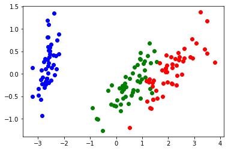

# Title
> summary


<h1>Table of Contents<span class="tocSkip"></span></h1>
<div class="toc"><ul class="toc-item"><li><span><a href="#mulearn" data-toc-modified-id="mulearn-1"><span class="toc-item-num">1&nbsp;&nbsp;</span>mulearn</a></span><ul class="toc-item"><li><span><a href="#Install" data-toc-modified-id="Install-1.1"><span class="toc-item-num">1.1&nbsp;&nbsp;</span>Install</a></span></li><li><span><a href="#How-to-use" data-toc-modified-id="How-to-use-1.2"><span class="toc-item-num">1.2&nbsp;&nbsp;</span>How to use</a></span></li></ul></li></ul></div>

```python
from mulearn import kernel, FuzzyInductor

from mulearn.fuzzifier import LinearFuzzifier
from mulearn.fuzzifier import ExponentialFuzzifier
from mulearn.kernel import GaussianKernel

from mulearn.optimization import solve_optimization_gurobi
from mulearn.optimization import solve_optimization_tensorflow
```

# mulearn

mulearn is a python package implementing the data-driven induction of fuzzy sets described in

- D. Malchiodi and W. Pedrycz, _Learning Membership Functions for Fuzzy Sets through Modified Support Vector Clustering_, in F. Masulli, G. Pasi e R. Yager (Eds.), Fuzzy Logic and Applications. 10th International Workshop, WILF 2013, Genoa, Italy, November 19–22, 2013. Proceedings., Vol. 8256, Springer International Publishing, Switzerland, Lecture Notes on Artificial Intelligence.

## Install

`pip install mulearn`

## How to use

Fill me in please! Don't forget code examples:

```python
%matplotlib inline
import matplotlib.pyplot as plt
import pandas as pd
import numpy as np
from sklearn.decomposition import PCA

source = 'https://archive.ics.uci.edu/ml/machine-learning-databases/iris/iris.data'

iris_df = pd.read_csv(source, header=None)
iris_df.columns=['sepal_length', 'sepal_width', 'petal_length', 'petal_width', 'class']

iris_values = iris_df.iloc[:,0:4].values
iris_labels = iris_df.iloc[:,4].values

pca_2d = PCA(n_components=2)
iris_values_2d = pca_2d.fit_transform(iris_values)
```

```python
def gr_dataset(): 
    for lab, col in zip(('Iris-setosa', 'Iris-versicolor', 'Iris-virginica'),
                        ('blue', 'green', 'red')):
        plt.scatter(iris_values_2d[iris_labels==lab, 0],
                    iris_values_2d[iris_labels==lab, 1],
                    label=lab,
                    c=col)

gr_dataset()
```





```python
def to_membership_values(labels, target):
    return [1 if l==target else 0 for l in labels]

mu = {}
for target in ('Iris-setosa', 'Iris-versicolor', 'Iris-virginica'):
    mu[target] = to_membership_values(iris_labels, target)
```

```python
def gr_membership_contour(estimated_membership):
    x = np.linspace(-4, 4, 50)
    y = np.linspace(-4, 4, 50)
    X, Y = np.meshgrid(x, y)
    zs = np.array([estimated_membership((x, y))
                   for x,y in zip(np.ravel(X), np.ravel(Y))])
    Z = zs.reshape(X.shape)
    membership_contour = plt.contour(X, Y, Z,
                                     levels=(.1, .3, .5, .95), colors='k')
    plt.clabel(membership_contour, inline=1)
    
```

```python

abracalla = 'fottiti!'
```

```python

print(abracalla)
f = FuzzyInductor(fuzzifier=(LinearFuzzifier, {}))
print(abracalla)
#here we go
f.fit(iris_values_2d, mu['Iris-virginica'])

gr_dataset()
gr_membership_contour(f.estimated_membership_)
plt.show()
```

    fottiti!


    100%|██████████| 100/100 [00:18<00:00,  5.55it/s]


```python
#from mulearn import FuzzyInductor

#f = FuzzyInductor()
#f.fit(iris_values_2d, mu['Iris-virginica'])
#gr_dataset()
#gr_membership_contour(f.estimated_membership_)
#plt.show()
```

    100%|██████████| 100/100 [00:17<00:00,  5.71it/s]


    FuzzyInductor(c=1,
                  fuzzifier=(<class 'mulearn.fuzzifier.ExponentialFuzzifier'>, {}),
                  k=GaussianKernel(1), random_state=None, return_profile=False,
                  solve_strategy=(<function solve_optimization_tensorflow at 0x7f940f52cd90>,
                                  {}))


```python

f = FuzzyInductor(fuzzifier=(ExponentialFuzzifier,
                             {'profile': 'alpha', 'alpha': 0.25}))
f.fit(iris_values_2d, mu['Iris-virginica'])

gr_dataset()
gr_membership_contour(f.estimated_membership_)
plt.show()
```

    100%|██████████| 100/100 [00:18<00:00,  5.40it/s]


```python

f = FuzzyInductor(k=GaussianKernel(.3))
f.fit(iris_values_2d, mu['Iris-virginica'])

gr_dataset()
gr_membership_contour(f.estimated_membership_)
plt.show()
```

    100%|██████████| 100/100 [00:18<00:00,  5.29it/s]


```python
try:
    f = FuzzyInductor(solve_strategy=(solve_optimization_gurobi, {}))
    f.fit(iris_values_2d, mu['Iris-virginica'])

    gr_dataset()
    gr_membership_contour(f.estimated_membership_)
    plt.show()
except ModuleNotFoundError:
    print('Gurobi not available')
```

    Academic license - for non-commercial use only


```python

f = FuzzyInductor(fuzzifier=(ExponentialFuzzifier,
                             {'profile': 'alpha', 'alpha': 0.15}),
                  k=GaussianKernel(1.5),
                  solve_strategy=(solve_optimization_tensorflow,
                                  {'n_iter': 20}),
                  return_profile=True)
f.fit(iris_values_2d, mu['Iris-virginica'])

gr_dataset()
gr_membership_contour(f.estimated_membership_)
plt.show()
```

    100%|██████████| 20/20 [00:03<00:00,  5.00it/s]


```python
plt.plot(f.profile_[0], mu['Iris-virginica'], '.')
plt.plot(f.profile_[1], f.profile_[2])
plt.ylim((-0.1, 1.1))
plt.show()
```


```python

sigmas = [.225,.5]
parameters = {'c': [1,10,100],
              'k': [GaussianKernel(i) for i in sigmas]}
```

```python
from sklearn.model_selection import GridSearchCV

f = FuzzyInductor()

virginica = GridSearchCV(f, param_grid=parameters)
virginica.fit(iris_values_2d, mu['Iris-virginica'])
```

    100%|██████████| 100/100 [00:14<00:00,  6.74it/s]
    100%|██████████| 100/100 [00:15<00:00,  6.48it/s]
    100%|██████████| 100/100 [00:16<00:00,  6.23it/s]
    100%|██████████| 100/100 [00:16<00:00,  6.02it/s]
    100%|██████████| 100/100 [00:16<00:00,  5.94it/s]
    100%|██████████| 100/100 [00:16<00:00,  6.14it/s]
    100%|██████████| 100/100 [00:14<00:00,  6.88it/s]
    100%|██████████| 100/100 [00:14<00:00,  6.74it/s]
    100%|██████████| 100/100 [00:14<00:00,  6.74it/s]
    100%|██████████| 100/100 [00:14<00:00,  6.86it/s]
    100%|██████████| 100/100 [00:14<00:00,  7.06it/s]
    100%|██████████| 100/100 [00:14<00:00,  6.83it/s]
    100%|██████████| 100/100 [00:14<00:00,  6.79it/s]
    100%|██████████| 100/100 [00:14<00:00,  6.86it/s]
    100%|██████████| 100/100 [00:13<00:00,  7.17it/s]
    100%|██████████| 100/100 [00:14<00:00,  6.82it/s]
    100%|██████████| 100/100 [00:14<00:00,  7.05it/s]
    100%|██████████| 100/100 [00:14<00:00,  6.82it/s]
    100%|██████████| 100/100 [00:14<00:00,  6.96it/s]
    100%|██████████| 100/100 [00:14<00:00,  7.13it/s]
    100%|██████████| 100/100 [00:13<00:00,  7.26it/s]
    100%|██████████| 100/100 [00:14<00:00,  7.05it/s]
    100%|██████████| 100/100 [00:13<00:00,  7.33it/s]
    100%|██████████| 100/100 [00:13<00:00,  7.21it/s]
    100%|██████████| 100/100 [00:13<00:00,  7.23it/s]
    100%|██████████| 100/100 [00:14<00:00,  7.02it/s]
    100%|██████████| 100/100 [00:13<00:00,  7.23it/s]
    100%|██████████| 100/100 [00:14<00:00,  6.85it/s]
    100%|██████████| 100/100 [00:14<00:00,  7.11it/s]
    100%|██████████| 100/100 [00:13<00:00,  7.15it/s]
    100%|██████████| 100/100 [00:18<00:00,  5.50it/s]


    GridSearchCV(cv=None, error_score=nan,
                 estimator=FuzzyInductor(c=1,
                                         fuzzifier=(<class 'mulearn.fuzzifier.ExponentialFuzzifier'>,
                                                    {}),
                                         k=GaussianKernel(1), random_state=None,
                                         return_profile=False,
                                         solve_strategy=(<function solve_optimization_tensorflow at 0x7f940f52cd90>,
                                                         {})),
                 iid='deprecated', n_jobs=None,
                 param_grid={'c': [1, 10, 100],
                             'k': [GaussianKernel(0.225), GaussianKernel(0.5)]},
                 pre_dispatch='2*n_jobs', refit=True, return_train_score=False,
                 scoring=None, verbose=0)


```python
gr_dataset()
gr_membership_contour(virginica.best_estimator_.estimated_membership_)
plt.show()
```


```python
import pickle

s = pickle.dumps(f)
```

```python
ff = pickle.loads(s)
```

```python
gr_dataset()
gr_membership_contour(ff.estimated_membership_)
plt.show()
```


